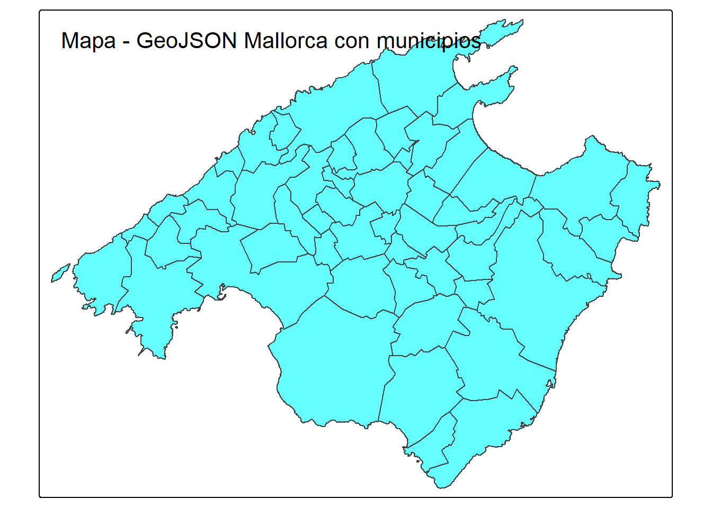
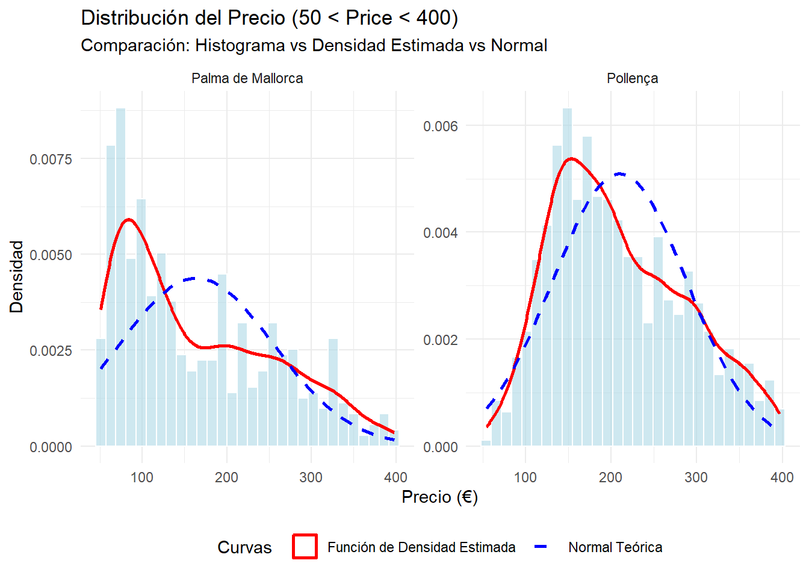
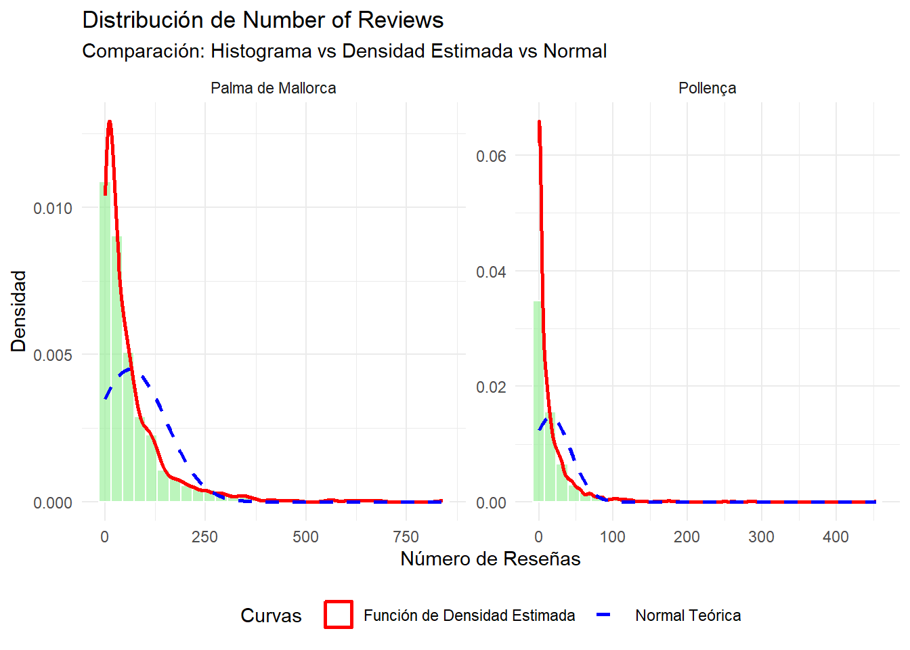
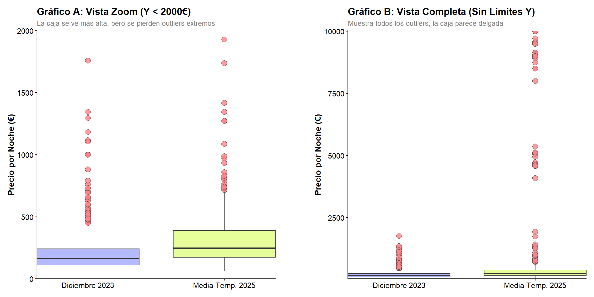
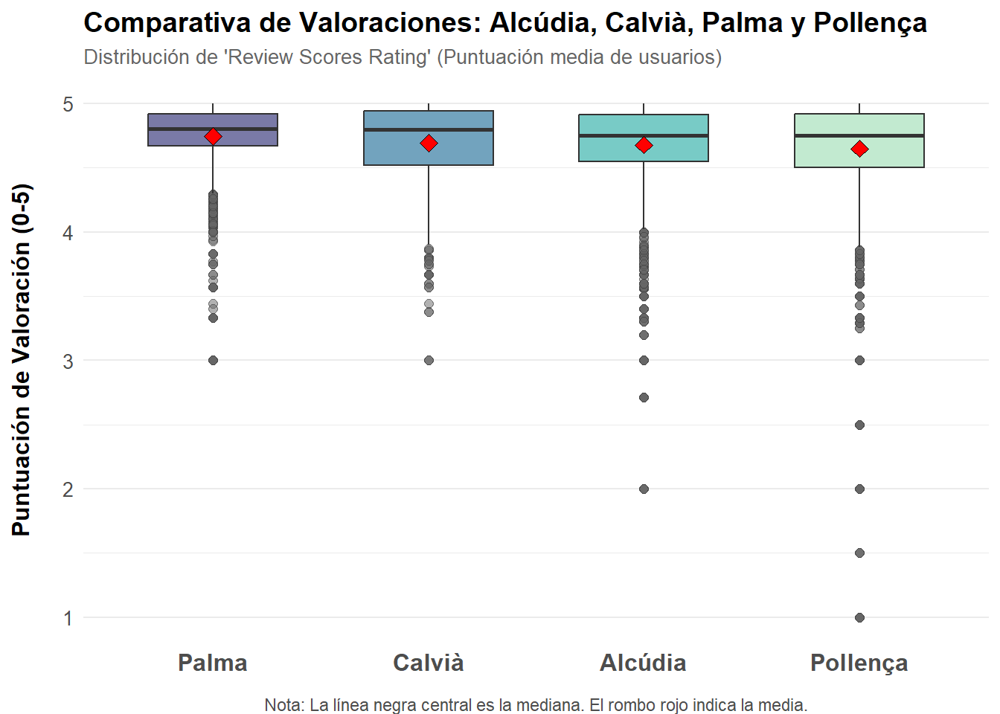
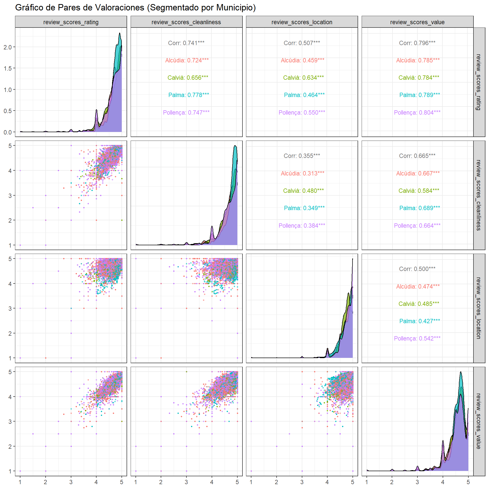
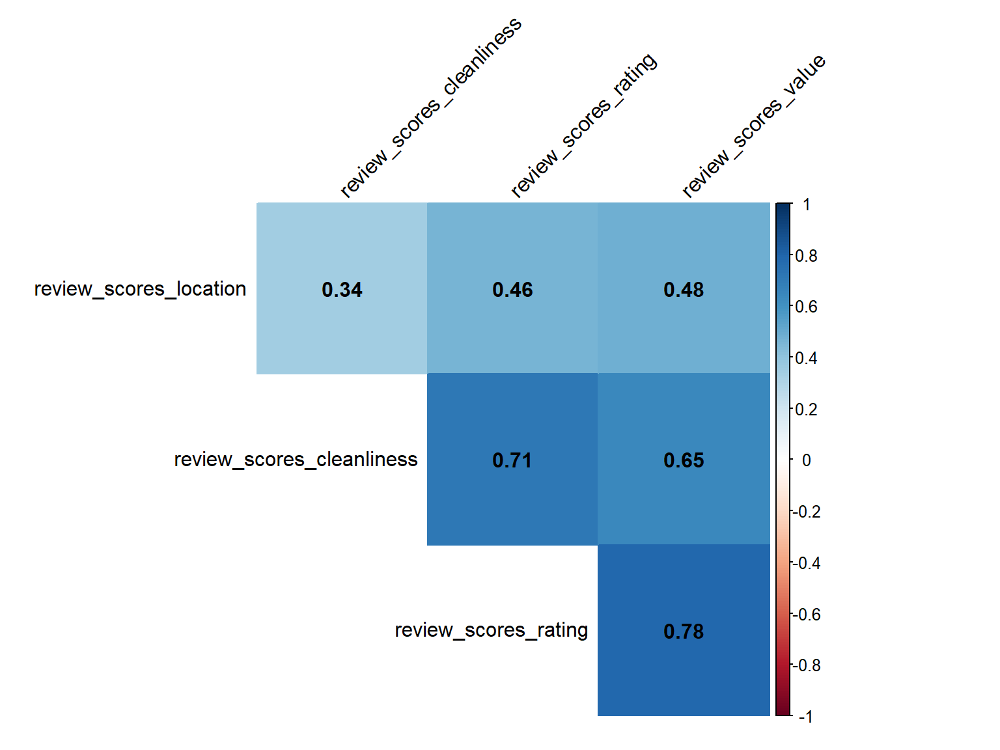
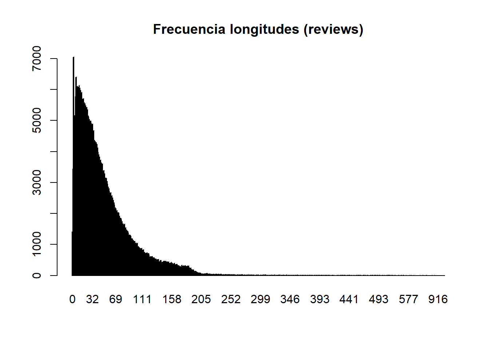

**Instrucciones para el taller**

Se entrega en grupos que deben de estar constituidos en la actividad de grupos. Los grupos son de 2 o 3 ESTUDIANTES, loa caso especiales consultadlos con el profesor para que los autorice.

**Enlaces y Bibliografía**
-   [R for data science, Hadley Wickham, Garret Grolemund.](https://r4ds.had.co.nz/)
-   [Fundamentos de ciencia de datos con R.](https://cdr-book.github.io/)
-   [Tablas avanzadas: kable, KableExtra.](https://haozhu233.github.io/kableExtra/awesome_table_in_html.html)
-   [Geocomputation with R, Robin Lovelace, Jakub Nowosad, Jannes Muenchow](https://r.geocompx.org/)
-   Apuntes de R-basico y tidyverse moodel MAT3.

**Objetivo MALLORCA**

Leeremos los siguientes datos de la zona de etiqueta `mallorca` con el
código siguiente:


::: {.cell}

```{.r .cell-code}
load("clean_data/mallorca/listing_common0.RData")
ls()
```

::: {.cell-output .cell-output-stdout}

```
[1] "listings_common0"
```


:::

```{.r .cell-code}
listings0 = listings_common0 %>%
  select(id, scrape_id, listing_url,
         neighbourhood_cleansed, price,
         number_of_reviews,
         review_scores_rating,
         review_scores_rating,
         review_scores_cleanliness,
         review_scores_location,
         review_scores_value,
         number_of_reviews,
         accommodates,
         bathrooms_text,
         bedrooms,
         beds,
         minimum_nights,
         description,
         latitude,
         longitude,
         property_type,
         room_type)
```
:::


**listings**

Generamos la tibble `listings0` con datos DE 8 periodos DE apartamentos de inside Airbnb de Mallorca Y seleccionando cuantas variables nos parecen más interesantes.

Separararemos la fecha del scrapping que es en la que se observaron los datos de cada apartamento nos quedaremos con los apartamentos que aparecen en las 8 periodos "scrapeados".


::: {.cell}

```{.r .cell-code}
listings0= listings0 %>% 
  mutate(date=as.Date(substr(
    as.character(scrape_id),1,8),
    format="%Y%m%d"),
    .after=id)
```
:::


Ahora analizamos las fechas de los scrapings y el número de veces que aparecen cada apartamentos.


::: {.cell}

```{.r .cell-code}
table(listings0$date)
```

::: {.cell-output .cell-output-stdout}

```

2023-12-17 2024-03-23 2024-06-19 2024-09-13 2024-12-14 2025-03-07 2025-06-15 
      9197       9197       9197       9197       9197       9197       9197 
2025-09-21 
      9197 
```


:::
:::


Hay 8 periodos de scrapping y vamos a quedarnos con los apartamentos que aparecen en todos los periodos
Vemos que cada apartamento aparece 8 veces una por periodo.


::: {.cell}

```{.r .cell-code}
table(table(listings0$id))
```

::: {.cell-output .cell-output-stdout}

```

   8 
9197 
```


:::
:::


Notemos que cada apartamento:
-   queda identificado por id y por date que nos da el periodo en la que apareció el dato.
-   así que cada apartamento aparece 8 veces ya que hemos elegido solo los apartamentos que 
    aparecen en las 8 muestras.
-   Las muestras son 2023-12-17, 2024-03-23, 2024-06-19, 2024-09-13, 2024-12-14, 2025-03-07, 2025-06-15, 2025-09-21,


::: {.cell}

```{.r .cell-code}
unique(listings0$date)
```

::: {.cell-output .cell-output-stdout}

```
[1] "2023-12-17" "2024-03-23" "2024-06-19" "2024-09-13" "2024-12-14"
[6] "2025-03-07" "2025-06-15" "2025-09-21"
```


:::
:::


**reviews**

Estos datos necesitan leerse de forma adecuada, las columnas 1, 2 y 4
deben ser de tipo `character` las otras son correctas


::: {.cell}

```{.r .cell-code}
  reviews=read_csv("data/mallorca/2025-09-21/reviews.csv.gz")
  str(reviews)
```

::: {.cell-output .cell-output-stdout}

```
spc_tbl_ [398,782 × 6] (S3: spec_tbl_df/tbl_df/tbl/data.frame)
 $ listing_id   : num [1:398782] 69998 69998 69998 69998 69998 ...
 $ id           : num [1:398782] 881474 4007103 4170371 4408459 4485779 ...
 $ date         : Date[1:398782], format: "2012-01-24" "2013-04-02" ...
 $ reviewer_id  : num [1:398782] 1595616 3868130 5730759 5921885 810469 ...
 $ reviewer_name: chr [1:398782] "Jean-Pierre" "Jo And Mike" "Elizabeth" "Jone" ...
 $ comments     : chr [1:398782] "This place was charming! Lorenzo himself is a very warm and engaging host and made us feel very welcome. \r<br/"| __truncated__ "We had a four night stay at this gorgeous apartment and it was absolutely perfect. It's really pretty, beautifu"| __truncated__ "Lor's apartment looks exactly like the pictures! It is perfectly located for historic Palma - close to the Cath"| __truncated__ "Wonderful place! 10/10. Charming, spacious and comfortable. Looks even more splendid than in the pictures. The "| __truncated__ ...
 - attr(*, "spec")=
  .. cols(
  ..   listing_id = col_double(),
  ..   id = col_double(),
  ..   date = col_date(format = ""),
  ..   reviewer_id = col_double(),
  ..   reviewer_name = col_character(),
  ..   comments = col_character()
  .. )
 - attr(*, "problems")=<externalptr> 
```


:::

```{.r .cell-code}
  head(reviews)
```

::: {.cell-output .cell-output-stdout}

```
# A tibble: 6 × 6
  listing_id      id date       reviewer_id reviewer_name comments              
       <dbl>   <dbl> <date>           <dbl> <chr>         <chr>                 
1      69998  881474 2012-01-24     1595616 Jean-Pierre   "This place was charm…
2      69998 4007103 2013-04-02     3868130 Jo And Mike   "We had a four night …
3      69998 4170371 2013-04-15     5730759 Elizabeth     "Lor's apartment look…
4      69998 4408459 2013-05-03     5921885 Jone          "Wonderful place! 10/…
5      69998 4485779 2013-05-07      810469 Andrea        "My boyfriend and I, …
6      69998 4619699 2013-05-15     3318059 Devii         "We had a very last m…
```


:::
:::


**neighbourhoods.csv**

Son dos columnas y la primera es una agrupación de municipios (están NA) y la segunda es el nombre del municipio


::: {.cell}

```{.r .cell-code}
  municipios=read_csv("data/mallorca/2025-09-21/neighbourhoods.csv")
  str(municipios)
```

::: {.cell-output .cell-output-stdout}

```
spc_tbl_ [53 × 2] (S3: spec_tbl_df/tbl_df/tbl/data.frame)
 $ neighbourhood_group: logi [1:53] NA NA NA NA NA NA ...
 $ neighbourhood      : chr [1:53] "Alaró" "Alcúdia" "Algaida" "Andratx" ...
 - attr(*, "spec")=
  .. cols(
  ..   neighbourhood_group = col_logical(),
  ..   neighbourhood = col_character()
  .. )
 - attr(*, "problems")=<externalptr> 
```


:::

```{.r .cell-code}
  head(municipios)
```

::: {.cell-output .cell-output-stdout}

```
# A tibble: 6 × 2
  neighbourhood_group neighbourhood
  <lgl>               <chr>        
1 NA                  Alaró        
2 NA                  Alcúdia      
3 NA                  Algaida      
4 NA                  Andratx      
5 NA                  Ariany       
6 NA                  Artà         
```


:::
:::


**neighbourhoods.geojson**

Es el mapa de Mallorca, o podemos leer así:


::: {.cell}

```{.r .cell-code}
library(sf)
library(tmap)

# Leer el archivo GeoJSON
geojson_sf <- sf::st_read("data/mallorca/2025-09-21/neighbourhoods.geojson")
```

::: {.cell-output .cell-output-stdout}

```
Reading layer `neighbourhoods' from data source 
  `C:\Users\JGalmés\RStudioProjects\taller-estadistica\data\mallorca\2025-09-21\neighbourhoods.geojson' 
  using driver `GeoJSON'
Simple feature collection with 53 features and 2 fields
Geometry type: MULTIPOLYGON
Dimension:     XY
Bounding box:  xmin: 2.303195 ymin: 39.26403 xmax: 3.479028 ymax: 39.96236
Geodetic CRS:  WGS 84
```


:::

```{.r .cell-code}
# Crear un mapa interactivo
tmap_mode("plot") # Cambiar a modo  view/plot   que es interactivo/estático
tm_shape(geojson_sf) +
  tm_polygons(col = "cyan", alpha = 0.6) +
  tm_layout(title = "Mapa - GeoJSON Mallorca con municipios")
```

::: {.cell-output-display}
{width=672}
:::
:::


Tenéis que consultar en la documentación de inside Airbnb para saber que
significa cada variable. Os puede ser útil leer los ficheros
[DATA_ABB_modelo_de_datos.html](DATA_ABB_modelo_de_datos.html) y
[DATA_ABB_modelo_de_datos.pdf](DATA_ABB_modelo_de_datos.html) en los que
se explica el modelo de datos de inside Airbnb y como se cargan en el
espacio de trabajo.

Responder las siguientes preguntas con formato Rmarkdown (.Rmd) o quarto
(.qmd) y entregad la fuente un fichero en formato html como salida del
informe. Se puntúa la claridad de la respuesta, la calidad de la
redacción y la corrección de la respuesta.

<br>▂▂▂▂▂▂▂▂▂▂▂▂▂▂▂▂▂▂▂▂▂▂▂▂▂▂▂▂▂▂▂▂▂▂▂▂▂▂▂▂▂▂▂▂▂▂▂▂▂▂▂<br>


# Bloque de inicialización
Inicialización de los ficheros y librerías necesarias para la ejecución de las preguntas:


::: {.cell}

```{.r .cell-code}
knitr::opts_chunk$set(echo = TRUE, message = FALSE, warning = FALSE)

library(tidyverse)
library(kableExtra)

load("clean_data/mallorca/listing_common0.RData") # Cargar datos procesados
listings0 <- listings_common0 # Asignamos a listings0

# Creamos la variable date si no existe, siguiendo el formato del scrape_id 
if(!"date" %in% names(listings0)){
  listings0 <- listings0 %>%
    mutate(
      date = as.Date(substr(as.character(scrape_id), 1, 8), format = "%Y%m%d"),
      .after = id
    )
}
```
:::


# Pregunta 1 (**1punto**)

Del fichero con los datos de listings `listings0` calcula los estadísticos descriptivos 
de las variable `price` y de la variable `number_of_reviews` agrupados por municipio y por periodo.

Presenta los resultados con una tabla de kableExtra.

**Respuesta:**


::: {.cell}

```{.r .cell-code}
# 1. Cálculo de la tabla
tabla_stats <- listings0 %>%
  group_by(neighbourhood_cleansed, date) %>%
  summarise(
    n = n(),
    mean_price = mean(price, na.rm = TRUE),
    sd_price = sd(price, na.rm = TRUE),
    min_price = min(price, na.rm = TRUE),
    max_price = max(price, na.rm = TRUE),
    mean_reviews = mean(number_of_reviews, na.rm = TRUE),
    sd_reviews = sd(number_of_reviews, na.rm = TRUE),
    max_reviews = max(number_of_reviews, na.rm = TRUE)
  ) %>%
  ungroup() %>%
  arrange(neighbourhood_cleansed, date)

knitr::kable(
  tabla_stats,
  caption = "Estadísticos descriptivos: Precio y Reseñas por Municipio y Periodo",
  format = "html",
  digits = 2,
  col.names = c("Municipio", "Fecha", "N", 
                "Media Precio", "D.T. Precio", "Min Precio", "Max Precio",
                "Media Reseñas", "D.T. Reseñas", "Max Reseñas"),
  booktabs = TRUE
) %>%
  row_spec(0, color = "black", background = "#CCCCCC") %>% # Color negre i fons gris clar
  kable_styling(
    bootstrap_options = c("striped", "hover", "condensed"),
    full_width = FALSE,
    fixed_thead = TRUE, # L'apliquem després del canvi de color
    font_size = 12
  ) %>%
  scroll_box(height = "500px", width = "100%")
```

::: {.cell-output-display}
`````{=html}
<div style="border: 1px solid #ddd; padding: 0px; overflow-y: scroll; height:500px; overflow-x: scroll; width:100%; "><table class="table table-striped table-hover table-condensed" style="font-size: 12px; width: auto !important; margin-left: auto; margin-right: auto;">
<caption style="font-size: initial !important;">Estadísticos descriptivos: Precio y Reseñas por Municipio y Periodo</caption>
 <thead>
  <tr>
   <th style="text-align:left;color: black !important;background-color: rgba(204, 204, 204, 255) !important;position: sticky; top:0; background-color: #FFFFFF;position: sticky; top:0; background-color: #FFFFFF;"> Municipio </th>
   <th style="text-align:left;color: black !important;background-color: rgba(204, 204, 204, 255) !important;position: sticky; top:0; background-color: #FFFFFF;position: sticky; top:0; background-color: #FFFFFF;"> Fecha </th>
   <th style="text-align:right;color: black !important;background-color: rgba(204, 204, 204, 255) !important;position: sticky; top:0; background-color: #FFFFFF;position: sticky; top:0; background-color: #FFFFFF;"> N </th>
   <th style="text-align:right;color: black !important;background-color: rgba(204, 204, 204, 255) !important;position: sticky; top:0; background-color: #FFFFFF;position: sticky; top:0; background-color: #FFFFFF;"> Media Precio </th>
   <th style="text-align:right;color: black !important;background-color: rgba(204, 204, 204, 255) !important;position: sticky; top:0; background-color: #FFFFFF;position: sticky; top:0; background-color: #FFFFFF;"> D.T. Precio </th>
   <th style="text-align:right;color: black !important;background-color: rgba(204, 204, 204, 255) !important;position: sticky; top:0; background-color: #FFFFFF;position: sticky; top:0; background-color: #FFFFFF;"> Min Precio </th>
   <th style="text-align:right;color: black !important;background-color: rgba(204, 204, 204, 255) !important;position: sticky; top:0; background-color: #FFFFFF;position: sticky; top:0; background-color: #FFFFFF;"> Max Precio </th>
   <th style="text-align:right;color: black !important;background-color: rgba(204, 204, 204, 255) !important;position: sticky; top:0; background-color: #FFFFFF;position: sticky; top:0; background-color: #FFFFFF;"> Media Reseñas </th>
   <th style="text-align:right;color: black !important;background-color: rgba(204, 204, 204, 255) !important;position: sticky; top:0; background-color: #FFFFFF;position: sticky; top:0; background-color: #FFFFFF;"> D.T. Reseñas </th>
   <th style="text-align:right;color: black !important;background-color: rgba(204, 204, 204, 255) !important;position: sticky; top:0; background-color: #FFFFFF;position: sticky; top:0; background-color: #FFFFFF;"> Max Reseñas </th>
  </tr>
 </thead>
<tbody>
  <tr>
   <td style="text-align:left;"> Alaró </td>
   <td style="text-align:left;"> 2023-12-17 </td>
   <td style="text-align:right;"> 62 </td>
   <td style="text-align:right;"> 425.23 </td>
   <td style="text-align:right;"> 884.07 </td>
   <td style="text-align:right;"> 60 </td>
   <td style="text-align:right;"> 5000 </td>
   <td style="text-align:right;"> 39.11 </td>
   <td style="text-align:right;"> 65.62 </td>
   <td style="text-align:right;"> 433 </td>
  </tr>
  <tr>
   <td style="text-align:left;"> Alaró </td>
   <td style="text-align:left;"> 2024-03-23 </td>
   <td style="text-align:right;"> 62 </td>
   <td style="text-align:right;"> 400.15 </td>
   <td style="text-align:right;"> 771.30 </td>
   <td style="text-align:right;"> 67 </td>
   <td style="text-align:right;"> 5000 </td>
   <td style="text-align:right;"> 39.95 </td>
   <td style="text-align:right;"> 68.46 </td>
   <td style="text-align:right;"> 457 </td>
  </tr>
  <tr>
   <td style="text-align:left;"> Alaró </td>
   <td style="text-align:left;"> 2024-06-19 </td>
   <td style="text-align:right;"> 63 </td>
   <td style="text-align:right;"> 439.57 </td>
   <td style="text-align:right;"> 831.16 </td>
   <td style="text-align:right;"> 70 </td>
   <td style="text-align:right;"> 5000 </td>
   <td style="text-align:right;"> 41.92 </td>
   <td style="text-align:right;"> 71.49 </td>
   <td style="text-align:right;"> 478 </td>
  </tr>
  <tr>
   <td style="text-align:left;"> Alaró </td>
   <td style="text-align:left;"> 2024-09-13 </td>
   <td style="text-align:right;"> 62 </td>
   <td style="text-align:right;"> 599.92 </td>
   <td style="text-align:right;"> 1496.86 </td>
   <td style="text-align:right;"> 70 </td>
   <td style="text-align:right;"> 9999 </td>
   <td style="text-align:right;"> 46.32 </td>
   <td style="text-align:right;"> 75.31 </td>
   <td style="text-align:right;"> 503 </td>
  </tr>
  <tr>
   <td style="text-align:left;"> Alaró </td>
   <td style="text-align:left;"> 2024-12-14 </td>
   <td style="text-align:right;"> 62 </td>
   <td style="text-align:right;"> 567.16 </td>
   <td style="text-align:right;"> 1487.23 </td>
   <td style="text-align:right;"> 56 </td>
   <td style="text-align:right;"> 9999 </td>
   <td style="text-align:right;"> 48.82 </td>
   <td style="text-align:right;"> 78.39 </td>
   <td style="text-align:right;"> 524 </td>
  </tr>
  <tr>
   <td style="text-align:left;"> Alaró </td>
   <td style="text-align:left;"> 2025-03-07 </td>
   <td style="text-align:right;"> 62 </td>
   <td style="text-align:right;"> 537.38 </td>
   <td style="text-align:right;"> 1321.93 </td>
   <td style="text-align:right;"> 64 </td>
   <td style="text-align:right;"> 9000 </td>
   <td style="text-align:right;"> 49.56 </td>
   <td style="text-align:right;"> 80.49 </td>
   <td style="text-align:right;"> 541 </td>
  </tr>
  <tr>
   <td style="text-align:left;"> Alaró </td>
   <td style="text-align:left;"> 2025-06-15 </td>
   <td style="text-align:right;"> 62 </td>
   <td style="text-align:right;"> 724.13 </td>
   <td style="text-align:right;"> 1795.41 </td>
   <td style="text-align:right;"> 67 </td>
   <td style="text-align:right;"> 9999 </td>
   <td style="text-align:right;"> 52.89 </td>
   <td style="text-align:right;"> 83.90 </td>
   <td style="text-align:right;"> 561 </td>
  </tr>
  <tr>
   <td style="text-align:left;"> Alaró </td>
   <td style="text-align:left;"> 2025-09-21 </td>
   <td style="text-align:right;"> 62 </td>
   <td style="text-align:right;"> 851.35 </td>
   <td style="text-align:right;"> 2020.01 </td>
   <td style="text-align:right;"> 67 </td>
   <td style="text-align:right;"> 9999 </td>
   <td style="text-align:right;"> 56.24 </td>
   <td style="text-align:right;"> 85.96 </td>
   <td style="text-align:right;"> 572 </td>
  </tr>
  <tr>
   <td style="text-align:left;"> Alcúdia </td>
   <td style="text-align:left;"> 2023-12-17 </td>
   <td style="text-align:right;"> 956 </td>
   <td style="text-align:right;"> 210.38 </td>
   <td style="text-align:right;"> 164.43 </td>
   <td style="text-align:right;"> 34 </td>
   <td style="text-align:right;"> 1758 </td>
   <td style="text-align:right;"> 20.68 </td>
   <td style="text-align:right;"> 33.54 </td>
   <td style="text-align:right;"> 348 </td>
  </tr>
  <tr>
   <td style="text-align:left;"> Alcúdia </td>
   <td style="text-align:left;"> 2024-03-23 </td>
   <td style="text-align:right;"> 955 </td>
   <td style="text-align:right;"> 209.82 </td>
   <td style="text-align:right;"> 170.98 </td>
   <td style="text-align:right;"> 34 </td>
   <td style="text-align:right;"> 1758 </td>
   <td style="text-align:right;"> 21.36 </td>
   <td style="text-align:right;"> 34.50 </td>
   <td style="text-align:right;"> 349 </td>
  </tr>
  <tr>
   <td style="text-align:left;"> Alcúdia </td>
   <td style="text-align:left;"> 2024-06-19 </td>
   <td style="text-align:right;"> 955 </td>
   <td style="text-align:right;"> 272.23 </td>
   <td style="text-align:right;"> 196.04 </td>
   <td style="text-align:right;"> 47 </td>
   <td style="text-align:right;"> 1658 </td>
   <td style="text-align:right;"> 23.73 </td>
   <td style="text-align:right;"> 37.38 </td>
   <td style="text-align:right;"> 408 </td>
  </tr>
  <tr>
   <td style="text-align:left;"> Alcúdia </td>
   <td style="text-align:left;"> 2024-09-13 </td>
   <td style="text-align:right;"> 955 </td>
   <td style="text-align:right;"> 284.61 </td>
   <td style="text-align:right;"> 485.23 </td>
   <td style="text-align:right;"> 47 </td>
   <td style="text-align:right;"> 9999 </td>
   <td style="text-align:right;"> 26.21 </td>
   <td style="text-align:right;"> 39.91 </td>
   <td style="text-align:right;"> 419 </td>
  </tr>
  <tr>
   <td style="text-align:left;"> Alcúdia </td>
   <td style="text-align:left;"> 2024-12-14 </td>
   <td style="text-align:right;"> 953 </td>
   <td style="text-align:right;"> 259.89 </td>
   <td style="text-align:right;"> 583.91 </td>
   <td style="text-align:right;"> 10 </td>
   <td style="text-align:right;"> 9999 </td>
   <td style="text-align:right;"> 28.24 </td>
   <td style="text-align:right;"> 42.38 </td>
   <td style="text-align:right;"> 431 </td>
  </tr>
  <tr>
   <td style="text-align:left;"> Alcúdia </td>
   <td style="text-align:left;"> 2025-03-07 </td>
   <td style="text-align:right;"> 955 </td>
   <td style="text-align:right;"> 753.86 </td>
   <td style="text-align:right;"> 2151.10 </td>
   <td style="text-align:right;"> 42 </td>
   <td style="text-align:right;"> 10000 </td>
   <td style="text-align:right;"> 28.69 </td>
   <td style="text-align:right;"> 43.02 </td>
   <td style="text-align:right;"> 431 </td>
  </tr>
  <tr>
   <td style="text-align:left;"> Alcúdia </td>
   <td style="text-align:left;"> 2025-06-15 </td>
   <td style="text-align:right;"> 955 </td>
   <td style="text-align:right;"> 909.07 </td>
   <td style="text-align:right;"> 2309.24 </td>
   <td style="text-align:right;"> 50 </td>
   <td style="text-align:right;"> 10000 </td>
   <td style="text-align:right;"> 31.45 </td>
   <td style="text-align:right;"> 46.42 </td>
   <td style="text-align:right;"> 455 </td>
  </tr>
  <tr>
   <td style="text-align:left;"> Alcúdia </td>
   <td style="text-align:left;"> 2025-09-21 </td>
   <td style="text-align:right;"> 955 </td>
   <td style="text-align:right;"> 816.68 </td>
   <td style="text-align:right;"> 2158.36 </td>
   <td style="text-align:right;"> 58 </td>
   <td style="text-align:right;"> 10053 </td>
   <td style="text-align:right;"> 34.00 </td>
   <td style="text-align:right;"> 49.41 </td>
   <td style="text-align:right;"> 474 </td>
  </tr>
  <tr>
   <td style="text-align:left;"> Algaida </td>
   <td style="text-align:left;"> 2023-12-17 </td>
   <td style="text-align:right;"> 61 </td>
   <td style="text-align:right;"> 279.00 </td>
   <td style="text-align:right;"> 402.79 </td>
   <td style="text-align:right;"> 70 </td>
   <td style="text-align:right;"> 3125 </td>
   <td style="text-align:right;"> 22.89 </td>
   <td style="text-align:right;"> 33.27 </td>
   <td style="text-align:right;"> 183 </td>
  </tr>
  <tr>
   <td style="text-align:left;"> Algaida </td>
   <td style="text-align:left;"> 2024-03-23 </td>
   <td style="text-align:right;"> 61 </td>
   <td style="text-align:right;"> 255.95 </td>
   <td style="text-align:right;"> 261.49 </td>
   <td style="text-align:right;"> 77 </td>
   <td style="text-align:right;"> 1994 </td>
   <td style="text-align:right;"> 23.11 </td>
   <td style="text-align:right;"> 33.68 </td>
   <td style="text-align:right;"> 188 </td>
  </tr>
  <tr>
   <td style="text-align:left;"> Algaida </td>
   <td style="text-align:left;"> 2024-06-19 </td>
   <td style="text-align:right;"> 60 </td>
   <td style="text-align:right;"> 313.19 </td>
   <td style="text-align:right;"> 397.38 </td>
   <td style="text-align:right;"> 108 </td>
   <td style="text-align:right;"> 3085 </td>
   <td style="text-align:right;"> 25.17 </td>
   <td style="text-align:right;"> 35.61 </td>
   <td style="text-align:right;"> 201 </td>
  </tr>
  <tr>
   <td style="text-align:left;"> Algaida </td>
   <td style="text-align:left;"> 2024-09-13 </td>
   <td style="text-align:right;"> 60 </td>
   <td style="text-align:right;"> 310.71 </td>
   <td style="text-align:right;"> 403.79 </td>
   <td style="text-align:right;"> 108 </td>
   <td style="text-align:right;"> 3125 </td>
   <td style="text-align:right;"> 27.45 </td>
   <td style="text-align:right;"> 36.98 </td>
   <td style="text-align:right;"> 207 </td>
  </tr>
  <tr>
   <td style="text-align:left;"> Algaida </td>
   <td style="text-align:left;"> 2024-12-14 </td>
   <td style="text-align:right;"> 60 </td>
   <td style="text-align:right;"> 300.39 </td>
   <td style="text-align:right;"> 301.83 </td>
   <td style="text-align:right;"> 77 </td>
   <td style="text-align:right;"> 2188 </td>
   <td style="text-align:right;"> 28.92 </td>
   <td style="text-align:right;"> 38.31 </td>
   <td style="text-align:right;"> 213 </td>
  </tr>
  <tr>
   <td style="text-align:left;"> Algaida </td>
   <td style="text-align:left;"> 2025-03-07 </td>
   <td style="text-align:right;"> 60 </td>
   <td style="text-align:right;"> 1372.37 </td>
   <td style="text-align:right;"> 3014.46 </td>
   <td style="text-align:right;"> 89 </td>
   <td style="text-align:right;"> 10000 </td>
   <td style="text-align:right;"> 29.18 </td>
   <td style="text-align:right;"> 38.94 </td>
   <td style="text-align:right;"> 218 </td>
  </tr>
  <tr>
   <td style="text-align:left;"> Algaida </td>
   <td style="text-align:left;"> 2025-06-15 </td>
   <td style="text-align:right;"> 60 </td>
   <td style="text-align:right;"> 1536.37 </td>
   <td style="text-align:right;"> 3190.42 </td>
   <td style="text-align:right;"> 110 </td>
   <td style="text-align:right;"> 10000 </td>
   <td style="text-align:right;"> 31.13 </td>
   <td style="text-align:right;"> 40.88 </td>
   <td style="text-align:right;"> 231 </td>
  </tr>
  <tr>
   <td style="text-align:left;"> Algaida </td>
   <td style="text-align:left;"> 2025-09-21 </td>
   <td style="text-align:right;"> 60 </td>
   <td style="text-align:right;"> 1380.87 </td>
   <td style="text-align:right;"> 2952.53 </td>
   <td style="text-align:right;"> 118 </td>
   <td style="text-align:right;"> 10000 </td>
   <td style="text-align:right;"> 33.47 </td>
   <td style="text-align:right;"> 42.71 </td>
   <td style="text-align:right;"> 238 </td>
  </tr>
  <tr>
   <td style="text-align:left;"> Andratx </td>
   <td style="text-align:left;"> 2023-12-17 </td>
   <td style="text-align:right;"> 136 </td>
   <td style="text-align:right;"> 586.34 </td>
   <td style="text-align:right;"> 1058.44 </td>
   <td style="text-align:right;"> 60 </td>
   <td style="text-align:right;"> 6711 </td>
   <td style="text-align:right;"> 27.76 </td>
   <td style="text-align:right;"> 49.86 </td>
   <td style="text-align:right;"> 361 </td>
  </tr>
  <tr>
   <td style="text-align:left;"> Andratx </td>
   <td style="text-align:left;"> 2024-03-23 </td>
   <td style="text-align:right;"> 136 </td>
   <td style="text-align:right;"> 584.71 </td>
   <td style="text-align:right;"> 933.90 </td>
   <td style="text-align:right;"> 50 </td>
   <td style="text-align:right;"> 4756 </td>
   <td style="text-align:right;"> 28.65 </td>
   <td style="text-align:right;"> 50.87 </td>
   <td style="text-align:right;"> 366 </td>
  </tr>
  <tr>
   <td style="text-align:left;"> Andratx </td>
   <td style="text-align:left;"> 2024-06-19 </td>
   <td style="text-align:right;"> 136 </td>
   <td style="text-align:right;"> 752.56 </td>
   <td style="text-align:right;"> 1253.32 </td>
   <td style="text-align:right;"> 70 </td>
   <td style="text-align:right;"> 8403 </td>
   <td style="text-align:right;"> 31.03 </td>
   <td style="text-align:right;"> 52.96 </td>
   <td style="text-align:right;"> 377 </td>
  </tr>
  <tr>
   <td style="text-align:left;"> Andratx </td>
   <td style="text-align:left;"> 2024-09-13 </td>
   <td style="text-align:right;"> 136 </td>
   <td style="text-align:right;"> 795.60 </td>
   <td style="text-align:right;"> 1415.74 </td>
   <td style="text-align:right;"> 70 </td>
   <td style="text-align:right;"> 9999 </td>
   <td style="text-align:right;"> 33.74 </td>
   <td style="text-align:right;"> 54.70 </td>
   <td style="text-align:right;"> 387 </td>
  </tr>
  <tr>
   <td style="text-align:left;"> Andratx </td>
   <td style="text-align:left;"> 2024-12-14 </td>
   <td style="text-align:right;"> 136 </td>
   <td style="text-align:right;"> 693.70 </td>
   <td style="text-align:right;"> 1350.73 </td>
   <td style="text-align:right;"> 60 </td>
   <td style="text-align:right;"> 9999 </td>
   <td style="text-align:right;"> 35.54 </td>
   <td style="text-align:right;"> 56.09 </td>
   <td style="text-align:right;"> 392 </td>
  </tr>
  <tr>
   <td style="text-align:left;"> Andratx </td>
   <td style="text-align:left;"> 2025-03-07 </td>
   <td style="text-align:right;"> 136 </td>
   <td style="text-align:right;"> 930.99 </td>
   <td style="text-align:right;"> 1866.29 </td>
   <td style="text-align:right;"> 50 </td>
   <td style="text-align:right;"> 9999 </td>
   <td style="text-align:right;"> 36.12 </td>
   <td style="text-align:right;"> 56.91 </td>
   <td style="text-align:right;"> 398 </td>
  </tr>
  <tr>
   <td style="text-align:left;"> Andratx </td>
   <td style="text-align:left;"> 2025-06-15 </td>
   <td style="text-align:right;"> 136 </td>
   <td style="text-align:right;"> 1020.52 </td>
   <td style="text-align:right;"> 1844.39 </td>
   <td style="text-align:right;"> 75 </td>
   <td style="text-align:right;"> 9000 </td>
   <td style="text-align:right;"> 38.69 </td>
   <td style="text-align:right;"> 59.57 </td>
   <td style="text-align:right;"> 415 </td>
  </tr>
  <tr>
   <td style="text-align:left;"> Andratx </td>
   <td style="text-align:left;"> 2025-09-21 </td>
   <td style="text-align:right;"> 136 </td>
   <td style="text-align:right;"> 1120.12 </td>
   <td style="text-align:right;"> 2070.25 </td>
   <td style="text-align:right;"> 75 </td>
   <td style="text-align:right;"> 9999 </td>
   <td style="text-align:right;"> 41.06 </td>
   <td style="text-align:right;"> 61.25 </td>
   <td style="text-align:right;"> 423 </td>
  </tr>
  <tr>
   <td style="text-align:left;"> Ariany </td>
   <td style="text-align:left;"> 2023-12-17 </td>
   <td style="text-align:right;"> 46 </td>
   <td style="text-align:right;"> 218.38 </td>
   <td style="text-align:right;"> 154.56 </td>
   <td style="text-align:right;"> 50 </td>
   <td style="text-align:right;"> 689 </td>
   <td style="text-align:right;"> 8.41 </td>
   <td style="text-align:right;"> 11.32 </td>
   <td style="text-align:right;"> 60 </td>
  </tr>
  <tr>
   <td style="text-align:left;"> Ariany </td>
   <td style="text-align:left;"> 2024-03-23 </td>
   <td style="text-align:right;"> 46 </td>
   <td style="text-align:right;"> 211.93 </td>
   <td style="text-align:right;"> 150.06 </td>
   <td style="text-align:right;"> 50 </td>
   <td style="text-align:right;"> 675 </td>
   <td style="text-align:right;"> 8.57 </td>
   <td style="text-align:right;"> 11.40 </td>
   <td style="text-align:right;"> 60 </td>
  </tr>
  <tr>
   <td style="text-align:left;"> Ariany </td>
   <td style="text-align:left;"> 2024-06-19 </td>
   <td style="text-align:right;"> 46 </td>
   <td style="text-align:right;"> 256.52 </td>
   <td style="text-align:right;"> 195.54 </td>
   <td style="text-align:right;"> 60 </td>
   <td style="text-align:right;"> 987 </td>
   <td style="text-align:right;"> 9.65 </td>
   <td style="text-align:right;"> 12.38 </td>
   <td style="text-align:right;"> 62 </td>
  </tr>
  <tr>
   <td style="text-align:left;"> Ariany </td>
   <td style="text-align:left;"> 2024-09-13 </td>
   <td style="text-align:right;"> 46 </td>
   <td style="text-align:right;"> 243.30 </td>
   <td style="text-align:right;"> 179.95 </td>
   <td style="text-align:right;"> 75 </td>
   <td style="text-align:right;"> 987 </td>
   <td style="text-align:right;"> 11.48 </td>
   <td style="text-align:right;"> 13.77 </td>
   <td style="text-align:right;"> 70 </td>
  </tr>
  <tr>
   <td style="text-align:left;"> Ariany </td>
   <td style="text-align:left;"> 2024-12-14 </td>
   <td style="text-align:right;"> 46 </td>
   <td style="text-align:right;"> 222.39 </td>
   <td style="text-align:right;"> 122.51 </td>
   <td style="text-align:right;"> 50 </td>
   <td style="text-align:right;"> 579 </td>
   <td style="text-align:right;"> 12.30 </td>
   <td style="text-align:right;"> 14.48 </td>
   <td style="text-align:right;"> 73 </td>
  </tr>
  <tr>
   <td style="text-align:left;"> Ariany </td>
   <td style="text-align:left;"> 2025-03-07 </td>
   <td style="text-align:right;"> 46 </td>
   <td style="text-align:right;"> 2705.76 </td>
   <td style="text-align:right;"> 4159.36 </td>
   <td style="text-align:right;"> 48 </td>
   <td style="text-align:right;"> 10000 </td>
   <td style="text-align:right;"> 12.39 </td>
   <td style="text-align:right;"> 14.61 </td>
   <td style="text-align:right;"> 73 </td>
  </tr>
  <tr>
   <td style="text-align:left;"> Ariany </td>
   <td style="text-align:left;"> 2025-06-15 </td>
   <td style="text-align:right;"> 46 </td>
   <td style="text-align:right;"> 3069.37 </td>
   <td style="text-align:right;"> 4268.56 </td>
   <td style="text-align:right;"> 62 </td>
   <td style="text-align:right;"> 10000 </td>
   <td style="text-align:right;"> 13.65 </td>
   <td style="text-align:right;"> 15.79 </td>
   <td style="text-align:right;"> 76 </td>
  </tr>
  <tr>
   <td style="text-align:left;"> Ariany </td>
   <td style="text-align:left;"> 2025-09-21 </td>
   <td style="text-align:right;"> 46 </td>
   <td style="text-align:right;"> 2861.72 </td>
   <td style="text-align:right;"> 4136.70 </td>
   <td style="text-align:right;"> 62 </td>
   <td style="text-align:right;"> 10000 </td>
   <td style="text-align:right;"> 15.20 </td>
   <td style="text-align:right;"> 17.46 </td>
   <td style="text-align:right;"> 82 </td>
  </tr>
  <tr>
   <td style="text-align:left;"> Artà </td>
   <td style="text-align:left;"> 2023-12-17 </td>
   <td style="text-align:right;"> 173 </td>
   <td style="text-align:right;"> 244.51 </td>
   <td style="text-align:right;"> 226.57 </td>
   <td style="text-align:right;"> 35 </td>
   <td style="text-align:right;"> 1590 </td>
   <td style="text-align:right;"> 13.66 </td>
   <td style="text-align:right;"> 24.48 </td>
   <td style="text-align:right;"> 231 </td>
  </tr>
  <tr>
   <td style="text-align:left;"> Artà </td>
   <td style="text-align:left;"> 2024-03-23 </td>
   <td style="text-align:right;"> 173 </td>
   <td style="text-align:right;"> 248.78 </td>
   <td style="text-align:right;"> 230.45 </td>
   <td style="text-align:right;"> 35 </td>
   <td style="text-align:right;"> 1610 </td>
   <td style="text-align:right;"> 14.00 </td>
   <td style="text-align:right;"> 24.81 </td>
   <td style="text-align:right;"> 234 </td>
  </tr>
  <tr>
   <td style="text-align:left;"> Artà </td>
   <td style="text-align:left;"> 2024-06-19 </td>
   <td style="text-align:right;"> 173 </td>
   <td style="text-align:right;"> 247.18 </td>
   <td style="text-align:right;"> 132.03 </td>
   <td style="text-align:right;"> 55 </td>
   <td style="text-align:right;"> 1036 </td>
   <td style="text-align:right;"> 15.20 </td>
   <td style="text-align:right;"> 26.14 </td>
   <td style="text-align:right;"> 245 </td>
  </tr>
  <tr>
   <td style="text-align:left;"> Artà </td>
   <td style="text-align:left;"> 2024-09-13 </td>
   <td style="text-align:right;"> 173 </td>
   <td style="text-align:right;"> 298.43 </td>
   <td style="text-align:right;"> 750.50 </td>
   <td style="text-align:right;"> 55 </td>
   <td style="text-align:right;"> 9999 </td>
   <td style="text-align:right;"> 17.13 </td>
   <td style="text-align:right;"> 27.71 </td>
   <td style="text-align:right;"> 256 </td>
  </tr>
  <tr>
   <td style="text-align:left;"> Artà </td>
   <td style="text-align:left;"> 2024-12-14 </td>
   <td style="text-align:right;"> 173 </td>
   <td style="text-align:right;"> 291.50 </td>
   <td style="text-align:right;"> 757.48 </td>
   <td style="text-align:right;"> 35 </td>
   <td style="text-align:right;"> 9999 </td>
   <td style="text-align:right;"> 18.21 </td>
   <td style="text-align:right;"> 28.89 </td>
   <td style="text-align:right;"> 267 </td>
  </tr>
  <tr>
   <td style="text-align:left;"> Artà </td>
   <td style="text-align:left;"> 2025-03-07 </td>
   <td style="text-align:right;"> 173 </td>
   <td style="text-align:right;"> 1611.71 </td>
   <td style="text-align:right;"> 3306.08 </td>
   <td style="text-align:right;"> 37 </td>
   <td style="text-align:right;"> 10000 </td>
   <td style="text-align:right;"> 18.50 </td>
   <td style="text-align:right;"> 29.29 </td>
   <td style="text-align:right;"> 273 </td>
  </tr>
  <tr>
   <td style="text-align:left;"> Artà </td>
   <td style="text-align:left;"> 2025-06-15 </td>
   <td style="text-align:right;"> 173 </td>
   <td style="text-align:right;"> 2329.95 </td>
   <td style="text-align:right;"> 3843.43 </td>
   <td style="text-align:right;"> 52 </td>
   <td style="text-align:right;"> 10018 </td>
   <td style="text-align:right;"> 19.88 </td>
   <td style="text-align:right;"> 30.69 </td>
   <td style="text-align:right;"> 285 </td>
  </tr>
  <tr>
   <td style="text-align:left;"> Artà </td>
   <td style="text-align:left;"> 2025-09-21 </td>
   <td style="text-align:right;"> 173 </td>
   <td style="text-align:right;"> 1954.48 </td>
   <td style="text-align:right;"> 3570.04 </td>
   <td style="text-align:right;"> 60 </td>
   <td style="text-align:right;"> 10016 </td>
   <td style="text-align:right;"> 21.66 </td>
   <td style="text-align:right;"> 32.14 </td>
   <td style="text-align:right;"> 294 </td>
  </tr>
  <tr>
   <td style="text-align:left;"> Banyalbufar </td>
   <td style="text-align:left;"> 2023-12-17 </td>
   <td style="text-align:right;"> 44 </td>
   <td style="text-align:right;"> 213.86 </td>
   <td style="text-align:right;"> 161.27 </td>
   <td style="text-align:right;"> 70 </td>
   <td style="text-align:right;"> 871 </td>
   <td style="text-align:right;"> 64.41 </td>
   <td style="text-align:right;"> 84.45 </td>
   <td style="text-align:right;"> 312 </td>
  </tr>
  <tr>
   <td style="text-align:left;"> Banyalbufar </td>
   <td style="text-align:left;"> 2024-03-23 </td>
   <td style="text-align:right;"> 44 </td>
   <td style="text-align:right;"> 219.20 </td>
   <td style="text-align:right;"> 168.24 </td>
   <td style="text-align:right;"> 65 </td>
   <td style="text-align:right;"> 999 </td>
   <td style="text-align:right;"> 66.25 </td>
   <td style="text-align:right;"> 86.80 </td>
   <td style="text-align:right;"> 325 </td>
  </tr>
  <tr>
   <td style="text-align:left;"> Banyalbufar </td>
   <td style="text-align:left;"> 2024-06-19 </td>
   <td style="text-align:right;"> 44 </td>
   <td style="text-align:right;"> 258.55 </td>
   <td style="text-align:right;"> 233.55 </td>
   <td style="text-align:right;"> 74 </td>
   <td style="text-align:right;"> 1500 </td>
   <td style="text-align:right;"> 70.50 </td>
   <td style="text-align:right;"> 90.22 </td>
   <td style="text-align:right;"> 327 </td>
  </tr>
  <tr>
   <td style="text-align:left;"> Banyalbufar </td>
   <td style="text-align:left;"> 2024-09-13 </td>
   <td style="text-align:right;"> 44 </td>
   <td style="text-align:right;"> 257.61 </td>
   <td style="text-align:right;"> 169.13 </td>
   <td style="text-align:right;"> 80 </td>
   <td style="text-align:right;"> 875 </td>
   <td style="text-align:right;"> 75.52 </td>
   <td style="text-align:right;"> 93.93 </td>
   <td style="text-align:right;"> 333 </td>
  </tr>
  <tr>
   <td style="text-align:left;"> Banyalbufar </td>
   <td style="text-align:left;"> 2024-12-14 </td>
   <td style="text-align:right;"> 44 </td>
   <td style="text-align:right;"> 244.64 </td>
   <td style="text-align:right;"> 206.85 </td>
   <td style="text-align:right;"> 65 </td>
   <td style="text-align:right;"> 1159 </td>
   <td style="text-align:right;"> 78.75 </td>
   <td style="text-align:right;"> 96.97 </td>
   <td style="text-align:right;"> 340 </td>
  </tr>
  <tr>
   <td style="text-align:left;"> Banyalbufar </td>
   <td style="text-align:left;"> 2025-03-07 </td>
   <td style="text-align:right;"> 44 </td>
   <td style="text-align:right;"> 666.24 </td>
   <td style="text-align:right;"> 2033.87 </td>
   <td style="text-align:right;"> 62 </td>
   <td style="text-align:right;"> 10000 </td>
   <td style="text-align:right;"> 80.34 </td>
   <td style="text-align:right;"> 99.04 </td>
   <td style="text-align:right;"> 345 </td>
  </tr>
  <tr>
   <td style="text-align:left;"> Banyalbufar </td>
   <td style="text-align:left;"> 2025-06-15 </td>
   <td style="text-align:right;"> 44 </td>
   <td style="text-align:right;"> 660.95 </td>
   <td style="text-align:right;"> 1849.59 </td>
   <td style="text-align:right;"> 77 </td>
   <td style="text-align:right;"> 9000 </td>
   <td style="text-align:right;"> 85.57 </td>
   <td style="text-align:right;"> 102.83 </td>
   <td style="text-align:right;"> 352 </td>
  </tr>
  <tr>
   <td style="text-align:left;"> Banyalbufar </td>
   <td style="text-align:left;"> 2025-09-21 </td>
   <td style="text-align:right;"> 44 </td>
   <td style="text-align:right;"> 647.61 </td>
   <td style="text-align:right;"> 1849.15 </td>
   <td style="text-align:right;"> 70 </td>
   <td style="text-align:right;"> 9000 </td>
   <td style="text-align:right;"> 91.18 </td>
   <td style="text-align:right;"> 107.34 </td>
   <td style="text-align:right;"> 368 </td>
  </tr>
  <tr>
   <td style="text-align:left;"> Binissalem </td>
   <td style="text-align:left;"> 2023-12-17 </td>
   <td style="text-align:right;"> 56 </td>
   <td style="text-align:right;"> 259.07 </td>
   <td style="text-align:right;"> 194.74 </td>
   <td style="text-align:right;"> 60 </td>
   <td style="text-align:right;"> 977 </td>
   <td style="text-align:right;"> 26.07 </td>
   <td style="text-align:right;"> 39.77 </td>
   <td style="text-align:right;"> 167 </td>
  </tr>
  <tr>
   <td style="text-align:left;"> Binissalem </td>
   <td style="text-align:left;"> 2024-03-23 </td>
   <td style="text-align:right;"> 56 </td>
   <td style="text-align:right;"> 264.00 </td>
   <td style="text-align:right;"> 193.16 </td>
   <td style="text-align:right;"> 60 </td>
   <td style="text-align:right;"> 963 </td>
   <td style="text-align:right;"> 26.48 </td>
   <td style="text-align:right;"> 40.20 </td>
   <td style="text-align:right;"> 169 </td>
  </tr>
  <tr>
   <td style="text-align:left;"> Binissalem </td>
   <td style="text-align:left;"> 2024-06-19 </td>
   <td style="text-align:right;"> 56 </td>
   <td style="text-align:right;"> 281.20 </td>
   <td style="text-align:right;"> 198.79 </td>
   <td style="text-align:right;"> 59 </td>
   <td style="text-align:right;"> 963 </td>
   <td style="text-align:right;"> 28.16 </td>
   <td style="text-align:right;"> 41.95 </td>
   <td style="text-align:right;"> 174 </td>
  </tr>
  <tr>
   <td style="text-align:left;"> Binissalem </td>
   <td style="text-align:left;"> 2024-09-13 </td>
   <td style="text-align:right;"> 56 </td>
   <td style="text-align:right;"> 294.39 </td>
   <td style="text-align:right;"> 221.81 </td>
   <td style="text-align:right;"> 60 </td>
   <td style="text-align:right;"> 1277 </td>
   <td style="text-align:right;"> 30.82 </td>
   <td style="text-align:right;"> 44.04 </td>
   <td style="text-align:right;"> 180 </td>
  </tr>
  <tr>
   <td style="text-align:left;"> Binissalem </td>
   <td style="text-align:left;"> 2024-12-14 </td>
   <td style="text-align:right;"> 56 </td>
   <td style="text-align:right;"> 281.25 </td>
   <td style="text-align:right;"> 256.97 </td>
   <td style="text-align:right;"> 60 </td>
   <td style="text-align:right;"> 1350 </td>
   <td style="text-align:right;"> 32.39 </td>
   <td style="text-align:right;"> 45.37 </td>
   <td style="text-align:right;"> 184 </td>
  </tr>
  <tr>
   <td style="text-align:left;"> Binissalem </td>
   <td style="text-align:left;"> 2025-03-07 </td>
   <td style="text-align:right;"> 56 </td>
   <td style="text-align:right;"> 969.56 </td>
   <td style="text-align:right;"> 2428.47 </td>
   <td style="text-align:right;"> 58 </td>
   <td style="text-align:right;"> 10000 </td>
   <td style="text-align:right;"> 32.68 </td>
   <td style="text-align:right;"> 45.72 </td>
   <td style="text-align:right;"> 184 </td>
  </tr>
  <tr>
   <td style="text-align:left;"> Binissalem </td>
   <td style="text-align:left;"> 2025-06-15 </td>
   <td style="text-align:right;"> 57 </td>
   <td style="text-align:right;"> 1000.42 </td>
   <td style="text-align:right;"> 2372.78 </td>
   <td style="text-align:right;"> 60 </td>
   <td style="text-align:right;"> 9143 </td>
   <td style="text-align:right;"> 34.96 </td>
   <td style="text-align:right;"> 47.59 </td>
   <td style="text-align:right;"> 190 </td>
  </tr>
  <tr>
   <td style="text-align:left;"> Binissalem </td>
   <td style="text-align:left;"> 2025-09-21 </td>
   <td style="text-align:right;"> 56 </td>
   <td style="text-align:right;"> 1124.80 </td>
   <td style="text-align:right;"> 2600.39 </td>
   <td style="text-align:right;"> 60 </td>
   <td style="text-align:right;"> 10000 </td>
   <td style="text-align:right;"> 37.52 </td>
   <td style="text-align:right;"> 50.31 </td>
   <td style="text-align:right;"> 195 </td>
  </tr>
  <tr>
   <td style="text-align:left;"> Bunyola </td>
   <td style="text-align:left;"> 2023-12-17 </td>
   <td style="text-align:right;"> 43 </td>
   <td style="text-align:right;"> 288.28 </td>
   <td style="text-align:right;"> 230.47 </td>
   <td style="text-align:right;"> 52 </td>
   <td style="text-align:right;"> 1257 </td>
   <td style="text-align:right;"> 35.47 </td>
   <td style="text-align:right;"> 48.23 </td>
   <td style="text-align:right;"> 197 </td>
  </tr>
  <tr>
   <td style="text-align:left;"> Bunyola </td>
   <td style="text-align:left;"> 2024-03-23 </td>
   <td style="text-align:right;"> 43 </td>
   <td style="text-align:right;"> 298.51 </td>
   <td style="text-align:right;"> 223.69 </td>
   <td style="text-align:right;"> 52 </td>
   <td style="text-align:right;"> 1300 </td>
   <td style="text-align:right;"> 36.16 </td>
   <td style="text-align:right;"> 48.74 </td>
   <td style="text-align:right;"> 202 </td>
  </tr>
  <tr>
   <td style="text-align:left;"> Bunyola </td>
   <td style="text-align:left;"> 2024-06-19 </td>
   <td style="text-align:right;"> 43 </td>
   <td style="text-align:right;"> 354.19 </td>
   <td style="text-align:right;"> 269.21 </td>
   <td style="text-align:right;"> 52 </td>
   <td style="text-align:right;"> 1400 </td>
   <td style="text-align:right;"> 38.81 </td>
   <td style="text-align:right;"> 50.50 </td>
   <td style="text-align:right;"> 215 </td>
  </tr>
  <tr>
   <td style="text-align:left;"> Bunyola </td>
   <td style="text-align:left;"> 2024-09-13 </td>
   <td style="text-align:right;"> 43 </td>
   <td style="text-align:right;"> 350.88 </td>
   <td style="text-align:right;"> 269.17 </td>
   <td style="text-align:right;"> 52 </td>
   <td style="text-align:right;"> 1400 </td>
   <td style="text-align:right;"> 42.56 </td>
   <td style="text-align:right;"> 52.37 </td>
   <td style="text-align:right;"> 225 </td>
  </tr>
  <tr>
   <td style="text-align:left;"> Bunyola </td>
   <td style="text-align:left;"> 2024-12-14 </td>
   <td style="text-align:right;"> 43 </td>
   <td style="text-align:right;"> 316.35 </td>
   <td style="text-align:right;"> 271.64 </td>
   <td style="text-align:right;"> 52 </td>
   <td style="text-align:right;"> 1400 </td>
   <td style="text-align:right;"> 44.77 </td>
   <td style="text-align:right;"> 54.05 </td>
   <td style="text-align:right;"> 236 </td>
  </tr>
  <tr>
   <td style="text-align:left;"> Bunyola </td>
   <td style="text-align:left;"> 2025-03-07 </td>
   <td style="text-align:right;"> 42 </td>
   <td style="text-align:right;"> 752.64 </td>
   <td style="text-align:right;"> 1832.92 </td>
   <td style="text-align:right;"> 52 </td>
   <td style="text-align:right;"> 9000 </td>
   <td style="text-align:right;"> 46.29 </td>
   <td style="text-align:right;"> 55.04 </td>
   <td style="text-align:right;"> 239 </td>
  </tr>
  <tr>
   <td style="text-align:left;"> Bunyola </td>
   <td style="text-align:left;"> 2025-06-15 </td>
   <td style="text-align:right;"> 42 </td>
   <td style="text-align:right;"> 786.49 </td>
   <td style="text-align:right;"> 1845.50 </td>
   <td style="text-align:right;"> 52 </td>
   <td style="text-align:right;"> 9000 </td>
   <td style="text-align:right;"> 49.12 </td>
   <td style="text-align:right;"> 57.33 </td>
   <td style="text-align:right;"> 247 </td>
  </tr>
  <tr>
   <td style="text-align:left;"> Bunyola </td>
   <td style="text-align:left;"> 2025-09-21 </td>
   <td style="text-align:right;"> 42 </td>
   <td style="text-align:right;"> 769.86 </td>
   <td style="text-align:right;"> 1823.79 </td>
   <td style="text-align:right;"> 90 </td>
   <td style="text-align:right;"> 9000 </td>
   <td style="text-align:right;"> 53.33 </td>
   <td style="text-align:right;"> 59.50 </td>
   <td style="text-align:right;"> 255 </td>
  </tr>
  <tr>
   <td style="text-align:left;"> Búger </td>
   <td style="text-align:left;"> 2023-12-17 </td>
   <td style="text-align:right;"> 98 </td>
   <td style="text-align:right;"> 254.64 </td>
   <td style="text-align:right;"> 146.96 </td>
   <td style="text-align:right;"> 66 </td>
   <td style="text-align:right;"> 772 </td>
   <td style="text-align:right;"> 10.94 </td>
   <td style="text-align:right;"> 21.53 </td>
   <td style="text-align:right;"> 144 </td>
  </tr>
  <tr>
   <td style="text-align:left;"> Búger </td>
   <td style="text-align:left;"> 2024-03-23 </td>
   <td style="text-align:right;"> 98 </td>
   <td style="text-align:right;"> 252.61 </td>
   <td style="text-align:right;"> 145.21 </td>
   <td style="text-align:right;"> 79 </td>
   <td style="text-align:right;"> 693 </td>
   <td style="text-align:right;"> 11.07 </td>
   <td style="text-align:right;"> 21.74 </td>
   <td style="text-align:right;"> 145 </td>
  </tr>
  <tr>
   <td style="text-align:left;"> Búger </td>
   <td style="text-align:left;"> 2024-06-19 </td>
   <td style="text-align:right;"> 98 </td>
   <td style="text-align:right;"> 297.86 </td>
   <td style="text-align:right;"> 171.24 </td>
   <td style="text-align:right;"> 79 </td>
   <td style="text-align:right;"> 861 </td>
   <td style="text-align:right;"> 11.92 </td>
   <td style="text-align:right;"> 22.80 </td>
   <td style="text-align:right;"> 151 </td>
  </tr>
  <tr>
   <td style="text-align:left;"> Búger </td>
   <td style="text-align:left;"> 2024-09-13 </td>
   <td style="text-align:right;"> 98 </td>
   <td style="text-align:right;"> 305.36 </td>
   <td style="text-align:right;"> 182.89 </td>
   <td style="text-align:right;"> 79 </td>
   <td style="text-align:right;"> 861 </td>
   <td style="text-align:right;"> 13.20 </td>
   <td style="text-align:right;"> 24.64 </td>
   <td style="text-align:right;"> 161 </td>
  </tr>
  <tr>
   <td style="text-align:left;"> Búger </td>
   <td style="text-align:left;"> 2024-12-14 </td>
   <td style="text-align:right;"> 98 </td>
   <td style="text-align:right;"> 283.96 </td>
   <td style="text-align:right;"> 168.52 </td>
   <td style="text-align:right;"> 79 </td>
   <td style="text-align:right;"> 1037 </td>
   <td style="text-align:right;"> 13.91 </td>
   <td style="text-align:right;"> 25.49 </td>
   <td style="text-align:right;"> 166 </td>
  </tr>
  <tr>
   <td style="text-align:left;"> Búger </td>
   <td style="text-align:left;"> 2025-03-07 </td>
   <td style="text-align:right;"> 98 </td>
   <td style="text-align:right;"> 851.95 </td>
   <td style="text-align:right;"> 2223.10 </td>
   <td style="text-align:right;"> 79 </td>
   <td style="text-align:right;"> 10000 </td>
   <td style="text-align:right;"> 13.98 </td>
   <td style="text-align:right;"> 25.61 </td>
   <td style="text-align:right;"> 166 </td>
  </tr>
  <tr>
   <td style="text-align:left;"> Búger </td>
   <td style="text-align:left;"> 2025-06-15 </td>
   <td style="text-align:right;"> 98 </td>
   <td style="text-align:right;"> 718.56 </td>
   <td style="text-align:right;"> 1838.50 </td>
   <td style="text-align:right;"> 79 </td>
   <td style="text-align:right;"> 10000 </td>
   <td style="text-align:right;"> 14.84 </td>
   <td style="text-align:right;"> 26.56 </td>
   <td style="text-align:right;"> 169 </td>
  </tr>
  <tr>
   <td style="text-align:left;"> Búger </td>
   <td style="text-align:left;"> 2025-09-21 </td>
   <td style="text-align:right;"> 98 </td>
   <td style="text-align:right;"> 784.13 </td>
   <td style="text-align:right;"> 2025.52 </td>
   <td style="text-align:right;"> 79 </td>
   <td style="text-align:right;"> 10000 </td>
   <td style="text-align:right;"> 16.09 </td>
   <td style="text-align:right;"> 28.38 </td>
   <td style="text-align:right;"> 182 </td>
  </tr>
  <tr>
   <td style="text-align:left;"> Calvià </td>
   <td style="text-align:left;"> 2023-12-17 </td>
   <td style="text-align:right;"> 183 </td>
   <td style="text-align:right;"> 462.89 </td>
   <td style="text-align:right;"> 600.58 </td>
   <td style="text-align:right;"> 31 </td>
   <td style="text-align:right;"> 3700 </td>
   <td style="text-align:right;"> 38.69 </td>
   <td style="text-align:right;"> 91.97 </td>
   <td style="text-align:right;"> 974 </td>
  </tr>
  <tr>
   <td style="text-align:left;"> Calvià </td>
   <td style="text-align:left;"> 2024-03-23 </td>
   <td style="text-align:right;"> 183 </td>
   <td style="text-align:right;"> 448.31 </td>
   <td style="text-align:right;"> 543.37 </td>
   <td style="text-align:right;"> 37 </td>
   <td style="text-align:right;"> 3125 </td>
   <td style="text-align:right;"> 40.19 </td>
   <td style="text-align:right;"> 96.68 </td>
   <td style="text-align:right;"> 1025 </td>
  </tr>
  <tr>
   <td style="text-align:left;"> Calvià </td>
   <td style="text-align:left;"> 2024-06-19 </td>
   <td style="text-align:right;"> 183 </td>
   <td style="text-align:right;"> 508.48 </td>
   <td style="text-align:right;"> 490.07 </td>
   <td style="text-align:right;"> 37 </td>
   <td style="text-align:right;"> 3146 </td>
   <td style="text-align:right;"> 45.68 </td>
   <td style="text-align:right;"> 110.76 </td>
   <td style="text-align:right;"> 1174 </td>
  </tr>
  <tr>
   <td style="text-align:left;"> Calvià </td>
   <td style="text-align:left;"> 2024-09-13 </td>
   <td style="text-align:right;"> 183 </td>
   <td style="text-align:right;"> 510.79 </td>
   <td style="text-align:right;"> 533.10 </td>
   <td style="text-align:right;"> 37 </td>
   <td style="text-align:right;"> 3305 </td>
   <td style="text-align:right;"> 51.07 </td>
   <td style="text-align:right;"> 122.70 </td>
   <td style="text-align:right;"> 1311 </td>
  </tr>
  <tr>
   <td style="text-align:left;"> Calvià </td>
   <td style="text-align:left;"> 2024-12-14 </td>
   <td style="text-align:right;"> 183 </td>
   <td style="text-align:right;"> 451.72 </td>
   <td style="text-align:right;"> 510.44 </td>
   <td style="text-align:right;"> 35 </td>
   <td style="text-align:right;"> 3125 </td>
   <td style="text-align:right;"> 54.77 </td>
   <td style="text-align:right;"> 129.53 </td>
   <td style="text-align:right;"> 1355 </td>
  </tr>
  <tr>
   <td style="text-align:left;"> Calvià </td>
   <td style="text-align:left;"> 2025-03-07 </td>
   <td style="text-align:right;"> 183 </td>
   <td style="text-align:right;"> 740.86 </td>
   <td style="text-align:right;"> 1731.77 </td>
   <td style="text-align:right;"> 37 </td>
   <td style="text-align:right;"> 10000 </td>
   <td style="text-align:right;"> 55.60 </td>
   <td style="text-align:right;"> 131.52 </td>
   <td style="text-align:right;"> 1364 </td>
  </tr>
  <tr>
   <td style="text-align:left;"> Calvià </td>
   <td style="text-align:left;"> 2025-06-15 </td>
   <td style="text-align:right;"> 183 </td>
   <td style="text-align:right;"> 791.22 </td>
   <td style="text-align:right;"> 1538.36 </td>
   <td style="text-align:right;"> 47 </td>
   <td style="text-align:right;"> 10000 </td>
   <td style="text-align:right;"> 60.68 </td>
   <td style="text-align:right;"> 139.63 </td>
   <td style="text-align:right;"> 1403 </td>
  </tr>
  <tr>
   <td style="text-align:left;"> Calvià </td>
   <td style="text-align:left;"> 2025-09-21 </td>
   <td style="text-align:right;"> 183 </td>
   <td style="text-align:right;"> 833.80 </td>
   <td style="text-align:right;"> 1760.20 </td>
   <td style="text-align:right;"> 47 </td>
   <td style="text-align:right;"> 10000 </td>
   <td style="text-align:right;"> 64.74 </td>
   <td style="text-align:right;"> 146.25 </td>
   <td style="text-align:right;"> 1461 </td>
  </tr>
  <tr>
   <td style="text-align:left;"> Campanet </td>
   <td style="text-align:left;"> 2023-12-17 </td>
   <td style="text-align:right;"> 97 </td>
   <td style="text-align:right;"> 195.73 </td>
   <td style="text-align:right;"> 123.24 </td>
   <td style="text-align:right;"> 68 </td>
   <td style="text-align:right;"> 1032 </td>
   <td style="text-align:right;"> 23.06 </td>
   <td style="text-align:right;"> 33.90 </td>
   <td style="text-align:right;"> 160 </td>
  </tr>
  <tr>
   <td style="text-align:left;"> Campanet </td>
   <td style="text-align:left;"> 2024-03-23 </td>
   <td style="text-align:right;"> 97 </td>
   <td style="text-align:right;"> 200.32 </td>
   <td style="text-align:right;"> 154.02 </td>
   <td style="text-align:right;"> 68 </td>
   <td style="text-align:right;"> 1483 </td>
   <td style="text-align:right;"> 23.36 </td>
   <td style="text-align:right;"> 34.32 </td>
   <td style="text-align:right;"> 163 </td>
  </tr>
  <tr>
   <td style="text-align:left;"> Campanet </td>
   <td style="text-align:left;"> 2024-06-19 </td>
   <td style="text-align:right;"> 97 </td>
   <td style="text-align:right;"> 244.54 </td>
   <td style="text-align:right;"> 207.37 </td>
   <td style="text-align:right;"> 82 </td>
   <td style="text-align:right;"> 2088 </td>
   <td style="text-align:right;"> 25.34 </td>
   <td style="text-align:right;"> 36.46 </td>
   <td style="text-align:right;"> 170 </td>
  </tr>
  <tr>
   <td style="text-align:left;"> Campanet </td>
   <td style="text-align:left;"> 2024-09-13 </td>
   <td style="text-align:right;"> 97 </td>
   <td style="text-align:right;"> 240.07 </td>
   <td style="text-align:right;"> 204.85 </td>
   <td style="text-align:right;"> 82 </td>
   <td style="text-align:right;"> 1993 </td>
   <td style="text-align:right;"> 28.46 </td>
   <td style="text-align:right;"> 39.43 </td>
   <td style="text-align:right;"> 177 </td>
  </tr>
  <tr>
   <td style="text-align:left;"> Campanet </td>
   <td style="text-align:left;"> 2024-12-14 </td>
   <td style="text-align:right;"> 97 </td>
   <td style="text-align:right;"> 220.01 </td>
   <td style="text-align:right;"> 131.41 </td>
   <td style="text-align:right;"> 82 </td>
   <td style="text-align:right;"> 1079 </td>
   <td style="text-align:right;"> 30.33 </td>
   <td style="text-align:right;"> 41.76 </td>
   <td style="text-align:right;"> 184 </td>
  </tr>
  <tr>
   <td style="text-align:left;"> Campanet </td>
   <td style="text-align:left;"> 2025-03-07 </td>
   <td style="text-align:right;"> 97 </td>
   <td style="text-align:right;"> 1423.48 </td>
   <td style="text-align:right;"> 3129.20 </td>
   <td style="text-align:right;"> 85 </td>
   <td style="text-align:right;"> 10000 </td>
   <td style="text-align:right;"> 30.46 </td>
   <td style="text-align:right;"> 41.82 </td>
   <td style="text-align:right;"> 184 </td>
  </tr>
  <tr>
   <td style="text-align:left;"> Campanet </td>
   <td style="text-align:left;"> 2025-06-15 </td>
   <td style="text-align:right;"> 97 </td>
   <td style="text-align:right;"> 1365.45 </td>
   <td style="text-align:right;"> 2983.56 </td>
   <td style="text-align:right;"> 111 </td>
   <td style="text-align:right;"> 10000 </td>
   <td style="text-align:right;"> 32.84 </td>
   <td style="text-align:right;"> 44.99 </td>
   <td style="text-align:right;"> 206 </td>
  </tr>
  <tr>
   <td style="text-align:left;"> Campanet </td>
   <td style="text-align:left;"> 2025-09-21 </td>
   <td style="text-align:right;"> 97 </td>
   <td style="text-align:right;"> 1299.56 </td>
   <td style="text-align:right;"> 2918.05 </td>
   <td style="text-align:right;"> 82 </td>
   <td style="text-align:right;"> 10000 </td>
   <td style="text-align:right;"> 35.54 </td>
   <td style="text-align:right;"> 47.98 </td>
   <td style="text-align:right;"> 223 </td>
  </tr>
  <tr>
   <td style="text-align:left;"> Campos </td>
   <td style="text-align:left;"> 2023-12-17 </td>
   <td style="text-align:right;"> 311 </td>
   <td style="text-align:right;"> 263.56 </td>
   <td style="text-align:right;"> 245.69 </td>
   <td style="text-align:right;"> 69 </td>
   <td style="text-align:right;"> 2171 </td>
   <td style="text-align:right;"> 14.60 </td>
   <td style="text-align:right;"> 21.49 </td>
   <td style="text-align:right;"> 137 </td>
  </tr>
  <tr>
   <td style="text-align:left;"> Campos </td>
   <td style="text-align:left;"> 2024-03-23 </td>
   <td style="text-align:right;"> 311 </td>
   <td style="text-align:right;"> 260.82 </td>
   <td style="text-align:right;"> 216.54 </td>
   <td style="text-align:right;"> 70 </td>
   <td style="text-align:right;"> 1650 </td>
   <td style="text-align:right;"> 14.84 </td>
   <td style="text-align:right;"> 21.73 </td>
   <td style="text-align:right;"> 141 </td>
  </tr>
  <tr>
   <td style="text-align:left;"> Campos </td>
   <td style="text-align:left;"> 2024-06-19 </td>
   <td style="text-align:right;"> 310 </td>
   <td style="text-align:right;"> 293.29 </td>
   <td style="text-align:right;"> 230.80 </td>
   <td style="text-align:right;"> 60 </td>
   <td style="text-align:right;"> 2150 </td>
   <td style="text-align:right;"> 16.08 </td>
   <td style="text-align:right;"> 22.86 </td>
   <td style="text-align:right;"> 153 </td>
  </tr>
  <tr>
   <td style="text-align:left;"> Campos </td>
   <td style="text-align:left;"> 2024-09-13 </td>
   <td style="text-align:right;"> 310 </td>
   <td style="text-align:right;"> 322.70 </td>
   <td style="text-align:right;"> 599.78 </td>
   <td style="text-align:right;"> 95 </td>
   <td style="text-align:right;"> 9999 </td>
   <td style="text-align:right;"> 17.82 </td>
   <td style="text-align:right;"> 24.25 </td>
   <td style="text-align:right;"> 165 </td>
  </tr>
  <tr>
   <td style="text-align:left;"> Campos </td>
   <td style="text-align:left;"> 2024-12-14 </td>
   <td style="text-align:right;"> 310 </td>
   <td style="text-align:right;"> 323.22 </td>
   <td style="text-align:right;"> 609.11 </td>
   <td style="text-align:right;"> 45 </td>
   <td style="text-align:right;"> 9999 </td>
   <td style="text-align:right;"> 19.00 </td>
   <td style="text-align:right;"> 25.37 </td>
   <td style="text-align:right;"> 175 </td>
  </tr>
  <tr>
   <td style="text-align:left;"> Campos </td>
   <td style="text-align:left;"> 2025-03-07 </td>
   <td style="text-align:right;"> 311 </td>
   <td style="text-align:right;"> 1171.16 </td>
   <td style="text-align:right;"> 2777.68 </td>
   <td style="text-align:right;"> 80 </td>
   <td style="text-align:right;"> 10000 </td>
   <td style="text-align:right;"> 19.12 </td>
   <td style="text-align:right;"> 25.60 </td>
   <td style="text-align:right;"> 179 </td>
  </tr>
  <tr>
   <td style="text-align:left;"> Campos </td>
   <td style="text-align:left;"> 2025-06-15 </td>
   <td style="text-align:right;"> 311 </td>
   <td style="text-align:right;"> 1455.01 </td>
   <td style="text-align:right;"> 3029.80 </td>
   <td style="text-align:right;"> 60 </td>
   <td style="text-align:right;"> 10000 </td>
   <td style="text-align:right;"> 20.76 </td>
   <td style="text-align:right;"> 26.92 </td>
   <td style="text-align:right;"> 180 </td>
  </tr>
  <tr>
   <td style="text-align:left;"> Campos </td>
   <td style="text-align:left;"> 2025-09-21 </td>
   <td style="text-align:right;"> 312 </td>
   <td style="text-align:right;"> 1346.72 </td>
   <td style="text-align:right;"> 2927.00 </td>
   <td style="text-align:right;"> 65 </td>
   <td style="text-align:right;"> 10000 </td>
   <td style="text-align:right;"> 22.95 </td>
   <td style="text-align:right;"> 28.84 </td>
   <td style="text-align:right;"> 188 </td>
  </tr>
  <tr>
   <td style="text-align:left;"> Capdepera </td>
   <td style="text-align:left;"> 2023-12-17 </td>
   <td style="text-align:right;"> 281 </td>
   <td style="text-align:right;"> 222.22 </td>
   <td style="text-align:right;"> 259.10 </td>
   <td style="text-align:right;"> 50 </td>
   <td style="text-align:right;"> 3000 </td>
   <td style="text-align:right;"> 12.56 </td>
   <td style="text-align:right;"> 18.15 </td>
   <td style="text-align:right;"> 114 </td>
  </tr>
  <tr>
   <td style="text-align:left;"> Capdepera </td>
   <td style="text-align:left;"> 2024-03-23 </td>
   <td style="text-align:right;"> 281 </td>
   <td style="text-align:right;"> 224.80 </td>
   <td style="text-align:right;"> 257.60 </td>
   <td style="text-align:right;"> 55 </td>
   <td style="text-align:right;"> 3000 </td>
   <td style="text-align:right;"> 12.94 </td>
   <td style="text-align:right;"> 18.69 </td>
   <td style="text-align:right;"> 119 </td>
  </tr>
  <tr>
   <td style="text-align:left;"> Capdepera </td>
   <td style="text-align:left;"> 2024-06-19 </td>
   <td style="text-align:right;"> 281 </td>
   <td style="text-align:right;"> 259.51 </td>
   <td style="text-align:right;"> 282.05 </td>
   <td style="text-align:right;"> 60 </td>
   <td style="text-align:right;"> 3000 </td>
   <td style="text-align:right;"> 14.15 </td>
   <td style="text-align:right;"> 20.05 </td>
   <td style="text-align:right;"> 126 </td>
  </tr>
  <tr>
   <td style="text-align:left;"> Capdepera </td>
   <td style="text-align:left;"> 2024-09-13 </td>
   <td style="text-align:right;"> 281 </td>
   <td style="text-align:right;"> 262.47 </td>
   <td style="text-align:right;"> 287.17 </td>
   <td style="text-align:right;"> 60 </td>
   <td style="text-align:right;"> 3000 </td>
   <td style="text-align:right;"> 16.12 </td>
   <td style="text-align:right;"> 21.73 </td>
   <td style="text-align:right;"> 131 </td>
  </tr>
  <tr>
   <td style="text-align:left;"> Capdepera </td>
   <td style="text-align:left;"> 2024-12-14 </td>
   <td style="text-align:right;"> 281 </td>
   <td style="text-align:right;"> 241.43 </td>
   <td style="text-align:right;"> 289.46 </td>
   <td style="text-align:right;"> 10 </td>
   <td style="text-align:right;"> 3000 </td>
   <td style="text-align:right;"> 17.29 </td>
   <td style="text-align:right;"> 22.91 </td>
   <td style="text-align:right;"> 135 </td>
  </tr>
  <tr>
   <td style="text-align:left;"> Capdepera </td>
   <td style="text-align:left;"> 2025-03-07 </td>
   <td style="text-align:right;"> 281 </td>
   <td style="text-align:right;"> 2503.65 </td>
   <td style="text-align:right;"> 3937.40 </td>
   <td style="text-align:right;"> 10 </td>
   <td style="text-align:right;"> 10013 </td>
   <td style="text-align:right;"> 17.56 </td>
   <td style="text-align:right;"> 23.26 </td>
   <td style="text-align:right;"> 135 </td>
  </tr>
  <tr>
   <td style="text-align:left;"> Capdepera </td>
   <td style="text-align:left;"> 2025-06-15 </td>
   <td style="text-align:right;"> 281 </td>
   <td style="text-align:right;"> 2879.30 </td>
   <td style="text-align:right;"> 4080.55 </td>
   <td style="text-align:right;"> 56 </td>
   <td style="text-align:right;"> 10013 </td>
   <td style="text-align:right;"> 19.24 </td>
   <td style="text-align:right;"> 24.95 </td>
   <td style="text-align:right;"> 143 </td>
  </tr>
  <tr>
   <td style="text-align:left;"> Capdepera </td>
   <td style="text-align:left;"> 2025-09-21 </td>
   <td style="text-align:right;"> 281 </td>
   <td style="text-align:right;"> 2850.43 </td>
   <td style="text-align:right;"> 4079.32 </td>
   <td style="text-align:right;"> 56 </td>
   <td style="text-align:right;"> 10000 </td>
   <td style="text-align:right;"> 21.37 </td>
   <td style="text-align:right;"> 26.76 </td>
   <td style="text-align:right;"> 150 </td>
  </tr>
  <tr>
   <td style="text-align:left;"> Consell </td>
   <td style="text-align:left;"> 2023-12-17 </td>
   <td style="text-align:right;"> 7 </td>
   <td style="text-align:right;"> 253.14 </td>
   <td style="text-align:right;"> 135.75 </td>
   <td style="text-align:right;"> 68 </td>
   <td style="text-align:right;"> 516 </td>
   <td style="text-align:right;"> 42.43 </td>
   <td style="text-align:right;"> 41.27 </td>
   <td style="text-align:right;"> 105 </td>
  </tr>
  <tr>
   <td style="text-align:left;"> Consell </td>
   <td style="text-align:left;"> 2024-03-23 </td>
   <td style="text-align:right;"> 7 </td>
   <td style="text-align:right;"> 253.71 </td>
   <td style="text-align:right;"> 125.93 </td>
   <td style="text-align:right;"> 69 </td>
   <td style="text-align:right;"> 490 </td>
   <td style="text-align:right;"> 42.71 </td>
   <td style="text-align:right;"> 41.68 </td>
   <td style="text-align:right;"> 106 </td>
  </tr>
  <tr>
   <td style="text-align:left;"> Consell </td>
   <td style="text-align:left;"> 2024-06-19 </td>
   <td style="text-align:right;"> 7 </td>
   <td style="text-align:right;"> 288.71 </td>
   <td style="text-align:right;"> 131.98 </td>
   <td style="text-align:right;"> 70 </td>
   <td style="text-align:right;"> 518 </td>
   <td style="text-align:right;"> 46.00 </td>
   <td style="text-align:right;"> 44.31 </td>
   <td style="text-align:right;"> 111 </td>
  </tr>
  <tr>
   <td style="text-align:left;"> Consell </td>
   <td style="text-align:left;"> 2024-09-13 </td>
   <td style="text-align:right;"> 7 </td>
   <td style="text-align:right;"> 260.86 </td>
   <td style="text-align:right;"> 136.74 </td>
   <td style="text-align:right;"> 69 </td>
   <td style="text-align:right;"> 498 </td>
   <td style="text-align:right;"> 51.00 </td>
   <td style="text-align:right;"> 46.12 </td>
   <td style="text-align:right;"> 115 </td>
  </tr>
  <tr>
   <td style="text-align:left;"> Consell </td>
   <td style="text-align:left;"> 2024-12-14 </td>
   <td style="text-align:right;"> 7 </td>
   <td style="text-align:right;"> 252.29 </td>
   <td style="text-align:right;"> 169.25 </td>
   <td style="text-align:right;"> 70 </td>
   <td style="text-align:right;"> 600 </td>
   <td style="text-align:right;"> 53.86 </td>
   <td style="text-align:right;"> 47.86 </td>
   <td style="text-align:right;"> 122 </td>
  </tr>
  <tr>
   <td style="text-align:left;"> Consell </td>
   <td style="text-align:left;"> 2025-03-07 </td>
   <td style="text-align:right;"> 7 </td>
   <td style="text-align:right;"> 1622.86 </td>
   <td style="text-align:right;"> 3695.47 </td>
   <td style="text-align:right;"> 75 </td>
   <td style="text-align:right;"> 10000 </td>
   <td style="text-align:right;"> 53.86 </td>
   <td style="text-align:right;"> 47.86 </td>
   <td style="text-align:right;"> 122 </td>
  </tr>
  <tr>
   <td style="text-align:left;"> Consell </td>
   <td style="text-align:left;"> 2025-06-15 </td>
   <td style="text-align:right;"> 7 </td>
   <td style="text-align:right;"> 3376.50 </td>
   <td style="text-align:right;"> 4756.20 </td>
   <td style="text-align:right;"> 75 </td>
   <td style="text-align:right;"> 10000 </td>
   <td style="text-align:right;"> 57.86 </td>
   <td style="text-align:right;"> 51.21 </td>
   <td style="text-align:right;"> 127 </td>
  </tr>
  <tr>
   <td style="text-align:left;"> Consell </td>
   <td style="text-align:left;"> 2025-09-21 </td>
   <td style="text-align:right;"> 7 </td>
   <td style="text-align:right;"> 2908.86 </td>
   <td style="text-align:right;"> 4513.86 </td>
   <td style="text-align:right;"> 75 </td>
   <td style="text-align:right;"> 10000 </td>
   <td style="text-align:right;"> 62.43 </td>
   <td style="text-align:right;"> 54.66 </td>
   <td style="text-align:right;"> 131 </td>
  </tr>
  <tr>
   <td style="text-align:left;"> Costitx </td>
   <td style="text-align:left;"> 2023-12-17 </td>
   <td style="text-align:right;"> 31 </td>
   <td style="text-align:right;"> 185.13 </td>
   <td style="text-align:right;"> 118.01 </td>
   <td style="text-align:right;"> 84 </td>
   <td style="text-align:right;"> 630 </td>
   <td style="text-align:right;"> 16.23 </td>
   <td style="text-align:right;"> 22.69 </td>
   <td style="text-align:right;"> 76 </td>
  </tr>
  <tr>
   <td style="text-align:left;"> Costitx </td>
   <td style="text-align:left;"> 2024-03-23 </td>
   <td style="text-align:right;"> 31 </td>
   <td style="text-align:right;"> 197.29 </td>
   <td style="text-align:right;"> 122.89 </td>
   <td style="text-align:right;"> 77 </td>
   <td style="text-align:right;"> 630 </td>
   <td style="text-align:right;"> 16.58 </td>
   <td style="text-align:right;"> 22.96 </td>
   <td style="text-align:right;"> 76 </td>
  </tr>
  <tr>
   <td style="text-align:left;"> Costitx </td>
   <td style="text-align:left;"> 2024-06-19 </td>
   <td style="text-align:right;"> 31 </td>
   <td style="text-align:right;"> 231.68 </td>
   <td style="text-align:right;"> 152.09 </td>
   <td style="text-align:right;"> 74 </td>
   <td style="text-align:right;"> 762 </td>
   <td style="text-align:right;"> 18.26 </td>
   <td style="text-align:right;"> 24.45 </td>
   <td style="text-align:right;"> 79 </td>
  </tr>
  <tr>
   <td style="text-align:left;"> Costitx </td>
   <td style="text-align:left;"> 2024-09-13 </td>
   <td style="text-align:right;"> 31 </td>
   <td style="text-align:right;"> 241.48 </td>
   <td style="text-align:right;"> 149.57 </td>
   <td style="text-align:right;"> 92 </td>
   <td style="text-align:right;"> 762 </td>
   <td style="text-align:right;"> 20.68 </td>
   <td style="text-align:right;"> 25.83 </td>
   <td style="text-align:right;"> 87 </td>
  </tr>
  <tr>
   <td style="text-align:left;"> Costitx </td>
   <td style="text-align:left;"> 2024-12-14 </td>
   <td style="text-align:right;"> 31 </td>
   <td style="text-align:right;"> 204.35 </td>
   <td style="text-align:right;"> 127.13 </td>
   <td style="text-align:right;"> 82 </td>
   <td style="text-align:right;"> 707 </td>
   <td style="text-align:right;"> 22.58 </td>
   <td style="text-align:right;"> 27.20 </td>
   <td style="text-align:right;"> 93 </td>
  </tr>
  <tr>
   <td style="text-align:left;"> Costitx </td>
   <td style="text-align:left;"> 2025-03-07 </td>
   <td style="text-align:right;"> 31 </td>
   <td style="text-align:right;"> 2035.45 </td>
   <td style="text-align:right;"> 3723.50 </td>
   <td style="text-align:right;"> 77 </td>
   <td style="text-align:right;"> 10000 </td>
   <td style="text-align:right;"> 23.35 </td>
   <td style="text-align:right;"> 27.49 </td>
   <td style="text-align:right;"> 94 </td>
  </tr>
  <tr>
   <td style="text-align:left;"> Costitx </td>
   <td style="text-align:left;"> 2025-06-15 </td>
   <td style="text-align:right;"> 31 </td>
   <td style="text-align:right;"> 2262.43 </td>
   <td style="text-align:right;"> 3793.18 </td>
   <td style="text-align:right;"> 95 </td>
   <td style="text-align:right;"> 9143 </td>
   <td style="text-align:right;"> 25.52 </td>
   <td style="text-align:right;"> 28.95 </td>
   <td style="text-align:right;"> 98 </td>
  </tr>
  <tr>
   <td style="text-align:left;"> Costitx </td>
   <td style="text-align:left;"> 2025-09-21 </td>
   <td style="text-align:right;"> 31 </td>
   <td style="text-align:right;"> 2055.87 </td>
   <td style="text-align:right;"> 3715.32 </td>
   <td style="text-align:right;"> 83 </td>
   <td style="text-align:right;"> 10000 </td>
   <td style="text-align:right;"> 27.74 </td>
   <td style="text-align:right;"> 30.47 </td>
   <td style="text-align:right;"> 102 </td>
  </tr>
  <tr>
   <td style="text-align:left;"> Deyá </td>
   <td style="text-align:left;"> 2023-12-17 </td>
   <td style="text-align:right;"> 43 </td>
   <td style="text-align:right;"> 462.50 </td>
   <td style="text-align:right;"> 368.94 </td>
   <td style="text-align:right;"> 60 </td>
   <td style="text-align:right;"> 1685 </td>
   <td style="text-align:right;"> 40.35 </td>
   <td style="text-align:right;"> 46.99 </td>
   <td style="text-align:right;"> 213 </td>
  </tr>
  <tr>
   <td style="text-align:left;"> Deyá </td>
   <td style="text-align:left;"> 2024-03-23 </td>
   <td style="text-align:right;"> 43 </td>
   <td style="text-align:right;"> 494.44 </td>
   <td style="text-align:right;"> 411.76 </td>
   <td style="text-align:right;"> 100 </td>
   <td style="text-align:right;"> 1697 </td>
   <td style="text-align:right;"> 41.14 </td>
   <td style="text-align:right;"> 47.87 </td>
   <td style="text-align:right;"> 215 </td>
  </tr>
  <tr>
   <td style="text-align:left;"> Deyá </td>
   <td style="text-align:left;"> 2024-06-19 </td>
   <td style="text-align:right;"> 44 </td>
   <td style="text-align:right;"> 657.05 </td>
   <td style="text-align:right;"> 590.03 </td>
   <td style="text-align:right;"> 90 </td>
   <td style="text-align:right;"> 2374 </td>
   <td style="text-align:right;"> 42.70 </td>
   <td style="text-align:right;"> 50.00 </td>
   <td style="text-align:right;"> 224 </td>
  </tr>
  <tr>
   <td style="text-align:left;"> Deyá </td>
   <td style="text-align:left;"> 2024-09-13 </td>
   <td style="text-align:right;"> 44 </td>
   <td style="text-align:right;"> 656.40 </td>
   <td style="text-align:right;"> 575.34 </td>
   <td style="text-align:right;"> 116 </td>
   <td style="text-align:right;"> 2248 </td>
   <td style="text-align:right;"> 46.36 </td>
   <td style="text-align:right;"> 51.84 </td>
   <td style="text-align:right;"> 227 </td>
  </tr>
  <tr>
   <td style="text-align:left;"> Deyá </td>
   <td style="text-align:left;"> 2024-12-14 </td>
   <td style="text-align:right;"> 44 </td>
   <td style="text-align:right;"> 515.55 </td>
   <td style="text-align:right;"> 493.98 </td>
   <td style="text-align:right;"> 63 </td>
   <td style="text-align:right;"> 2299 </td>
   <td style="text-align:right;"> 48.34 </td>
   <td style="text-align:right;"> 53.66 </td>
   <td style="text-align:right;"> 234 </td>
  </tr>
  <tr>
   <td style="text-align:left;"> Deyá </td>
   <td style="text-align:left;"> 2025-03-07 </td>
   <td style="text-align:right;"> 44 </td>
   <td style="text-align:right;"> 545.26 </td>
   <td style="text-align:right;"> 471.00 </td>
   <td style="text-align:right;"> 75 </td>
   <td style="text-align:right;"> 2318 </td>
   <td style="text-align:right;"> 48.75 </td>
   <td style="text-align:right;"> 54.00 </td>
   <td style="text-align:right;"> 234 </td>
  </tr>
  <tr>
   <td style="text-align:left;"> Deyá </td>
   <td style="text-align:left;"> 2025-06-15 </td>
   <td style="text-align:right;"> 44 </td>
   <td style="text-align:right;"> 698.77 </td>
   <td style="text-align:right;"> 618.51 </td>
   <td style="text-align:right;"> 120 </td>
   <td style="text-align:right;"> 2597 </td>
   <td style="text-align:right;"> 51.43 </td>
   <td style="text-align:right;"> 56.49 </td>
   <td style="text-align:right;"> 240 </td>
  </tr>
  <tr>
   <td style="text-align:left;"> Deyá </td>
   <td style="text-align:left;"> 2025-09-21 </td>
   <td style="text-align:right;"> 44 </td>
   <td style="text-align:right;"> 652.05 </td>
   <td style="text-align:right;"> 576.26 </td>
   <td style="text-align:right;"> 94 </td>
   <td style="text-align:right;"> 2327 </td>
   <td style="text-align:right;"> 55.07 </td>
   <td style="text-align:right;"> 58.65 </td>
   <td style="text-align:right;"> 249 </td>
  </tr>
  <tr>
   <td style="text-align:left;"> Escorca </td>
   <td style="text-align:left;"> 2023-12-17 </td>
   <td style="text-align:right;"> 19 </td>
   <td style="text-align:right;"> 243.47 </td>
   <td style="text-align:right;"> 209.09 </td>
   <td style="text-align:right;"> 98 </td>
   <td style="text-align:right;"> 1000 </td>
   <td style="text-align:right;"> 35.11 </td>
   <td style="text-align:right;"> 43.63 </td>
   <td style="text-align:right;"> 195 </td>
  </tr>
  <tr>
   <td style="text-align:left;"> Escorca </td>
   <td style="text-align:left;"> 2024-03-23 </td>
   <td style="text-align:right;"> 19 </td>
   <td style="text-align:right;"> 246.95 </td>
   <td style="text-align:right;"> 228.32 </td>
   <td style="text-align:right;"> 87 </td>
   <td style="text-align:right;"> 1100 </td>
   <td style="text-align:right;"> 35.42 </td>
   <td style="text-align:right;"> 44.08 </td>
   <td style="text-align:right;"> 197 </td>
  </tr>
  <tr>
   <td style="text-align:left;"> Escorca </td>
   <td style="text-align:left;"> 2024-06-19 </td>
   <td style="text-align:right;"> 19 </td>
   <td style="text-align:right;"> 280.42 </td>
   <td style="text-align:right;"> 288.71 </td>
   <td style="text-align:right;"> 98 </td>
   <td style="text-align:right;"> 1350 </td>
   <td style="text-align:right;"> 37.74 </td>
   <td style="text-align:right;"> 46.33 </td>
   <td style="text-align:right;"> 209 </td>
  </tr>
  <tr>
   <td style="text-align:left;"> Escorca </td>
   <td style="text-align:left;"> 2024-09-13 </td>
   <td style="text-align:right;"> 19 </td>
   <td style="text-align:right;"> 277.21 </td>
   <td style="text-align:right;"> 290.09 </td>
   <td style="text-align:right;"> 104 </td>
   <td style="text-align:right;"> 1350 </td>
   <td style="text-align:right;"> 41.00 </td>
   <td style="text-align:right;"> 47.58 </td>
   <td style="text-align:right;"> 217 </td>
  </tr>
  <tr>
   <td style="text-align:left;"> Escorca </td>
   <td style="text-align:left;"> 2024-12-14 </td>
   <td style="text-align:right;"> 19 </td>
   <td style="text-align:right;"> 264.11 </td>
   <td style="text-align:right;"> 222.30 </td>
   <td style="text-align:right;"> 98 </td>
   <td style="text-align:right;"> 1050 </td>
   <td style="text-align:right;"> 43.00 </td>
   <td style="text-align:right;"> 49.07 </td>
   <td style="text-align:right;"> 225 </td>
  </tr>
  <tr>
   <td style="text-align:left;"> Escorca </td>
   <td style="text-align:left;"> 2025-03-07 </td>
   <td style="text-align:right;"> 19 </td>
   <td style="text-align:right;"> 794.53 </td>
   <td style="text-align:right;"> 2128.49 </td>
   <td style="text-align:right;"> 86 </td>
   <td style="text-align:right;"> 9000 </td>
   <td style="text-align:right;"> 43.21 </td>
   <td style="text-align:right;"> 49.29 </td>
   <td style="text-align:right;"> 226 </td>
  </tr>
  <tr>
   <td style="text-align:left;"> Escorca </td>
   <td style="text-align:left;"> 2025-06-15 </td>
   <td style="text-align:right;"> 19 </td>
   <td style="text-align:right;"> 240.75 </td>
   <td style="text-align:right;"> 145.48 </td>
   <td style="text-align:right;"> 109 </td>
   <td style="text-align:right;"> 678 </td>
   <td style="text-align:right;"> 45.32 </td>
   <td style="text-align:right;"> 50.85 </td>
   <td style="text-align:right;"> 233 </td>
  </tr>
  <tr>
   <td style="text-align:left;"> Escorca </td>
   <td style="text-align:left;"> 2025-09-21 </td>
   <td style="text-align:right;"> 19 </td>
   <td style="text-align:right;"> 296.16 </td>
   <td style="text-align:right;"> 288.55 </td>
   <td style="text-align:right;"> 110 </td>
   <td style="text-align:right;"> 1350 </td>
   <td style="text-align:right;"> 47.84 </td>
   <td style="text-align:right;"> 52.78 </td>
   <td style="text-align:right;"> 242 </td>
  </tr>
  <tr>
   <td style="text-align:left;"> Esporles </td>
   <td style="text-align:left;"> 2023-12-17 </td>
   <td style="text-align:right;"> 33 </td>
   <td style="text-align:right;"> 373.24 </td>
   <td style="text-align:right;"> 310.75 </td>
   <td style="text-align:right;"> 75 </td>
   <td style="text-align:right;"> 1141 </td>
   <td style="text-align:right;"> 22.24 </td>
   <td style="text-align:right;"> 39.26 </td>
   <td style="text-align:right;"> 182 </td>
  </tr>
  <tr>
   <td style="text-align:left;"> Esporles </td>
   <td style="text-align:left;"> 2024-03-23 </td>
   <td style="text-align:right;"> 34 </td>
   <td style="text-align:right;"> 417.44 </td>
   <td style="text-align:right;"> 266.37 </td>
   <td style="text-align:right;"> 75 </td>
   <td style="text-align:right;"> 1112 </td>
   <td style="text-align:right;"> 22.09 </td>
   <td style="text-align:right;"> 40.16 </td>
   <td style="text-align:right;"> 187 </td>
  </tr>
  <tr>
   <td style="text-align:left;"> Esporles </td>
   <td style="text-align:left;"> 2024-06-19 </td>
   <td style="text-align:right;"> 34 </td>
   <td style="text-align:right;"> 488.50 </td>
   <td style="text-align:right;"> 244.38 </td>
   <td style="text-align:right;"> 86 </td>
   <td style="text-align:right;"> 1064 </td>
   <td style="text-align:right;"> 24.06 </td>
   <td style="text-align:right;"> 42.30 </td>
   <td style="text-align:right;"> 193 </td>
  </tr>
  <tr>
   <td style="text-align:left;"> Esporles </td>
   <td style="text-align:left;"> 2024-09-13 </td>
   <td style="text-align:right;"> 34 </td>
   <td style="text-align:right;"> 502.26 </td>
   <td style="text-align:right;"> 251.02 </td>
   <td style="text-align:right;"> 86 </td>
   <td style="text-align:right;"> 1299 </td>
   <td style="text-align:right;"> 27.06 </td>
   <td style="text-align:right;"> 44.61 </td>
   <td style="text-align:right;"> 199 </td>
  </tr>
  <tr>
   <td style="text-align:left;"> Esporles </td>
   <td style="text-align:left;"> 2024-12-14 </td>
   <td style="text-align:right;"> 34 </td>
   <td style="text-align:right;"> 569.35 </td>
   <td style="text-align:right;"> 373.51 </td>
   <td style="text-align:right;"> 86 </td>
   <td style="text-align:right;"> 1486 </td>
   <td style="text-align:right;"> 28.15 </td>
   <td style="text-align:right;"> 46.06 </td>
   <td style="text-align:right;"> 204 </td>
  </tr>
  <tr>
   <td style="text-align:left;"> Esporles </td>
   <td style="text-align:left;"> 2025-03-07 </td>
   <td style="text-align:right;"> 34 </td>
   <td style="text-align:right;"> 716.21 </td>
   <td style="text-align:right;"> 1686.61 </td>
   <td style="text-align:right;"> 80 </td>
   <td style="text-align:right;"> 10000 </td>
   <td style="text-align:right;"> 28.38 </td>
   <td style="text-align:right;"> 46.80 </td>
   <td style="text-align:right;"> 206 </td>
  </tr>
  <tr>
   <td style="text-align:left;"> Esporles </td>
   <td style="text-align:left;"> 2025-06-15 </td>
   <td style="text-align:right;"> 34 </td>
   <td style="text-align:right;"> 1018.65 </td>
   <td style="text-align:right;"> 2055.43 </td>
   <td style="text-align:right;"> 88 </td>
   <td style="text-align:right;"> 9143 </td>
   <td style="text-align:right;"> 30.24 </td>
   <td style="text-align:right;"> 49.25 </td>
   <td style="text-align:right;"> 211 </td>
  </tr>
  <tr>
   <td style="text-align:left;"> Esporles </td>
   <td style="text-align:left;"> 2025-09-21 </td>
   <td style="text-align:right;"> 34 </td>
   <td style="text-align:right;"> 992.06 </td>
   <td style="text-align:right;"> 2043.64 </td>
   <td style="text-align:right;"> 89 </td>
   <td style="text-align:right;"> 9000 </td>
   <td style="text-align:right;"> 32.29 </td>
   <td style="text-align:right;"> 51.28 </td>
   <td style="text-align:right;"> 219 </td>
  </tr>
  <tr>
   <td style="text-align:left;"> Estellencs </td>
   <td style="text-align:left;"> 2023-12-17 </td>
   <td style="text-align:right;"> 18 </td>
   <td style="text-align:right;"> 514.33 </td>
   <td style="text-align:right;"> 390.84 </td>
   <td style="text-align:right;"> 36 </td>
   <td style="text-align:right;"> 999 </td>
   <td style="text-align:right;"> 19.50 </td>
   <td style="text-align:right;"> 40.75 </td>
   <td style="text-align:right;"> 131 </td>
  </tr>
  <tr>
   <td style="text-align:left;"> Estellencs </td>
   <td style="text-align:left;"> 2024-03-23 </td>
   <td style="text-align:right;"> 18 </td>
   <td style="text-align:right;"> 242.39 </td>
   <td style="text-align:right;"> 165.94 </td>
   <td style="text-align:right;"> 45 </td>
   <td style="text-align:right;"> 690 </td>
   <td style="text-align:right;"> 19.89 </td>
   <td style="text-align:right;"> 41.50 </td>
   <td style="text-align:right;"> 131 </td>
  </tr>
  <tr>
   <td style="text-align:left;"> Estellencs </td>
   <td style="text-align:left;"> 2024-06-19 </td>
   <td style="text-align:right;"> 18 </td>
   <td style="text-align:right;"> 297.72 </td>
   <td style="text-align:right;"> 186.27 </td>
   <td style="text-align:right;"> 55 </td>
   <td style="text-align:right;"> 690 </td>
   <td style="text-align:right;"> 21.33 </td>
   <td style="text-align:right;"> 43.73 </td>
   <td style="text-align:right;"> 140 </td>
  </tr>
  <tr>
   <td style="text-align:left;"> Estellencs </td>
   <td style="text-align:left;"> 2024-09-13 </td>
   <td style="text-align:right;"> 18 </td>
   <td style="text-align:right;"> 1898.22 </td>
   <td style="text-align:right;"> 3731.47 </td>
   <td style="text-align:right;"> 39 </td>
   <td style="text-align:right;"> 9999 </td>
   <td style="text-align:right;"> 23.61 </td>
   <td style="text-align:right;"> 45.35 </td>
   <td style="text-align:right;"> 145 </td>
  </tr>
  <tr>
   <td style="text-align:left;"> Estellencs </td>
   <td style="text-align:left;"> 2024-12-14 </td>
   <td style="text-align:right;"> 18 </td>
   <td style="text-align:right;"> 2114.00 </td>
   <td style="text-align:right;"> 3647.73 </td>
   <td style="text-align:right;"> 38 </td>
   <td style="text-align:right;"> 9999 </td>
   <td style="text-align:right;"> 25.00 </td>
   <td style="text-align:right;"> 47.13 </td>
   <td style="text-align:right;"> 152 </td>
  </tr>
  <tr>
   <td style="text-align:left;"> Estellencs </td>
   <td style="text-align:left;"> 2025-03-07 </td>
   <td style="text-align:right;"> 18 </td>
   <td style="text-align:right;"> 766.50 </td>
   <td style="text-align:right;"> 2308.94 </td>
   <td style="text-align:right;"> 38 </td>
   <td style="text-align:right;"> 9999 </td>
   <td style="text-align:right;"> 25.28 </td>
   <td style="text-align:right;"> 47.64 </td>
   <td style="text-align:right;"> 154 </td>
  </tr>
  <tr>
   <td style="text-align:left;"> Estellencs </td>
   <td style="text-align:left;"> 2025-06-15 </td>
   <td style="text-align:right;"> 18 </td>
   <td style="text-align:right;"> 1894.67 </td>
   <td style="text-align:right;"> 3742.63 </td>
   <td style="text-align:right;"> 45 </td>
   <td style="text-align:right;"> 10022 </td>
   <td style="text-align:right;"> 27.11 </td>
   <td style="text-align:right;"> 51.28 </td>
   <td style="text-align:right;"> 167 </td>
  </tr>
  <tr>
   <td style="text-align:left;"> Estellencs </td>
   <td style="text-align:left;"> 2025-09-21 </td>
   <td style="text-align:right;"> 18 </td>
   <td style="text-align:right;"> 1376.28 </td>
   <td style="text-align:right;"> 3142.08 </td>
   <td style="text-align:right;"> 68 </td>
   <td style="text-align:right;"> 9999 </td>
   <td style="text-align:right;"> 29.00 </td>
   <td style="text-align:right;"> 53.54 </td>
   <td style="text-align:right;"> 175 </td>
  </tr>
  <tr>
   <td style="text-align:left;"> Felanitx </td>
   <td style="text-align:left;"> 2023-12-17 </td>
   <td style="text-align:right;"> 387 </td>
   <td style="text-align:right;"> 351.82 </td>
   <td style="text-align:right;"> 378.65 </td>
   <td style="text-align:right;"> 41 </td>
   <td style="text-align:right;"> 1606 </td>
   <td style="text-align:right;"> 17.83 </td>
   <td style="text-align:right;"> 31.98 </td>
   <td style="text-align:right;"> 224 </td>
  </tr>
  <tr>
   <td style="text-align:left;"> Felanitx </td>
   <td style="text-align:left;"> 2024-03-23 </td>
   <td style="text-align:right;"> 387 </td>
   <td style="text-align:right;"> 337.74 </td>
   <td style="text-align:right;"> 365.72 </td>
   <td style="text-align:right;"> 41 </td>
   <td style="text-align:right;"> 1500 </td>
   <td style="text-align:right;"> 18.08 </td>
   <td style="text-align:right;"> 32.52 </td>
   <td style="text-align:right;"> 236 </td>
  </tr>
  <tr>
   <td style="text-align:left;"> Felanitx </td>
   <td style="text-align:left;"> 2024-06-19 </td>
   <td style="text-align:right;"> 387 </td>
   <td style="text-align:right;"> 327.79 </td>
   <td style="text-align:right;"> 266.58 </td>
   <td style="text-align:right;"> 59 </td>
   <td style="text-align:right;"> 2310 </td>
   <td style="text-align:right;"> 19.90 </td>
   <td style="text-align:right;"> 34.12 </td>
   <td style="text-align:right;"> 255 </td>
  </tr>
  <tr>
   <td style="text-align:left;"> Felanitx </td>
   <td style="text-align:left;"> 2024-09-13 </td>
   <td style="text-align:right;"> 387 </td>
   <td style="text-align:right;"> 342.51 </td>
   <td style="text-align:right;"> 550.95 </td>
   <td style="text-align:right;"> 59 </td>
   <td style="text-align:right;"> 9999 </td>
   <td style="text-align:right;"> 22.37 </td>
   <td style="text-align:right;"> 35.72 </td>
   <td style="text-align:right;"> 263 </td>
  </tr>
  <tr>
   <td style="text-align:left;"> Felanitx </td>
   <td style="text-align:left;"> 2024-12-14 </td>
   <td style="text-align:right;"> 387 </td>
   <td style="text-align:right;"> 394.52 </td>
   <td style="text-align:right;"> 621.52 </td>
   <td style="text-align:right;"> 41 </td>
   <td style="text-align:right;"> 9999 </td>
   <td style="text-align:right;"> 23.93 </td>
   <td style="text-align:right;"> 37.26 </td>
   <td style="text-align:right;"> 275 </td>
  </tr>
  <tr>
   <td style="text-align:left;"> Felanitx </td>
   <td style="text-align:left;"> 2025-03-07 </td>
   <td style="text-align:right;"> 387 </td>
   <td style="text-align:right;"> 1502.98 </td>
   <td style="text-align:right;"> 2987.93 </td>
   <td style="text-align:right;"> 43 </td>
   <td style="text-align:right;"> 10000 </td>
   <td style="text-align:right;"> 24.12 </td>
   <td style="text-align:right;"> 37.60 </td>
   <td style="text-align:right;"> 277 </td>
  </tr>
  <tr>
   <td style="text-align:left;"> Felanitx </td>
   <td style="text-align:left;"> 2025-06-15 </td>
   <td style="text-align:right;"> 388 </td>
   <td style="text-align:right;"> 1633.14 </td>
   <td style="text-align:right;"> 3155.24 </td>
   <td style="text-align:right;"> 59 </td>
   <td style="text-align:right;"> 10000 </td>
   <td style="text-align:right;"> 26.46 </td>
   <td style="text-align:right;"> 39.78 </td>
   <td style="text-align:right;"> 294 </td>
  </tr>
  <tr>
   <td style="text-align:left;"> Felanitx </td>
   <td style="text-align:left;"> 2025-09-21 </td>
   <td style="text-align:right;"> 388 </td>
   <td style="text-align:right;"> 1567.73 </td>
   <td style="text-align:right;"> 3121.42 </td>
   <td style="text-align:right;"> 59 </td>
   <td style="text-align:right;"> 10000 </td>
   <td style="text-align:right;"> 28.98 </td>
   <td style="text-align:right;"> 41.60 </td>
   <td style="text-align:right;"> 313 </td>
  </tr>
  <tr>
   <td style="text-align:left;"> Fornalutx </td>
   <td style="text-align:left;"> 2023-12-17 </td>
   <td style="text-align:right;"> 57 </td>
   <td style="text-align:right;"> 245.16 </td>
   <td style="text-align:right;"> 233.47 </td>
   <td style="text-align:right;"> 89 </td>
   <td style="text-align:right;"> 1645 </td>
   <td style="text-align:right;"> 44.77 </td>
   <td style="text-align:right;"> 51.80 </td>
   <td style="text-align:right;"> 272 </td>
  </tr>
  <tr>
   <td style="text-align:left;"> Fornalutx </td>
   <td style="text-align:left;"> 2024-03-23 </td>
   <td style="text-align:right;"> 58 </td>
   <td style="text-align:right;"> 249.38 </td>
   <td style="text-align:right;"> 220.01 </td>
   <td style="text-align:right;"> 95 </td>
   <td style="text-align:right;"> 1511 </td>
   <td style="text-align:right;"> 45.21 </td>
   <td style="text-align:right;"> 52.73 </td>
   <td style="text-align:right;"> 283 </td>
  </tr>
  <tr>
   <td style="text-align:left;"> Fornalutx </td>
   <td style="text-align:left;"> 2024-06-19 </td>
   <td style="text-align:right;"> 58 </td>
   <td style="text-align:right;"> 248.15 </td>
   <td style="text-align:right;"> 139.33 </td>
   <td style="text-align:right;"> 98 </td>
   <td style="text-align:right;"> 752 </td>
   <td style="text-align:right;"> 48.03 </td>
   <td style="text-align:right;"> 54.13 </td>
   <td style="text-align:right;"> 291 </td>
  </tr>
  <tr>
   <td style="text-align:left;"> Fornalutx </td>
   <td style="text-align:left;"> 2024-09-13 </td>
   <td style="text-align:right;"> 58 </td>
   <td style="text-align:right;"> 245.15 </td>
   <td style="text-align:right;"> 127.88 </td>
   <td style="text-align:right;"> 105 </td>
   <td style="text-align:right;"> 673 </td>
   <td style="text-align:right;"> 51.76 </td>
   <td style="text-align:right;"> 56.34 </td>
   <td style="text-align:right;"> 306 </td>
  </tr>
  <tr>
   <td style="text-align:left;"> Fornalutx </td>
   <td style="text-align:left;"> 2024-12-14 </td>
   <td style="text-align:right;"> 58 </td>
   <td style="text-align:right;"> 221.58 </td>
   <td style="text-align:right;"> 127.55 </td>
   <td style="text-align:right;"> 97 </td>
   <td style="text-align:right;"> 762 </td>
   <td style="text-align:right;"> 54.48 </td>
   <td style="text-align:right;"> 58.44 </td>
   <td style="text-align:right;"> 322 </td>
  </tr>
  <tr>
   <td style="text-align:left;"> Fornalutx </td>
   <td style="text-align:left;"> 2025-03-07 </td>
   <td style="text-align:right;"> 58 </td>
   <td style="text-align:right;"> 1040.91 </td>
   <td style="text-align:right;"> 2659.07 </td>
   <td style="text-align:right;"> 89 </td>
   <td style="text-align:right;"> 10000 </td>
   <td style="text-align:right;"> 55.12 </td>
   <td style="text-align:right;"> 59.02 </td>
   <td style="text-align:right;"> 327 </td>
  </tr>
  <tr>
   <td style="text-align:left;"> Fornalutx </td>
   <td style="text-align:left;"> 2025-06-15 </td>
   <td style="text-align:right;"> 58 </td>
   <td style="text-align:right;"> 1125.00 </td>
   <td style="text-align:right;"> 2714.83 </td>
   <td style="text-align:right;"> 110 </td>
   <td style="text-align:right;"> 10000 </td>
   <td style="text-align:right;"> 58.69 </td>
   <td style="text-align:right;"> 61.59 </td>
   <td style="text-align:right;"> 343 </td>
  </tr>
  <tr>
   <td style="text-align:left;"> Fornalutx </td>
   <td style="text-align:left;"> 2025-09-21 </td>
   <td style="text-align:right;"> 58 </td>
   <td style="text-align:right;"> 1357.33 </td>
   <td style="text-align:right;"> 2970.11 </td>
   <td style="text-align:right;"> 110 </td>
   <td style="text-align:right;"> 10000 </td>
   <td style="text-align:right;"> 62.74 </td>
   <td style="text-align:right;"> 63.39 </td>
   <td style="text-align:right;"> 353 </td>
  </tr>
  <tr>
   <td style="text-align:left;"> Inca </td>
   <td style="text-align:left;"> 2023-12-17 </td>
   <td style="text-align:right;"> 143 </td>
   <td style="text-align:right;"> 241.46 </td>
   <td style="text-align:right;"> 165.96 </td>
   <td style="text-align:right;"> 38 </td>
   <td style="text-align:right;"> 1154 </td>
   <td style="text-align:right;"> 16.27 </td>
   <td style="text-align:right;"> 26.82 </td>
   <td style="text-align:right;"> 157 </td>
  </tr>
  <tr>
   <td style="text-align:left;"> Inca </td>
   <td style="text-align:left;"> 2024-03-23 </td>
   <td style="text-align:right;"> 143 </td>
   <td style="text-align:right;"> 246.27 </td>
   <td style="text-align:right;"> 176.19 </td>
   <td style="text-align:right;"> 38 </td>
   <td style="text-align:right;"> 1387 </td>
   <td style="text-align:right;"> 16.61 </td>
   <td style="text-align:right;"> 27.64 </td>
   <td style="text-align:right;"> 166 </td>
  </tr>
  <tr>
   <td style="text-align:left;"> Inca </td>
   <td style="text-align:left;"> 2024-06-19 </td>
   <td style="text-align:right;"> 143 </td>
   <td style="text-align:right;"> 278.39 </td>
   <td style="text-align:right;"> 243.25 </td>
   <td style="text-align:right;"> 43 </td>
   <td style="text-align:right;"> 2680 </td>
   <td style="text-align:right;"> 17.90 </td>
   <td style="text-align:right;"> 28.77 </td>
   <td style="text-align:right;"> 171 </td>
  </tr>
  <tr>
   <td style="text-align:left;"> Inca </td>
   <td style="text-align:left;"> 2024-09-13 </td>
   <td style="text-align:right;"> 143 </td>
   <td style="text-align:right;"> 272.87 </td>
   <td style="text-align:right;"> 243.34 </td>
   <td style="text-align:right;"> 43 </td>
   <td style="text-align:right;"> 2680 </td>
   <td style="text-align:right;"> 19.95 </td>
   <td style="text-align:right;"> 30.93 </td>
   <td style="text-align:right;"> 180 </td>
  </tr>
  <tr>
   <td style="text-align:left;"> Inca </td>
   <td style="text-align:left;"> 2024-12-14 </td>
   <td style="text-align:right;"> 143 </td>
   <td style="text-align:right;"> 249.85 </td>
   <td style="text-align:right;"> 139.94 </td>
   <td style="text-align:right;"> 43 </td>
   <td style="text-align:right;"> 1154 </td>
   <td style="text-align:right;"> 20.93 </td>
   <td style="text-align:right;"> 31.88 </td>
   <td style="text-align:right;"> 183 </td>
  </tr>
  <tr>
   <td style="text-align:left;"> Inca </td>
   <td style="text-align:left;"> 2025-03-07 </td>
   <td style="text-align:right;"> 143 </td>
   <td style="text-align:right;"> 769.53 </td>
   <td style="text-align:right;"> 2144.98 </td>
   <td style="text-align:right;"> 43 </td>
   <td style="text-align:right;"> 10000 </td>
   <td style="text-align:right;"> 21.29 </td>
   <td style="text-align:right;"> 32.58 </td>
   <td style="text-align:right;"> 191 </td>
  </tr>
  <tr>
   <td style="text-align:left;"> Inca </td>
   <td style="text-align:left;"> 2025-06-15 </td>
   <td style="text-align:right;"> 143 </td>
   <td style="text-align:right;"> 790.43 </td>
   <td style="text-align:right;"> 2116.63 </td>
   <td style="text-align:right;"> 52 </td>
   <td style="text-align:right;"> 10000 </td>
   <td style="text-align:right;"> 22.71 </td>
   <td style="text-align:right;"> 34.20 </td>
   <td style="text-align:right;"> 197 </td>
  </tr>
  <tr>
   <td style="text-align:left;"> Inca </td>
   <td style="text-align:left;"> 2025-09-21 </td>
   <td style="text-align:right;"> 143 </td>
   <td style="text-align:right;"> 866.87 </td>
   <td style="text-align:right;"> 2230.29 </td>
   <td style="text-align:right;"> 46 </td>
   <td style="text-align:right;"> 10013 </td>
   <td style="text-align:right;"> 24.73 </td>
   <td style="text-align:right;"> 35.97 </td>
   <td style="text-align:right;"> 201 </td>
  </tr>
  <tr>
   <td style="text-align:left;"> Lloret de Vistalegre </td>
   <td style="text-align:left;"> 2023-12-17 </td>
   <td style="text-align:right;"> 26 </td>
   <td style="text-align:right;"> 191.46 </td>
   <td style="text-align:right;"> 80.50 </td>
   <td style="text-align:right;"> 71 </td>
   <td style="text-align:right;"> 474 </td>
   <td style="text-align:right;"> 23.92 </td>
   <td style="text-align:right;"> 52.42 </td>
   <td style="text-align:right;"> 245 </td>
  </tr>
  <tr>
   <td style="text-align:left;"> Lloret de Vistalegre </td>
   <td style="text-align:left;"> 2024-03-23 </td>
   <td style="text-align:right;"> 26 </td>
   <td style="text-align:right;"> 187.27 </td>
   <td style="text-align:right;"> 65.89 </td>
   <td style="text-align:right;"> 100 </td>
   <td style="text-align:right;"> 368 </td>
   <td style="text-align:right;"> 24.38 </td>
   <td style="text-align:right;"> 53.60 </td>
   <td style="text-align:right;"> 251 </td>
  </tr>
  <tr>
   <td style="text-align:left;"> Lloret de Vistalegre </td>
   <td style="text-align:left;"> 2024-06-19 </td>
   <td style="text-align:right;"> 27 </td>
   <td style="text-align:right;"> 223.96 </td>
   <td style="text-align:right;"> 86.18 </td>
   <td style="text-align:right;"> 135 </td>
   <td style="text-align:right;"> 474 </td>
   <td style="text-align:right;"> 24.89 </td>
   <td style="text-align:right;"> 54.78 </td>
   <td style="text-align:right;"> 261 </td>
  </tr>
  <tr>
   <td style="text-align:left;"> Lloret de Vistalegre </td>
   <td style="text-align:left;"> 2024-09-13 </td>
   <td style="text-align:right;"> 27 </td>
   <td style="text-align:right;"> 215.81 </td>
   <td style="text-align:right;"> 71.12 </td>
   <td style="text-align:right;"> 130 </td>
   <td style="text-align:right;"> 396 </td>
   <td style="text-align:right;"> 26.52 </td>
   <td style="text-align:right;"> 56.71 </td>
   <td style="text-align:right;"> 269 </td>
  </tr>
  <tr>
   <td style="text-align:left;"> Lloret de Vistalegre </td>
   <td style="text-align:left;"> 2024-12-14 </td>
   <td style="text-align:right;"> 27 </td>
   <td style="text-align:right;"> 200.41 </td>
   <td style="text-align:right;"> 94.75 </td>
   <td style="text-align:right;"> 83 </td>
   <td style="text-align:right;"> 458 </td>
   <td style="text-align:right;"> 27.44 </td>
   <td style="text-align:right;"> 57.99 </td>
   <td style="text-align:right;"> 275 </td>
  </tr>
  <tr>
   <td style="text-align:left;"> Lloret de Vistalegre </td>
   <td style="text-align:left;"> 2025-03-07 </td>
   <td style="text-align:right;"> 27 </td>
   <td style="text-align:right;"> 200.04 </td>
   <td style="text-align:right;"> 88.05 </td>
   <td style="text-align:right;"> 95 </td>
   <td style="text-align:right;"> 500 </td>
   <td style="text-align:right;"> 27.81 </td>
   <td style="text-align:right;"> 59.24 </td>
   <td style="text-align:right;"> 281 </td>
  </tr>
  <tr>
   <td style="text-align:left;"> Lloret de Vistalegre </td>
   <td style="text-align:left;"> 2025-06-15 </td>
   <td style="text-align:right;"> 27 </td>
   <td style="text-align:right;"> 239.52 </td>
   <td style="text-align:right;"> 95.96 </td>
   <td style="text-align:right;"> 118 </td>
   <td style="text-align:right;"> 415 </td>
   <td style="text-align:right;"> 29.44 </td>
   <td style="text-align:right;"> 60.75 </td>
   <td style="text-align:right;"> 287 </td>
  </tr>
  <tr>
   <td style="text-align:left;"> Lloret de Vistalegre </td>
   <td style="text-align:left;"> 2025-09-21 </td>
   <td style="text-align:right;"> 27 </td>
   <td style="text-align:right;"> 232.74 </td>
   <td style="text-align:right;"> 93.54 </td>
   <td style="text-align:right;"> 118 </td>
   <td style="text-align:right;"> 500 </td>
   <td style="text-align:right;"> 31.11 </td>
   <td style="text-align:right;"> 62.21 </td>
   <td style="text-align:right;"> 291 </td>
  </tr>
  <tr>
   <td style="text-align:left;"> Lloseta </td>
   <td style="text-align:left;"> 2023-12-17 </td>
   <td style="text-align:right;"> 33 </td>
   <td style="text-align:right;"> 246.18 </td>
   <td style="text-align:right;"> 180.33 </td>
   <td style="text-align:right;"> 80 </td>
   <td style="text-align:right;"> 990 </td>
   <td style="text-align:right;"> 21.61 </td>
   <td style="text-align:right;"> 27.86 </td>
   <td style="text-align:right;"> 97 </td>
  </tr>
  <tr>
   <td style="text-align:left;"> Lloseta </td>
   <td style="text-align:left;"> 2024-03-23 </td>
   <td style="text-align:right;"> 33 </td>
   <td style="text-align:right;"> 241.88 </td>
   <td style="text-align:right;"> 155.03 </td>
   <td style="text-align:right;"> 83 </td>
   <td style="text-align:right;"> 821 </td>
   <td style="text-align:right;"> 22.00 </td>
   <td style="text-align:right;"> 28.20 </td>
   <td style="text-align:right;"> 97 </td>
  </tr>
  <tr>
   <td style="text-align:left;"> Lloseta </td>
   <td style="text-align:left;"> 2024-06-19 </td>
   <td style="text-align:right;"> 33 </td>
   <td style="text-align:right;"> 282.24 </td>
   <td style="text-align:right;"> 144.42 </td>
   <td style="text-align:right;"> 114 </td>
   <td style="text-align:right;"> 806 </td>
   <td style="text-align:right;"> 24.15 </td>
   <td style="text-align:right;"> 30.68 </td>
   <td style="text-align:right;"> 103 </td>
  </tr>
  <tr>
   <td style="text-align:left;"> Lloseta </td>
   <td style="text-align:left;"> 2024-09-13 </td>
   <td style="text-align:right;"> 33 </td>
   <td style="text-align:right;"> 284.42 </td>
   <td style="text-align:right;"> 130.40 </td>
   <td style="text-align:right;"> 108 </td>
   <td style="text-align:right;"> 715 </td>
   <td style="text-align:right;"> 26.64 </td>
   <td style="text-align:right;"> 32.73 </td>
   <td style="text-align:right;"> 113 </td>
  </tr>
  <tr>
   <td style="text-align:left;"> Lloseta </td>
   <td style="text-align:left;"> 2024-12-14 </td>
   <td style="text-align:right;"> 33 </td>
   <td style="text-align:right;"> 293.09 </td>
   <td style="text-align:right;"> 198.65 </td>
   <td style="text-align:right;"> 83 </td>
   <td style="text-align:right;"> 913 </td>
   <td style="text-align:right;"> 28.36 </td>
   <td style="text-align:right;"> 35.02 </td>
   <td style="text-align:right;"> 126 </td>
  </tr>
  <tr>
   <td style="text-align:left;"> Lloseta </td>
   <td style="text-align:left;"> 2025-03-07 </td>
   <td style="text-align:right;"> 33 </td>
   <td style="text-align:right;"> 824.73 </td>
   <td style="text-align:right;"> 2246.55 </td>
   <td style="text-align:right;"> 110 </td>
   <td style="text-align:right;"> 10000 </td>
   <td style="text-align:right;"> 29.18 </td>
   <td style="text-align:right;"> 35.92 </td>
   <td style="text-align:right;"> 129 </td>
  </tr>
  <tr>
   <td style="text-align:left;"> Lloseta </td>
   <td style="text-align:left;"> 2025-06-15 </td>
   <td style="text-align:right;"> 33 </td>
   <td style="text-align:right;"> 1132.36 </td>
   <td style="text-align:right;"> 2641.08 </td>
   <td style="text-align:right;"> 110 </td>
   <td style="text-align:right;"> 10000 </td>
   <td style="text-align:right;"> 32.15 </td>
   <td style="text-align:right;"> 38.35 </td>
   <td style="text-align:right;"> 136 </td>
  </tr>
  <tr>
   <td style="text-align:left;"> Lloseta </td>
   <td style="text-align:left;"> 2025-09-21 </td>
   <td style="text-align:right;"> 33 </td>
   <td style="text-align:right;"> 1089.85 </td>
   <td style="text-align:right;"> 2543.63 </td>
   <td style="text-align:right;"> 106 </td>
   <td style="text-align:right;"> 9000 </td>
   <td style="text-align:right;"> 34.76 </td>
   <td style="text-align:right;"> 40.41 </td>
   <td style="text-align:right;"> 144 </td>
  </tr>
  <tr>
   <td style="text-align:left;"> Llubí </td>
   <td style="text-align:left;"> 2023-12-17 </td>
   <td style="text-align:right;"> 56 </td>
   <td style="text-align:right;"> 208.07 </td>
   <td style="text-align:right;"> 239.19 </td>
   <td style="text-align:right;"> 60 </td>
   <td style="text-align:right;"> 1500 </td>
   <td style="text-align:right;"> 19.68 </td>
   <td style="text-align:right;"> 29.42 </td>
   <td style="text-align:right;"> 156 </td>
  </tr>
  <tr>
   <td style="text-align:left;"> Llubí </td>
   <td style="text-align:left;"> 2024-03-23 </td>
   <td style="text-align:right;"> 56 </td>
   <td style="text-align:right;"> 184.98 </td>
   <td style="text-align:right;"> 153.39 </td>
   <td style="text-align:right;"> 78 </td>
   <td style="text-align:right;"> 1100 </td>
   <td style="text-align:right;"> 19.96 </td>
   <td style="text-align:right;"> 29.98 </td>
   <td style="text-align:right;"> 159 </td>
  </tr>
  <tr>
   <td style="text-align:left;"> Llubí </td>
   <td style="text-align:left;"> 2024-06-19 </td>
   <td style="text-align:right;"> 56 </td>
   <td style="text-align:right;"> 217.59 </td>
   <td style="text-align:right;"> 155.74 </td>
   <td style="text-align:right;"> 92 </td>
   <td style="text-align:right;"> 1100 </td>
   <td style="text-align:right;"> 21.57 </td>
   <td style="text-align:right;"> 30.80 </td>
   <td style="text-align:right;"> 163 </td>
  </tr>
  <tr>
   <td style="text-align:left;"> Llubí </td>
   <td style="text-align:left;"> 2024-09-13 </td>
   <td style="text-align:right;"> 56 </td>
   <td style="text-align:right;"> 226.07 </td>
   <td style="text-align:right;"> 190.76 </td>
   <td style="text-align:right;"> 82 </td>
   <td style="text-align:right;"> 1400 </td>
   <td style="text-align:right;"> 23.91 </td>
   <td style="text-align:right;"> 32.07 </td>
   <td style="text-align:right;"> 169 </td>
  </tr>
  <tr>
   <td style="text-align:left;"> Llubí </td>
   <td style="text-align:left;"> 2024-12-14 </td>
   <td style="text-align:right;"> 56 </td>
   <td style="text-align:right;"> 233.79 </td>
   <td style="text-align:right;"> 264.84 </td>
   <td style="text-align:right;"> 60 </td>
   <td style="text-align:right;"> 1500 </td>
   <td style="text-align:right;"> 25.45 </td>
   <td style="text-align:right;"> 33.25 </td>
   <td style="text-align:right;"> 174 </td>
  </tr>
  <tr>
   <td style="text-align:left;"> Llubí </td>
   <td style="text-align:left;"> 2025-03-07 </td>
   <td style="text-align:right;"> 56 </td>
   <td style="text-align:right;"> 552.25 </td>
   <td style="text-align:right;"> 1720.70 </td>
   <td style="text-align:right;"> 72 </td>
   <td style="text-align:right;"> 10000 </td>
   <td style="text-align:right;"> 25.66 </td>
   <td style="text-align:right;"> 33.48 </td>
   <td style="text-align:right;"> 175 </td>
  </tr>
  <tr>
   <td style="text-align:left;"> Llubí </td>
   <td style="text-align:left;"> 2025-06-15 </td>
   <td style="text-align:right;"> 56 </td>
   <td style="text-align:right;"> 598.53 </td>
   <td style="text-align:right;"> 1693.28 </td>
   <td style="text-align:right;"> 99 </td>
   <td style="text-align:right;"> 10000 </td>
   <td style="text-align:right;"> 27.88 </td>
   <td style="text-align:right;"> 35.21 </td>
   <td style="text-align:right;"> 182 </td>
  </tr>
  <tr>
   <td style="text-align:left;"> Llubí </td>
   <td style="text-align:left;"> 2025-09-21 </td>
   <td style="text-align:right;"> 56 </td>
   <td style="text-align:right;"> 448.89 </td>
   <td style="text-align:right;"> 1345.08 </td>
   <td style="text-align:right;"> 88 </td>
   <td style="text-align:right;"> 10000 </td>
   <td style="text-align:right;"> 30.36 </td>
   <td style="text-align:right;"> 36.53 </td>
   <td style="text-align:right;"> 187 </td>
  </tr>
  <tr>
   <td style="text-align:left;"> Llucmajor </td>
   <td style="text-align:left;"> 2023-12-17 </td>
   <td style="text-align:right;"> 314 </td>
   <td style="text-align:right;"> 321.78 </td>
   <td style="text-align:right;"> 487.35 </td>
   <td style="text-align:right;"> 17 </td>
   <td style="text-align:right;"> 3125 </td>
   <td style="text-align:right;"> 22.46 </td>
   <td style="text-align:right;"> 33.04 </td>
   <td style="text-align:right;"> 273 </td>
  </tr>
  <tr>
   <td style="text-align:left;"> Llucmajor </td>
   <td style="text-align:left;"> 2024-03-23 </td>
   <td style="text-align:right;"> 314 </td>
   <td style="text-align:right;"> 258.20 </td>
   <td style="text-align:right;"> 242.70 </td>
   <td style="text-align:right;"> 35 </td>
   <td style="text-align:right;"> 3050 </td>
   <td style="text-align:right;"> 22.96 </td>
   <td style="text-align:right;"> 33.97 </td>
   <td style="text-align:right;"> 281 </td>
  </tr>
  <tr>
   <td style="text-align:left;"> Llucmajor </td>
   <td style="text-align:left;"> 2024-06-19 </td>
   <td style="text-align:right;"> 315 </td>
   <td style="text-align:right;"> 313.47 </td>
   <td style="text-align:right;"> 239.32 </td>
   <td style="text-align:right;"> 35 </td>
   <td style="text-align:right;"> 2320 </td>
   <td style="text-align:right;"> 25.19 </td>
   <td style="text-align:right;"> 36.02 </td>
   <td style="text-align:right;"> 298 </td>
  </tr>
  <tr>
   <td style="text-align:left;"> Llucmajor </td>
   <td style="text-align:left;"> 2024-09-13 </td>
   <td style="text-align:right;"> 315 </td>
   <td style="text-align:right;"> 367.16 </td>
   <td style="text-align:right;"> 808.69 </td>
   <td style="text-align:right;"> 35 </td>
   <td style="text-align:right;"> 9999 </td>
   <td style="text-align:right;"> 28.10 </td>
   <td style="text-align:right;"> 38.20 </td>
   <td style="text-align:right;"> 316 </td>
  </tr>
  <tr>
   <td style="text-align:left;"> Llucmajor </td>
   <td style="text-align:left;"> 2024-12-14 </td>
   <td style="text-align:right;"> 313 </td>
   <td style="text-align:right;"> 372.19 </td>
   <td style="text-align:right;"> 988.66 </td>
   <td style="text-align:right;"> 35 </td>
   <td style="text-align:right;"> 9999 </td>
   <td style="text-align:right;"> 29.70 </td>
   <td style="text-align:right;"> 40.17 </td>
   <td style="text-align:right;"> 331 </td>
  </tr>
  <tr>
   <td style="text-align:left;"> Llucmajor </td>
   <td style="text-align:left;"> 2025-03-07 </td>
   <td style="text-align:right;"> 313 </td>
   <td style="text-align:right;"> 1178.62 </td>
   <td style="text-align:right;"> 2721.52 </td>
   <td style="text-align:right;"> 31 </td>
   <td style="text-align:right;"> 10000 </td>
   <td style="text-align:right;"> 30.04 </td>
   <td style="text-align:right;"> 40.87 </td>
   <td style="text-align:right;"> 336 </td>
  </tr>
  <tr>
   <td style="text-align:left;"> Llucmajor </td>
   <td style="text-align:left;"> 2025-06-15 </td>
   <td style="text-align:right;"> 313 </td>
   <td style="text-align:right;"> 1622.16 </td>
   <td style="text-align:right;"> 3140.47 </td>
   <td style="text-align:right;"> 31 </td>
   <td style="text-align:right;"> 10032 </td>
   <td style="text-align:right;"> 32.48 </td>
   <td style="text-align:right;"> 43.42 </td>
   <td style="text-align:right;"> 355 </td>
  </tr>
  <tr>
   <td style="text-align:left;"> Llucmajor </td>
   <td style="text-align:left;"> 2025-09-21 </td>
   <td style="text-align:right;"> 313 </td>
   <td style="text-align:right;"> 1624.29 </td>
   <td style="text-align:right;"> 3161.08 </td>
   <td style="text-align:right;"> 31 </td>
   <td style="text-align:right;"> 10000 </td>
   <td style="text-align:right;"> 35.26 </td>
   <td style="text-align:right;"> 45.81 </td>
   <td style="text-align:right;"> 376 </td>
  </tr>
  <tr>
   <td style="text-align:left;"> Manacor </td>
   <td style="text-align:left;"> 2023-12-17 </td>
   <td style="text-align:right;"> 442 </td>
   <td style="text-align:right;"> 251.01 </td>
   <td style="text-align:right;"> 212.64 </td>
   <td style="text-align:right;"> 28 </td>
   <td style="text-align:right;"> 2083 </td>
   <td style="text-align:right;"> 16.19 </td>
   <td style="text-align:right;"> 25.80 </td>
   <td style="text-align:right;"> 167 </td>
  </tr>
  <tr>
   <td style="text-align:left;"> Manacor </td>
   <td style="text-align:left;"> 2024-03-23 </td>
   <td style="text-align:right;"> 442 </td>
   <td style="text-align:right;"> 247.37 </td>
   <td style="text-align:right;"> 200.90 </td>
   <td style="text-align:right;"> 33 </td>
   <td style="text-align:right;"> 2083 </td>
   <td style="text-align:right;"> 16.60 </td>
   <td style="text-align:right;"> 26.40 </td>
   <td style="text-align:right;"> 171 </td>
  </tr>
  <tr>
   <td style="text-align:left;"> Manacor </td>
   <td style="text-align:left;"> 2024-06-19 </td>
   <td style="text-align:right;"> 442 </td>
   <td style="text-align:right;"> 285.84 </td>
   <td style="text-align:right;"> 221.22 </td>
   <td style="text-align:right;"> 33 </td>
   <td style="text-align:right;"> 2607 </td>
   <td style="text-align:right;"> 18.36 </td>
   <td style="text-align:right;"> 28.36 </td>
   <td style="text-align:right;"> 174 </td>
  </tr>
  <tr>
   <td style="text-align:left;"> Manacor </td>
   <td style="text-align:left;"> 2024-09-13 </td>
   <td style="text-align:right;"> 443 </td>
   <td style="text-align:right;"> 350.51 </td>
   <td style="text-align:right;"> 833.99 </td>
   <td style="text-align:right;"> 40 </td>
   <td style="text-align:right;"> 9999 </td>
   <td style="text-align:right;"> 20.87 </td>
   <td style="text-align:right;"> 30.70 </td>
   <td style="text-align:right;"> 189 </td>
  </tr>
  <tr>
   <td style="text-align:left;"> Manacor </td>
   <td style="text-align:left;"> 2024-12-14 </td>
   <td style="text-align:right;"> 443 </td>
   <td style="text-align:right;"> 340.49 </td>
   <td style="text-align:right;"> 844.28 </td>
   <td style="text-align:right;"> 39 </td>
   <td style="text-align:right;"> 9999 </td>
   <td style="text-align:right;"> 22.49 </td>
   <td style="text-align:right;"> 32.74 </td>
   <td style="text-align:right;"> 218 </td>
  </tr>
  <tr>
   <td style="text-align:left;"> Manacor </td>
   <td style="text-align:left;"> 2025-03-07 </td>
   <td style="text-align:right;"> 443 </td>
   <td style="text-align:right;"> 1101.70 </td>
   <td style="text-align:right;"> 2665.70 </td>
   <td style="text-align:right;"> 45 </td>
   <td style="text-align:right;"> 10000 </td>
   <td style="text-align:right;"> 22.82 </td>
   <td style="text-align:right;"> 33.35 </td>
   <td style="text-align:right;"> 223 </td>
  </tr>
  <tr>
   <td style="text-align:left;"> Manacor </td>
   <td style="text-align:left;"> 2025-06-15 </td>
   <td style="text-align:right;"> 443 </td>
   <td style="text-align:right;"> 1170.63 </td>
   <td style="text-align:right;"> 2704.70 </td>
   <td style="text-align:right;"> 50 </td>
   <td style="text-align:right;"> 10000 </td>
   <td style="text-align:right;"> 24.95 </td>
   <td style="text-align:right;"> 36.42 </td>
   <td style="text-align:right;"> 259 </td>
  </tr>
  <tr>
   <td style="text-align:left;"> Manacor </td>
   <td style="text-align:left;"> 2025-09-21 </td>
   <td style="text-align:right;"> 443 </td>
   <td style="text-align:right;"> 1178.35 </td>
   <td style="text-align:right;"> 2725.72 </td>
   <td style="text-align:right;"> 44 </td>
   <td style="text-align:right;"> 10000 </td>
   <td style="text-align:right;"> 27.43 </td>
   <td style="text-align:right;"> 38.87 </td>
   <td style="text-align:right;"> 307 </td>
  </tr>
  <tr>
   <td style="text-align:left;"> Mancor de la Vall </td>
   <td style="text-align:left;"> 2023-12-17 </td>
   <td style="text-align:right;"> 28 </td>
   <td style="text-align:right;"> 219.89 </td>
   <td style="text-align:right;"> 100.09 </td>
   <td style="text-align:right;"> 80 </td>
   <td style="text-align:right;"> 473 </td>
   <td style="text-align:right;"> 27.89 </td>
   <td style="text-align:right;"> 37.27 </td>
   <td style="text-align:right;"> 141 </td>
  </tr>
  <tr>
   <td style="text-align:left;"> Mancor de la Vall </td>
   <td style="text-align:left;"> 2024-03-23 </td>
   <td style="text-align:right;"> 28 </td>
   <td style="text-align:right;"> 216.50 </td>
   <td style="text-align:right;"> 85.38 </td>
   <td style="text-align:right;"> 89 </td>
   <td style="text-align:right;"> 421 </td>
   <td style="text-align:right;"> 28.39 </td>
   <td style="text-align:right;"> 38.07 </td>
   <td style="text-align:right;"> 145 </td>
  </tr>
  <tr>
   <td style="text-align:left;"> Mancor de la Vall </td>
   <td style="text-align:left;"> 2024-06-19 </td>
   <td style="text-align:right;"> 28 </td>
   <td style="text-align:right;"> 275.36 </td>
   <td style="text-align:right;"> 106.58 </td>
   <td style="text-align:right;"> 105 </td>
   <td style="text-align:right;"> 490 </td>
   <td style="text-align:right;"> 29.75 </td>
   <td style="text-align:right;"> 39.61 </td>
   <td style="text-align:right;"> 153 </td>
  </tr>
  <tr>
   <td style="text-align:left;"> Mancor de la Vall </td>
   <td style="text-align:left;"> 2024-09-13 </td>
   <td style="text-align:right;"> 28 </td>
   <td style="text-align:right;"> 276.14 </td>
   <td style="text-align:right;"> 107.48 </td>
   <td style="text-align:right;"> 103 </td>
   <td style="text-align:right;"> 485 </td>
   <td style="text-align:right;"> 31.86 </td>
   <td style="text-align:right;"> 41.43 </td>
   <td style="text-align:right;"> 161 </td>
  </tr>
  <tr>
   <td style="text-align:left;"> Mancor de la Vall </td>
   <td style="text-align:left;"> 2024-12-14 </td>
   <td style="text-align:right;"> 28 </td>
   <td style="text-align:right;"> 264.33 </td>
   <td style="text-align:right;"> 117.68 </td>
   <td style="text-align:right;"> 80 </td>
   <td style="text-align:right;"> 567 </td>
   <td style="text-align:right;"> 33.64 </td>
   <td style="text-align:right;"> 43.29 </td>
   <td style="text-align:right;"> 170 </td>
  </tr>
  <tr>
   <td style="text-align:left;"> Mancor de la Vall </td>
   <td style="text-align:left;"> 2025-03-07 </td>
   <td style="text-align:right;"> 28 </td>
   <td style="text-align:right;"> 388.14 </td>
   <td style="text-align:right;"> 628.63 </td>
   <td style="text-align:right;"> 83 </td>
   <td style="text-align:right;"> 3539 </td>
   <td style="text-align:right;"> 33.93 </td>
   <td style="text-align:right;"> 43.81 </td>
   <td style="text-align:right;"> 173 </td>
  </tr>
  <tr>
   <td style="text-align:left;"> Mancor de la Vall </td>
   <td style="text-align:left;"> 2025-06-15 </td>
   <td style="text-align:right;"> 28 </td>
   <td style="text-align:right;"> 301.54 </td>
   <td style="text-align:right;"> 108.66 </td>
   <td style="text-align:right;"> 110 </td>
   <td style="text-align:right;"> 486 </td>
   <td style="text-align:right;"> 35.64 </td>
   <td style="text-align:right;"> 45.62 </td>
   <td style="text-align:right;"> 184 </td>
  </tr>
  <tr>
   <td style="text-align:left;"> Mancor de la Vall </td>
   <td style="text-align:left;"> 2025-09-21 </td>
   <td style="text-align:right;"> 28 </td>
   <td style="text-align:right;"> 289.79 </td>
   <td style="text-align:right;"> 117.18 </td>
   <td style="text-align:right;"> 95 </td>
   <td style="text-align:right;"> 514 </td>
   <td style="text-align:right;"> 37.57 </td>
   <td style="text-align:right;"> 47.08 </td>
   <td style="text-align:right;"> 188 </td>
  </tr>
  <tr>
   <td style="text-align:left;"> Maria de la Salut </td>
   <td style="text-align:left;"> 2023-12-17 </td>
   <td style="text-align:right;"> 40 </td>
   <td style="text-align:right;"> 160.85 </td>
   <td style="text-align:right;"> 73.36 </td>
   <td style="text-align:right;"> 31 </td>
   <td style="text-align:right;"> 341 </td>
   <td style="text-align:right;"> 18.40 </td>
   <td style="text-align:right;"> 38.20 </td>
   <td style="text-align:right;"> 186 </td>
  </tr>
  <tr>
   <td style="text-align:left;"> Maria de la Salut </td>
   <td style="text-align:left;"> 2024-03-23 </td>
   <td style="text-align:right;"> 40 </td>
   <td style="text-align:right;"> 177.32 </td>
   <td style="text-align:right;"> 85.70 </td>
   <td style="text-align:right;"> 60 </td>
   <td style="text-align:right;"> 382 </td>
   <td style="text-align:right;"> 19.10 </td>
   <td style="text-align:right;"> 39.88 </td>
   <td style="text-align:right;"> 193 </td>
  </tr>
  <tr>
   <td style="text-align:left;"> Maria de la Salut </td>
   <td style="text-align:left;"> 2024-06-19 </td>
   <td style="text-align:right;"> 40 </td>
   <td style="text-align:right;"> 212.47 </td>
   <td style="text-align:right;"> 94.60 </td>
   <td style="text-align:right;"> 60 </td>
   <td style="text-align:right;"> 444 </td>
   <td style="text-align:right;"> 20.60 </td>
   <td style="text-align:right;"> 41.12 </td>
   <td style="text-align:right;"> 199 </td>
  </tr>
  <tr>
   <td style="text-align:left;"> Maria de la Salut </td>
   <td style="text-align:left;"> 2024-09-13 </td>
   <td style="text-align:right;"> 40 </td>
   <td style="text-align:right;"> 224.50 </td>
   <td style="text-align:right;"> 116.77 </td>
   <td style="text-align:right;"> 47 </td>
   <td style="text-align:right;"> 553 </td>
   <td style="text-align:right;"> 22.55 </td>
   <td style="text-align:right;"> 42.87 </td>
   <td style="text-align:right;"> 209 </td>
  </tr>
  <tr>
   <td style="text-align:left;"> Maria de la Salut </td>
   <td style="text-align:left;"> 2024-12-14 </td>
   <td style="text-align:right;"> 40 </td>
   <td style="text-align:right;"> 209.30 </td>
   <td style="text-align:right;"> 109.29 </td>
   <td style="text-align:right;"> 45 </td>
   <td style="text-align:right;"> 560 </td>
   <td style="text-align:right;"> 23.90 </td>
   <td style="text-align:right;"> 44.40 </td>
   <td style="text-align:right;"> 218 </td>
  </tr>
  <tr>
   <td style="text-align:left;"> Maria de la Salut </td>
   <td style="text-align:left;"> 2025-03-07 </td>
   <td style="text-align:right;"> 40 </td>
   <td style="text-align:right;"> 903.59 </td>
   <td style="text-align:right;"> 2567.45 </td>
   <td style="text-align:right;"> 29 </td>
   <td style="text-align:right;"> 10000 </td>
   <td style="text-align:right;"> 24.45 </td>
   <td style="text-align:right;"> 45.56 </td>
   <td style="text-align:right;"> 220 </td>
  </tr>
  <tr>
   <td style="text-align:left;"> Maria de la Salut </td>
   <td style="text-align:left;"> 2025-06-15 </td>
   <td style="text-align:right;"> 40 </td>
   <td style="text-align:right;"> 901.46 </td>
   <td style="text-align:right;"> 2369.66 </td>
   <td style="text-align:right;"> 60 </td>
   <td style="text-align:right;"> 10000 </td>
   <td style="text-align:right;"> 26.27 </td>
   <td style="text-align:right;"> 47.45 </td>
   <td style="text-align:right;"> 227 </td>
  </tr>
  <tr>
   <td style="text-align:left;"> Maria de la Salut </td>
   <td style="text-align:left;"> 2025-09-21 </td>
   <td style="text-align:right;"> 40 </td>
   <td style="text-align:right;"> 893.32 </td>
   <td style="text-align:right;"> 2339.80 </td>
   <td style="text-align:right;"> 60 </td>
   <td style="text-align:right;"> 10000 </td>
   <td style="text-align:right;"> 27.90 </td>
   <td style="text-align:right;"> 48.15 </td>
   <td style="text-align:right;"> 229 </td>
  </tr>
  <tr>
   <td style="text-align:left;"> Marratxí </td>
   <td style="text-align:left;"> 2023-12-17 </td>
   <td style="text-align:right;"> 63 </td>
   <td style="text-align:right;"> 351.10 </td>
   <td style="text-align:right;"> 243.92 </td>
   <td style="text-align:right;"> 60 </td>
   <td style="text-align:right;"> 1235 </td>
   <td style="text-align:right;"> 24.52 </td>
   <td style="text-align:right;"> 29.05 </td>
   <td style="text-align:right;"> 114 </td>
  </tr>
  <tr>
   <td style="text-align:left;"> Marratxí </td>
   <td style="text-align:left;"> 2024-03-23 </td>
   <td style="text-align:right;"> 63 </td>
   <td style="text-align:right;"> 298.16 </td>
   <td style="text-align:right;"> 131.77 </td>
   <td style="text-align:right;"> 60 </td>
   <td style="text-align:right;"> 613 </td>
   <td style="text-align:right;"> 24.81 </td>
   <td style="text-align:right;"> 29.31 </td>
   <td style="text-align:right;"> 116 </td>
  </tr>
  <tr>
   <td style="text-align:left;"> Marratxí </td>
   <td style="text-align:left;"> 2024-06-19 </td>
   <td style="text-align:right;"> 63 </td>
   <td style="text-align:right;"> 365.49 </td>
   <td style="text-align:right;"> 173.20 </td>
   <td style="text-align:right;"> 60 </td>
   <td style="text-align:right;"> 773 </td>
   <td style="text-align:right;"> 26.97 </td>
   <td style="text-align:right;"> 31.06 </td>
   <td style="text-align:right;"> 122 </td>
  </tr>
  <tr>
   <td style="text-align:left;"> Marratxí </td>
   <td style="text-align:left;"> 2024-09-13 </td>
   <td style="text-align:right;"> 63 </td>
   <td style="text-align:right;"> 520.44 </td>
   <td style="text-align:right;"> 1236.50 </td>
   <td style="text-align:right;"> 60 </td>
   <td style="text-align:right;"> 9999 </td>
   <td style="text-align:right;"> 30.37 </td>
   <td style="text-align:right;"> 33.30 </td>
   <td style="text-align:right;"> 131 </td>
  </tr>
  <tr>
   <td style="text-align:left;"> Marratxí </td>
   <td style="text-align:left;"> 2024-12-14 </td>
   <td style="text-align:right;"> 63 </td>
   <td style="text-align:right;"> 490.47 </td>
   <td style="text-align:right;"> 1262.20 </td>
   <td style="text-align:right;"> 60 </td>
   <td style="text-align:right;"> 9999 </td>
   <td style="text-align:right;"> 31.95 </td>
   <td style="text-align:right;"> 34.65 </td>
   <td style="text-align:right;"> 135 </td>
  </tr>
  <tr>
   <td style="text-align:left;"> Marratxí </td>
   <td style="text-align:left;"> 2025-03-07 </td>
   <td style="text-align:right;"> 63 </td>
   <td style="text-align:right;"> 2024.03 </td>
   <td style="text-align:right;"> 3569.59 </td>
   <td style="text-align:right;"> 60 </td>
   <td style="text-align:right;"> 10000 </td>
   <td style="text-align:right;"> 32.24 </td>
   <td style="text-align:right;"> 34.88 </td>
   <td style="text-align:right;"> 135 </td>
  </tr>
  <tr>
   <td style="text-align:left;"> Marratxí </td>
   <td style="text-align:left;"> 2025-06-15 </td>
   <td style="text-align:right;"> 63 </td>
   <td style="text-align:right;"> 1566.71 </td>
   <td style="text-align:right;"> 3080.42 </td>
   <td style="text-align:right;"> 60 </td>
   <td style="text-align:right;"> 10000 </td>
   <td style="text-align:right;"> 34.87 </td>
   <td style="text-align:right;"> 36.62 </td>
   <td style="text-align:right;"> 141 </td>
  </tr>
  <tr>
   <td style="text-align:left;"> Marratxí </td>
   <td style="text-align:left;"> 2025-09-21 </td>
   <td style="text-align:right;"> 63 </td>
   <td style="text-align:right;"> 1761.22 </td>
   <td style="text-align:right;"> 3182.08 </td>
   <td style="text-align:right;"> 60 </td>
   <td style="text-align:right;"> 10000 </td>
   <td style="text-align:right;"> 38.16 </td>
   <td style="text-align:right;"> 38.15 </td>
   <td style="text-align:right;"> 145 </td>
  </tr>
  <tr>
   <td style="text-align:left;"> Montuïri </td>
   <td style="text-align:left;"> 2023-12-17 </td>
   <td style="text-align:right;"> 30 </td>
   <td style="text-align:right;"> 165.34 </td>
   <td style="text-align:right;"> 99.24 </td>
   <td style="text-align:right;"> 75 </td>
   <td style="text-align:right;"> 541 </td>
   <td style="text-align:right;"> 26.33 </td>
   <td style="text-align:right;"> 38.13 </td>
   <td style="text-align:right;"> 145 </td>
  </tr>
  <tr>
   <td style="text-align:left;"> Montuïri </td>
   <td style="text-align:left;"> 2024-03-23 </td>
   <td style="text-align:right;"> 30 </td>
   <td style="text-align:right;"> 175.00 </td>
   <td style="text-align:right;"> 97.31 </td>
   <td style="text-align:right;"> 90 </td>
   <td style="text-align:right;"> 541 </td>
   <td style="text-align:right;"> 26.90 </td>
   <td style="text-align:right;"> 39.10 </td>
   <td style="text-align:right;"> 148 </td>
  </tr>
  <tr>
   <td style="text-align:left;"> Montuïri </td>
   <td style="text-align:left;"> 2024-06-19 </td>
   <td style="text-align:right;"> 30 </td>
   <td style="text-align:right;"> 224.73 </td>
   <td style="text-align:right;"> 115.82 </td>
   <td style="text-align:right;"> 90 </td>
   <td style="text-align:right;"> 614 </td>
   <td style="text-align:right;"> 27.93 </td>
   <td style="text-align:right;"> 40.22 </td>
   <td style="text-align:right;"> 153 </td>
  </tr>
  <tr>
   <td style="text-align:left;"> Montuïri </td>
   <td style="text-align:left;"> 2024-09-13 </td>
   <td style="text-align:right;"> 30 </td>
   <td style="text-align:right;"> 235.41 </td>
   <td style="text-align:right;"> 120.16 </td>
   <td style="text-align:right;"> 90 </td>
   <td style="text-align:right;"> 635 </td>
   <td style="text-align:right;"> 30.40 </td>
   <td style="text-align:right;"> 41.50 </td>
   <td style="text-align:right;"> 160 </td>
  </tr>
  <tr>
   <td style="text-align:left;"> Montuïri </td>
   <td style="text-align:left;"> 2024-12-14 </td>
   <td style="text-align:right;"> 30 </td>
   <td style="text-align:right;"> 221.17 </td>
   <td style="text-align:right;"> 182.26 </td>
   <td style="text-align:right;"> 83 </td>
   <td style="text-align:right;"> 747 </td>
   <td style="text-align:right;"> 31.67 </td>
   <td style="text-align:right;"> 42.79 </td>
   <td style="text-align:right;"> 166 </td>
  </tr>
  <tr>
   <td style="text-align:left;"> Montuïri </td>
   <td style="text-align:left;"> 2025-03-07 </td>
   <td style="text-align:right;"> 30 </td>
   <td style="text-align:right;"> 209.93 </td>
   <td style="text-align:right;"> 155.40 </td>
   <td style="text-align:right;"> 81 </td>
   <td style="text-align:right;"> 747 </td>
   <td style="text-align:right;"> 31.97 </td>
   <td style="text-align:right;"> 43.00 </td>
   <td style="text-align:right;"> 167 </td>
  </tr>
  <tr>
   <td style="text-align:left;"> Montuïri </td>
   <td style="text-align:left;"> 2025-06-15 </td>
   <td style="text-align:right;"> 30 </td>
   <td style="text-align:right;"> 561.90 </td>
   <td style="text-align:right;"> 1787.66 </td>
   <td style="text-align:right;"> 86 </td>
   <td style="text-align:right;"> 10000 </td>
   <td style="text-align:right;"> 33.73 </td>
   <td style="text-align:right;"> 45.50 </td>
   <td style="text-align:right;"> 181 </td>
  </tr>
  <tr>
   <td style="text-align:left;"> Montuïri </td>
   <td style="text-align:left;"> 2025-09-21 </td>
   <td style="text-align:right;"> 30 </td>
   <td style="text-align:right;"> 232.97 </td>
   <td style="text-align:right;"> 136.24 </td>
   <td style="text-align:right;"> 86 </td>
   <td style="text-align:right;"> 615 </td>
   <td style="text-align:right;"> 36.17 </td>
   <td style="text-align:right;"> 47.21 </td>
   <td style="text-align:right;"> 189 </td>
  </tr>
  <tr>
   <td style="text-align:left;"> Muro </td>
   <td style="text-align:left;"> 2023-12-17 </td>
   <td style="text-align:right;"> 219 </td>
   <td style="text-align:right;"> 222.21 </td>
   <td style="text-align:right;"> 125.40 </td>
   <td style="text-align:right;"> 45 </td>
   <td style="text-align:right;"> 663 </td>
   <td style="text-align:right;"> 12.63 </td>
   <td style="text-align:right;"> 20.04 </td>
   <td style="text-align:right;"> 142 </td>
  </tr>
  <tr>
   <td style="text-align:left;"> Muro </td>
   <td style="text-align:left;"> 2024-03-23 </td>
   <td style="text-align:right;"> 219 </td>
   <td style="text-align:right;"> 227.06 </td>
   <td style="text-align:right;"> 128.03 </td>
   <td style="text-align:right;"> 45 </td>
   <td style="text-align:right;"> 758 </td>
   <td style="text-align:right;"> 12.83 </td>
   <td style="text-align:right;"> 20.20 </td>
   <td style="text-align:right;"> 143 </td>
  </tr>
  <tr>
   <td style="text-align:left;"> Muro </td>
   <td style="text-align:left;"> 2024-06-19 </td>
   <td style="text-align:right;"> 219 </td>
   <td style="text-align:right;"> 270.53 </td>
   <td style="text-align:right;"> 150.93 </td>
   <td style="text-align:right;"> 55 </td>
   <td style="text-align:right;"> 863 </td>
   <td style="text-align:right;"> 14.37 </td>
   <td style="text-align:right;"> 21.09 </td>
   <td style="text-align:right;"> 149 </td>
  </tr>
  <tr>
   <td style="text-align:left;"> Muro </td>
   <td style="text-align:left;"> 2024-09-13 </td>
   <td style="text-align:right;"> 219 </td>
   <td style="text-align:right;"> 353.45 </td>
   <td style="text-align:right;"> 941.00 </td>
   <td style="text-align:right;"> 62 </td>
   <td style="text-align:right;"> 9999 </td>
   <td style="text-align:right;"> 16.09 </td>
   <td style="text-align:right;"> 22.15 </td>
   <td style="text-align:right;"> 157 </td>
  </tr>
  <tr>
   <td style="text-align:left;"> Muro </td>
   <td style="text-align:left;"> 2024-12-14 </td>
   <td style="text-align:right;"> 219 </td>
   <td style="text-align:right;"> 329.51 </td>
   <td style="text-align:right;"> 945.99 </td>
   <td style="text-align:right;"> 45 </td>
   <td style="text-align:right;"> 9999 </td>
   <td style="text-align:right;"> 17.21 </td>
   <td style="text-align:right;"> 23.02 </td>
   <td style="text-align:right;"> 166 </td>
  </tr>
  <tr>
   <td style="text-align:left;"> Muro </td>
   <td style="text-align:left;"> 2025-03-07 </td>
   <td style="text-align:right;"> 219 </td>
   <td style="text-align:right;"> 582.92 </td>
   <td style="text-align:right;"> 1792.93 </td>
   <td style="text-align:right;"> 44 </td>
   <td style="text-align:right;"> 10000 </td>
   <td style="text-align:right;"> 17.36 </td>
   <td style="text-align:right;"> 23.20 </td>
   <td style="text-align:right;"> 168 </td>
  </tr>
  <tr>
   <td style="text-align:left;"> Muro </td>
   <td style="text-align:left;"> 2025-06-15 </td>
   <td style="text-align:right;"> 219 </td>
   <td style="text-align:right;"> 814.51 </td>
   <td style="text-align:right;"> 2135.79 </td>
   <td style="text-align:right;"> 62 </td>
   <td style="text-align:right;"> 10000 </td>
   <td style="text-align:right;"> 19.11 </td>
   <td style="text-align:right;"> 24.33 </td>
   <td style="text-align:right;"> 174 </td>
  </tr>
  <tr>
   <td style="text-align:left;"> Muro </td>
   <td style="text-align:left;"> 2025-09-21 </td>
   <td style="text-align:right;"> 219 </td>
   <td style="text-align:right;"> 849.41 </td>
   <td style="text-align:right;"> 2195.48 </td>
   <td style="text-align:right;"> 62 </td>
   <td style="text-align:right;"> 10000 </td>
   <td style="text-align:right;"> 20.99 </td>
   <td style="text-align:right;"> 25.81 </td>
   <td style="text-align:right;"> 183 </td>
  </tr>
  <tr>
   <td style="text-align:left;"> Palma de Mallorca </td>
   <td style="text-align:left;"> 2023-12-17 </td>
   <td style="text-align:right;"> 503 </td>
   <td style="text-align:right;"> 268.57 </td>
   <td style="text-align:right;"> 382.26 </td>
   <td style="text-align:right;"> 18 </td>
   <td style="text-align:right;"> 3125 </td>
   <td style="text-align:right;"> 57.93 </td>
   <td style="text-align:right;"> 81.87 </td>
   <td style="text-align:right;"> 616 </td>
  </tr>
  <tr>
   <td style="text-align:left;"> Palma de Mallorca </td>
   <td style="text-align:left;"> 2024-03-23 </td>
   <td style="text-align:right;"> 503 </td>
   <td style="text-align:right;"> 226.41 </td>
   <td style="text-align:right;"> 199.31 </td>
   <td style="text-align:right;"> 27 </td>
   <td style="text-align:right;"> 1741 </td>
   <td style="text-align:right;"> 60.26 </td>
   <td style="text-align:right;"> 84.43 </td>
   <td style="text-align:right;"> 636 </td>
  </tr>
  <tr>
   <td style="text-align:left;"> Palma de Mallorca </td>
   <td style="text-align:left;"> 2024-06-19 </td>
   <td style="text-align:right;"> 503 </td>
   <td style="text-align:right;"> 296.85 </td>
   <td style="text-align:right;"> 249.05 </td>
   <td style="text-align:right;"> 30 </td>
   <td style="text-align:right;"> 1821 </td>
   <td style="text-align:right;"> 64.94 </td>
   <td style="text-align:right;"> 88.14 </td>
   <td style="text-align:right;"> 658 </td>
  </tr>
  <tr>
   <td style="text-align:left;"> Palma de Mallorca </td>
   <td style="text-align:left;"> 2024-09-13 </td>
   <td style="text-align:right;"> 503 </td>
   <td style="text-align:right;"> 312.27 </td>
   <td style="text-align:right;"> 529.55 </td>
   <td style="text-align:right;"> 30 </td>
   <td style="text-align:right;"> 9999 </td>
   <td style="text-align:right;"> 70.08 </td>
   <td style="text-align:right;"> 91.49 </td>
   <td style="text-align:right;"> 680 </td>
  </tr>
  <tr>
   <td style="text-align:left;"> Palma de Mallorca </td>
   <td style="text-align:left;"> 2024-12-14 </td>
   <td style="text-align:right;"> 505 </td>
   <td style="text-align:right;"> 274.16 </td>
   <td style="text-align:right;"> 550.10 </td>
   <td style="text-align:right;"> 25 </td>
   <td style="text-align:right;"> 9999 </td>
   <td style="text-align:right;"> 74.09 </td>
   <td style="text-align:right;"> 94.62 </td>
   <td style="text-align:right;"> 696 </td>
  </tr>
  <tr>
   <td style="text-align:left;"> Palma de Mallorca </td>
   <td style="text-align:left;"> 2025-03-07 </td>
   <td style="text-align:right;"> 505 </td>
   <td style="text-align:right;"> 442.76 </td>
   <td style="text-align:right;"> 1339.07 </td>
   <td style="text-align:right;"> 27 </td>
   <td style="text-align:right;"> 10000 </td>
   <td style="text-align:right;"> 76.13 </td>
   <td style="text-align:right;"> 96.70 </td>
   <td style="text-align:right;"> 710 </td>
  </tr>
  <tr>
   <td style="text-align:left;"> Palma de Mallorca </td>
   <td style="text-align:left;"> 2025-06-15 </td>
   <td style="text-align:right;"> 505 </td>
   <td style="text-align:right;"> 519.51 </td>
   <td style="text-align:right;"> 1351.50 </td>
   <td style="text-align:right;"> 27 </td>
   <td style="text-align:right;"> 10000 </td>
   <td style="text-align:right;"> 81.54 </td>
   <td style="text-align:right;"> 101.34 </td>
   <td style="text-align:right;"> 732 </td>
  </tr>
  <tr>
   <td style="text-align:left;"> Palma de Mallorca </td>
   <td style="text-align:left;"> 2025-09-21 </td>
   <td style="text-align:right;"> 505 </td>
   <td style="text-align:right;"> 517.49 </td>
   <td style="text-align:right;"> 1377.66 </td>
   <td style="text-align:right;"> 27 </td>
   <td style="text-align:right;"> 10000 </td>
   <td style="text-align:right;"> 86.36 </td>
   <td style="text-align:right;"> 104.48 </td>
   <td style="text-align:right;"> 748 </td>
  </tr>
  <tr>
   <td style="text-align:left;"> Petra </td>
   <td style="text-align:left;"> 2023-12-17 </td>
   <td style="text-align:right;"> 78 </td>
   <td style="text-align:right;"> 275.97 </td>
   <td style="text-align:right;"> 190.70 </td>
   <td style="text-align:right;"> 60 </td>
   <td style="text-align:right;"> 1000 </td>
   <td style="text-align:right;"> 15.64 </td>
   <td style="text-align:right;"> 31.73 </td>
   <td style="text-align:right;"> 169 </td>
  </tr>
  <tr>
   <td style="text-align:left;"> Petra </td>
   <td style="text-align:left;"> 2024-03-23 </td>
   <td style="text-align:right;"> 78 </td>
   <td style="text-align:right;"> 269.87 </td>
   <td style="text-align:right;"> 173.96 </td>
   <td style="text-align:right;"> 85 </td>
   <td style="text-align:right;"> 960 </td>
   <td style="text-align:right;"> 15.91 </td>
   <td style="text-align:right;"> 32.31 </td>
   <td style="text-align:right;"> 171 </td>
  </tr>
  <tr>
   <td style="text-align:left;"> Petra </td>
   <td style="text-align:left;"> 2024-06-19 </td>
   <td style="text-align:right;"> 78 </td>
   <td style="text-align:right;"> 293.43 </td>
   <td style="text-align:right;"> 161.77 </td>
   <td style="text-align:right;"> 79 </td>
   <td style="text-align:right;"> 758 </td>
   <td style="text-align:right;"> 16.99 </td>
   <td style="text-align:right;"> 33.40 </td>
   <td style="text-align:right;"> 175 </td>
  </tr>
  <tr>
   <td style="text-align:left;"> Petra </td>
   <td style="text-align:left;"> 2024-09-13 </td>
   <td style="text-align:right;"> 78 </td>
   <td style="text-align:right;"> 312.08 </td>
   <td style="text-align:right;"> 204.31 </td>
   <td style="text-align:right;"> 79 </td>
   <td style="text-align:right;"> 1000 </td>
   <td style="text-align:right;"> 19.26 </td>
   <td style="text-align:right;"> 34.80 </td>
   <td style="text-align:right;"> 181 </td>
  </tr>
  <tr>
   <td style="text-align:left;"> Petra </td>
   <td style="text-align:left;"> 2024-12-14 </td>
   <td style="text-align:right;"> 78 </td>
   <td style="text-align:right;"> 292.37 </td>
   <td style="text-align:right;"> 222.17 </td>
   <td style="text-align:right;"> 68 </td>
   <td style="text-align:right;"> 1000 </td>
   <td style="text-align:right;"> 20.54 </td>
   <td style="text-align:right;"> 36.55 </td>
   <td style="text-align:right;"> 188 </td>
  </tr>
  <tr>
   <td style="text-align:left;"> Petra </td>
   <td style="text-align:left;"> 2025-03-07 </td>
   <td style="text-align:right;"> 78 </td>
   <td style="text-align:right;"> 1858.84 </td>
   <td style="text-align:right;"> 3496.28 </td>
   <td style="text-align:right;"> 67 </td>
   <td style="text-align:right;"> 10000 </td>
   <td style="text-align:right;"> 20.83 </td>
   <td style="text-align:right;"> 37.20 </td>
   <td style="text-align:right;"> 192 </td>
  </tr>
  <tr>
   <td style="text-align:left;"> Petra </td>
   <td style="text-align:left;"> 2025-06-15 </td>
   <td style="text-align:right;"> 78 </td>
   <td style="text-align:right;"> 2053.60 </td>
   <td style="text-align:right;"> 3629.39 </td>
   <td style="text-align:right;"> 80 </td>
   <td style="text-align:right;"> 10000 </td>
   <td style="text-align:right;"> 22.21 </td>
   <td style="text-align:right;"> 39.18 </td>
   <td style="text-align:right;"> 202 </td>
  </tr>
  <tr>
   <td style="text-align:left;"> Petra </td>
   <td style="text-align:left;"> 2025-09-21 </td>
   <td style="text-align:right;"> 78 </td>
   <td style="text-align:right;"> 1584.40 </td>
   <td style="text-align:right;"> 3182.15 </td>
   <td style="text-align:right;"> 83 </td>
   <td style="text-align:right;"> 10000 </td>
   <td style="text-align:right;"> 24.26 </td>
   <td style="text-align:right;"> 40.85 </td>
   <td style="text-align:right;"> 210 </td>
  </tr>
  <tr>
   <td style="text-align:left;"> Pollença </td>
   <td style="text-align:left;"> 2023-12-17 </td>
   <td style="text-align:right;"> 1593 </td>
   <td style="text-align:right;"> 270.42 </td>
   <td style="text-align:right;"> 487.09 </td>
   <td style="text-align:right;"> 25 </td>
   <td style="text-align:right;"> 11600 </td>
   <td style="text-align:right;"> 13.75 </td>
   <td style="text-align:right;"> 24.97 </td>
   <td style="text-align:right;"> 415 </td>
  </tr>
  <tr>
   <td style="text-align:left;"> Pollença </td>
   <td style="text-align:left;"> 2024-03-23 </td>
   <td style="text-align:right;"> 1593 </td>
   <td style="text-align:right;"> 249.96 </td>
   <td style="text-align:right;"> 252.47 </td>
   <td style="text-align:right;"> 25 </td>
   <td style="text-align:right;"> 5500 </td>
   <td style="text-align:right;"> 14.01 </td>
   <td style="text-align:right;"> 25.54 </td>
   <td style="text-align:right;"> 427 </td>
  </tr>
  <tr>
   <td style="text-align:left;"> Pollença </td>
   <td style="text-align:left;"> 2024-06-19 </td>
   <td style="text-align:right;"> 1592 </td>
   <td style="text-align:right;"> 319.14 </td>
   <td style="text-align:right;"> 353.99 </td>
   <td style="text-align:right;"> 25 </td>
   <td style="text-align:right;"> 8797 </td>
   <td style="text-align:right;"> 15.62 </td>
   <td style="text-align:right;"> 26.90 </td>
   <td style="text-align:right;"> 441 </td>
  </tr>
  <tr>
   <td style="text-align:left;"> Pollença </td>
   <td style="text-align:left;"> 2024-09-13 </td>
   <td style="text-align:right;"> 1593 </td>
   <td style="text-align:right;"> 303.21 </td>
   <td style="text-align:right;"> 363.51 </td>
   <td style="text-align:right;"> 25 </td>
   <td style="text-align:right;"> 9999 </td>
   <td style="text-align:right;"> 17.29 </td>
   <td style="text-align:right;"> 28.27 </td>
   <td style="text-align:right;"> 454 </td>
  </tr>
  <tr>
   <td style="text-align:left;"> Pollença </td>
   <td style="text-align:left;"> 2024-12-14 </td>
   <td style="text-align:right;"> 1595 </td>
   <td style="text-align:right;"> 288.70 </td>
   <td style="text-align:right;"> 394.20 </td>
   <td style="text-align:right;"> 25 </td>
   <td style="text-align:right;"> 9999 </td>
   <td style="text-align:right;"> 18.51 </td>
   <td style="text-align:right;"> 29.39 </td>
   <td style="text-align:right;"> 466 </td>
  </tr>
  <tr>
   <td style="text-align:left;"> Pollença </td>
   <td style="text-align:left;"> 2025-03-07 </td>
   <td style="text-align:right;"> 1593 </td>
   <td style="text-align:right;"> 965.46 </td>
   <td style="text-align:right;"> 2455.13 </td>
   <td style="text-align:right;"> 40 </td>
   <td style="text-align:right;"> 10011 </td>
   <td style="text-align:right;"> 18.73 </td>
   <td style="text-align:right;"> 29.88 </td>
   <td style="text-align:right;"> 477 </td>
  </tr>
  <tr>
   <td style="text-align:left;"> Pollença </td>
   <td style="text-align:left;"> 2025-06-15 </td>
   <td style="text-align:right;"> 1593 </td>
   <td style="text-align:right;"> 1262.98 </td>
   <td style="text-align:right;"> 2777.98 </td>
   <td style="text-align:right;"> 25 </td>
   <td style="text-align:right;"> 10000 </td>
   <td style="text-align:right;"> 20.47 </td>
   <td style="text-align:right;"> 31.45 </td>
   <td style="text-align:right;"> 495 </td>
  </tr>
  <tr>
   <td style="text-align:left;"> Pollença </td>
   <td style="text-align:left;"> 2025-09-21 </td>
   <td style="text-align:right;"> 1593 </td>
   <td style="text-align:right;"> 1242.19 </td>
   <td style="text-align:right;"> 2741.79 </td>
   <td style="text-align:right;"> 25 </td>
   <td style="text-align:right;"> 10000 </td>
   <td style="text-align:right;"> 22.23 </td>
   <td style="text-align:right;"> 32.95 </td>
   <td style="text-align:right;"> 508 </td>
  </tr>
  <tr>
   <td style="text-align:left;"> Porreres </td>
   <td style="text-align:left;"> 2023-12-17 </td>
   <td style="text-align:right;"> 53 </td>
   <td style="text-align:right;"> 298.34 </td>
   <td style="text-align:right;"> 481.94 </td>
   <td style="text-align:right;"> 68 </td>
   <td style="text-align:right;"> 3200 </td>
   <td style="text-align:right;"> 22.83 </td>
   <td style="text-align:right;"> 44.23 </td>
   <td style="text-align:right;"> 269 </td>
  </tr>
  <tr>
   <td style="text-align:left;"> Porreres </td>
   <td style="text-align:left;"> 2024-03-23 </td>
   <td style="text-align:right;"> 53 </td>
   <td style="text-align:right;"> 240.62 </td>
   <td style="text-align:right;"> 260.35 </td>
   <td style="text-align:right;"> 65 </td>
   <td style="text-align:right;"> 1500 </td>
   <td style="text-align:right;"> 23.45 </td>
   <td style="text-align:right;"> 45.54 </td>
   <td style="text-align:right;"> 278 </td>
  </tr>
  <tr>
   <td style="text-align:left;"> Porreres </td>
   <td style="text-align:left;"> 2024-06-19 </td>
   <td style="text-align:right;"> 54 </td>
   <td style="text-align:right;"> 254.13 </td>
   <td style="text-align:right;"> 168.15 </td>
   <td style="text-align:right;"> 98 </td>
   <td style="text-align:right;"> 1188 </td>
   <td style="text-align:right;"> 24.85 </td>
   <td style="text-align:right;"> 46.78 </td>
   <td style="text-align:right;"> 287 </td>
  </tr>
  <tr>
   <td style="text-align:left;"> Porreres </td>
   <td style="text-align:left;"> 2024-09-13 </td>
   <td style="text-align:right;"> 54 </td>
   <td style="text-align:right;"> 432.96 </td>
   <td style="text-align:right;"> 1335.36 </td>
   <td style="text-align:right;"> 100 </td>
   <td style="text-align:right;"> 9999 </td>
   <td style="text-align:right;"> 27.24 </td>
   <td style="text-align:right;"> 47.81 </td>
   <td style="text-align:right;"> 292 </td>
  </tr>
  <tr>
   <td style="text-align:left;"> Porreres </td>
   <td style="text-align:left;"> 2024-12-14 </td>
   <td style="text-align:right;"> 54 </td>
   <td style="text-align:right;"> 486.09 </td>
   <td style="text-align:right;"> 1397.63 </td>
   <td style="text-align:right;"> 53 </td>
   <td style="text-align:right;"> 9999 </td>
   <td style="text-align:right;"> 28.54 </td>
   <td style="text-align:right;"> 49.38 </td>
   <td style="text-align:right;"> 298 </td>
  </tr>
  <tr>
   <td style="text-align:left;"> Porreres </td>
   <td style="text-align:left;"> 2025-03-07 </td>
   <td style="text-align:right;"> 53 </td>
   <td style="text-align:right;"> 1212.04 </td>
   <td style="text-align:right;"> 2934.00 </td>
   <td style="text-align:right;"> 66 </td>
   <td style="text-align:right;"> 10000 </td>
   <td style="text-align:right;"> 29.49 </td>
   <td style="text-align:right;"> 50.47 </td>
   <td style="text-align:right;"> 303 </td>
  </tr>
  <tr>
   <td style="text-align:left;"> Porreres </td>
   <td style="text-align:left;"> 2025-06-15 </td>
   <td style="text-align:right;"> 53 </td>
   <td style="text-align:right;"> 1006.43 </td>
   <td style="text-align:right;"> 2601.50 </td>
   <td style="text-align:right;"> 106 </td>
   <td style="text-align:right;"> 10011 </td>
   <td style="text-align:right;"> 31.17 </td>
   <td style="text-align:right;"> 52.17 </td>
   <td style="text-align:right;"> 312 </td>
  </tr>
  <tr>
   <td style="text-align:left;"> Porreres </td>
   <td style="text-align:left;"> 2025-09-21 </td>
   <td style="text-align:right;"> 53 </td>
   <td style="text-align:right;"> 1154.74 </td>
   <td style="text-align:right;"> 2822.62 </td>
   <td style="text-align:right;"> 99 </td>
   <td style="text-align:right;"> 10000 </td>
   <td style="text-align:right;"> 33.68 </td>
   <td style="text-align:right;"> 53.68 </td>
   <td style="text-align:right;"> 318 </td>
  </tr>
  <tr>
   <td style="text-align:left;"> Puigpunyent </td>
   <td style="text-align:left;"> 2023-12-17 </td>
   <td style="text-align:right;"> 23 </td>
   <td style="text-align:right;"> 247.87 </td>
   <td style="text-align:right;"> 147.55 </td>
   <td style="text-align:right;"> 93 </td>
   <td style="text-align:right;"> 750 </td>
   <td style="text-align:right;"> 62.39 </td>
   <td style="text-align:right;"> 79.72 </td>
   <td style="text-align:right;"> 267 </td>
  </tr>
  <tr>
   <td style="text-align:left;"> Puigpunyent </td>
   <td style="text-align:left;"> 2024-03-23 </td>
   <td style="text-align:right;"> 23 </td>
   <td style="text-align:right;"> 274.04 </td>
   <td style="text-align:right;"> 159.92 </td>
   <td style="text-align:right;"> 94 </td>
   <td style="text-align:right;"> 750 </td>
   <td style="text-align:right;"> 63.09 </td>
   <td style="text-align:right;"> 80.30 </td>
   <td style="text-align:right;"> 268 </td>
  </tr>
  <tr>
   <td style="text-align:left;"> Puigpunyent </td>
   <td style="text-align:left;"> 2024-06-19 </td>
   <td style="text-align:right;"> 23 </td>
   <td style="text-align:right;"> 279.62 </td>
   <td style="text-align:right;"> 160.06 </td>
   <td style="text-align:right;"> 45 </td>
   <td style="text-align:right;"> 750 </td>
   <td style="text-align:right;"> 66.48 </td>
   <td style="text-align:right;"> 83.74 </td>
   <td style="text-align:right;"> 283 </td>
  </tr>
  <tr>
   <td style="text-align:left;"> Puigpunyent </td>
   <td style="text-align:left;"> 2024-09-13 </td>
   <td style="text-align:right;"> 23 </td>
   <td style="text-align:right;"> 713.68 </td>
   <td style="text-align:right;"> 2078.57 </td>
   <td style="text-align:right;"> 118 </td>
   <td style="text-align:right;"> 9999 </td>
   <td style="text-align:right;"> 70.65 </td>
   <td style="text-align:right;"> 87.19 </td>
   <td style="text-align:right;"> 298 </td>
  </tr>
  <tr>
   <td style="text-align:left;"> Puigpunyent </td>
   <td style="text-align:left;"> 2024-12-14 </td>
   <td style="text-align:right;"> 23 </td>
   <td style="text-align:right;"> 687.00 </td>
   <td style="text-align:right;"> 2038.91 </td>
   <td style="text-align:right;"> 75 </td>
   <td style="text-align:right;"> 9999 </td>
   <td style="text-align:right;"> 73.30 </td>
   <td style="text-align:right;"> 88.94 </td>
   <td style="text-align:right;"> 301 </td>
  </tr>
  <tr>
   <td style="text-align:left;"> Puigpunyent </td>
   <td style="text-align:left;"> 2025-03-07 </td>
   <td style="text-align:right;"> 23 </td>
   <td style="text-align:right;"> 1051.74 </td>
   <td style="text-align:right;"> 2672.62 </td>
   <td style="text-align:right;"> 118 </td>
   <td style="text-align:right;"> 9999 </td>
   <td style="text-align:right;"> 73.74 </td>
   <td style="text-align:right;"> 89.21 </td>
   <td style="text-align:right;"> 301 </td>
  </tr>
  <tr>
   <td style="text-align:left;"> Puigpunyent </td>
   <td style="text-align:left;"> 2025-06-15 </td>
   <td style="text-align:right;"> 23 </td>
   <td style="text-align:right;"> 1161.22 </td>
   <td style="text-align:right;"> 2792.91 </td>
   <td style="text-align:right;"> 115 </td>
   <td style="text-align:right;"> 10000 </td>
   <td style="text-align:right;"> 76.74 </td>
   <td style="text-align:right;"> 91.55 </td>
   <td style="text-align:right;"> 309 </td>
  </tr>
  <tr>
   <td style="text-align:left;"> Puigpunyent </td>
   <td style="text-align:left;"> 2025-09-21 </td>
   <td style="text-align:right;"> 23 </td>
   <td style="text-align:right;"> 1130.13 </td>
   <td style="text-align:right;"> 2802.04 </td>
   <td style="text-align:right;"> 10 </td>
   <td style="text-align:right;"> 10000 </td>
   <td style="text-align:right;"> 80.22 </td>
   <td style="text-align:right;"> 93.17 </td>
   <td style="text-align:right;"> 316 </td>
  </tr>
  <tr>
   <td style="text-align:left;"> Sa Pobla </td>
   <td style="text-align:left;"> 2023-12-17 </td>
   <td style="text-align:right;"> 171 </td>
   <td style="text-align:right;"> 296.75 </td>
   <td style="text-align:right;"> 765.26 </td>
   <td style="text-align:right;"> 21 </td>
   <td style="text-align:right;"> 10000 </td>
   <td style="text-align:right;"> 17.09 </td>
   <td style="text-align:right;"> 30.62 </td>
   <td style="text-align:right;"> 211 </td>
  </tr>
  <tr>
   <td style="text-align:left;"> Sa Pobla </td>
   <td style="text-align:left;"> 2024-03-23 </td>
   <td style="text-align:right;"> 171 </td>
   <td style="text-align:right;"> 220.55 </td>
   <td style="text-align:right;"> 120.43 </td>
   <td style="text-align:right;"> 22 </td>
   <td style="text-align:right;"> 934 </td>
   <td style="text-align:right;"> 17.37 </td>
   <td style="text-align:right;"> 31.26 </td>
   <td style="text-align:right;"> 217 </td>
  </tr>
  <tr>
   <td style="text-align:left;"> Sa Pobla </td>
   <td style="text-align:left;"> 2024-06-19 </td>
   <td style="text-align:right;"> 171 </td>
   <td style="text-align:right;"> 274.99 </td>
   <td style="text-align:right;"> 160.03 </td>
   <td style="text-align:right;"> 21 </td>
   <td style="text-align:right;"> 1120 </td>
   <td style="text-align:right;"> 18.97 </td>
   <td style="text-align:right;"> 32.82 </td>
   <td style="text-align:right;"> 225 </td>
  </tr>
  <tr>
   <td style="text-align:left;"> Sa Pobla </td>
   <td style="text-align:left;"> 2024-09-13 </td>
   <td style="text-align:right;"> 171 </td>
   <td style="text-align:right;"> 380.95 </td>
   <td style="text-align:right;"> 1063.66 </td>
   <td style="text-align:right;"> 21 </td>
   <td style="text-align:right;"> 10000 </td>
   <td style="text-align:right;"> 20.76 </td>
   <td style="text-align:right;"> 34.08 </td>
   <td style="text-align:right;"> 232 </td>
  </tr>
  <tr>
   <td style="text-align:left;"> Sa Pobla </td>
   <td style="text-align:left;"> 2024-12-14 </td>
   <td style="text-align:right;"> 171 </td>
   <td style="text-align:right;"> 376.96 </td>
   <td style="text-align:right;"> 1075.20 </td>
   <td style="text-align:right;"> 21 </td>
   <td style="text-align:right;"> 10000 </td>
   <td style="text-align:right;"> 21.81 </td>
   <td style="text-align:right;"> 35.44 </td>
   <td style="text-align:right;"> 241 </td>
  </tr>
  <tr>
   <td style="text-align:left;"> Sa Pobla </td>
   <td style="text-align:left;"> 2025-03-07 </td>
   <td style="text-align:right;"> 171 </td>
   <td style="text-align:right;"> 852.52 </td>
   <td style="text-align:right;"> 2295.81 </td>
   <td style="text-align:right;"> 21 </td>
   <td style="text-align:right;"> 10000 </td>
   <td style="text-align:right;"> 22.01 </td>
   <td style="text-align:right;"> 35.81 </td>
   <td style="text-align:right;"> 245 </td>
  </tr>
  <tr>
   <td style="text-align:left;"> Sa Pobla </td>
   <td style="text-align:left;"> 2025-06-15 </td>
   <td style="text-align:right;"> 171 </td>
   <td style="text-align:right;"> 922.50 </td>
   <td style="text-align:right;"> 2318.16 </td>
   <td style="text-align:right;"> 21 </td>
   <td style="text-align:right;"> 10000 </td>
   <td style="text-align:right;"> 23.47 </td>
   <td style="text-align:right;"> 37.13 </td>
   <td style="text-align:right;"> 255 </td>
  </tr>
  <tr>
   <td style="text-align:left;"> Sa Pobla </td>
   <td style="text-align:left;"> 2025-09-21 </td>
   <td style="text-align:right;"> 170 </td>
   <td style="text-align:right;"> 796.82 </td>
   <td style="text-align:right;"> 2088.67 </td>
   <td style="text-align:right;"> 21 </td>
   <td style="text-align:right;"> 10000 </td>
   <td style="text-align:right;"> 24.84 </td>
   <td style="text-align:right;"> 38.12 </td>
   <td style="text-align:right;"> 264 </td>
  </tr>
  <tr>
   <td style="text-align:left;"> Sant Joan </td>
   <td style="text-align:left;"> 2023-12-17 </td>
   <td style="text-align:right;"> 24 </td>
   <td style="text-align:right;"> 202.75 </td>
   <td style="text-align:right;"> 102.16 </td>
   <td style="text-align:right;"> 50 </td>
   <td style="text-align:right;"> 501 </td>
   <td style="text-align:right;"> 14.29 </td>
   <td style="text-align:right;"> 22.56 </td>
   <td style="text-align:right;"> 93 </td>
  </tr>
  <tr>
   <td style="text-align:left;"> Sant Joan </td>
   <td style="text-align:left;"> 2024-03-23 </td>
   <td style="text-align:right;"> 24 </td>
   <td style="text-align:right;"> 189.92 </td>
   <td style="text-align:right;"> 81.91 </td>
   <td style="text-align:right;"> 60 </td>
   <td style="text-align:right;"> 419 </td>
   <td style="text-align:right;"> 14.58 </td>
   <td style="text-align:right;"> 22.64 </td>
   <td style="text-align:right;"> 93 </td>
  </tr>
  <tr>
   <td style="text-align:left;"> Sant Joan </td>
   <td style="text-align:left;"> 2024-06-19 </td>
   <td style="text-align:right;"> 24 </td>
   <td style="text-align:right;"> 206.17 </td>
   <td style="text-align:right;"> 97.25 </td>
   <td style="text-align:right;"> 70 </td>
   <td style="text-align:right;"> 566 </td>
   <td style="text-align:right;"> 16.62 </td>
   <td style="text-align:right;"> 23.56 </td>
   <td style="text-align:right;"> 93 </td>
  </tr>
  <tr>
   <td style="text-align:left;"> Sant Joan </td>
   <td style="text-align:left;"> 2024-09-13 </td>
   <td style="text-align:right;"> 24 </td>
   <td style="text-align:right;"> 210.52 </td>
   <td style="text-align:right;"> 95.52 </td>
   <td style="text-align:right;"> 118 </td>
   <td style="text-align:right;"> 566 </td>
   <td style="text-align:right;"> 19.12 </td>
   <td style="text-align:right;"> 24.74 </td>
   <td style="text-align:right;"> 93 </td>
  </tr>
  <tr>
   <td style="text-align:left;"> Sant Joan </td>
   <td style="text-align:left;"> 2024-12-14 </td>
   <td style="text-align:right;"> 24 </td>
   <td style="text-align:right;"> 257.82 </td>
   <td style="text-align:right;"> 144.53 </td>
   <td style="text-align:right;"> 124 </td>
   <td style="text-align:right;"> 715 </td>
   <td style="text-align:right;"> 20.54 </td>
   <td style="text-align:right;"> 25.62 </td>
   <td style="text-align:right;"> 93 </td>
  </tr>
  <tr>
   <td style="text-align:left;"> Sant Joan </td>
   <td style="text-align:left;"> 2025-03-07 </td>
   <td style="text-align:right;"> 24 </td>
   <td style="text-align:right;"> 642.70 </td>
   <td style="text-align:right;"> 2042.45 </td>
   <td style="text-align:right;"> 105 </td>
   <td style="text-align:right;"> 10000 </td>
   <td style="text-align:right;"> 20.88 </td>
   <td style="text-align:right;"> 25.68 </td>
   <td style="text-align:right;"> 93 </td>
  </tr>
  <tr>
   <td style="text-align:left;"> Sant Joan </td>
   <td style="text-align:left;"> 2025-06-15 </td>
   <td style="text-align:right;"> 24 </td>
   <td style="text-align:right;"> 581.17 </td>
   <td style="text-align:right;"> 1619.45 </td>
   <td style="text-align:right;"> 120 </td>
   <td style="text-align:right;"> 8000 </td>
   <td style="text-align:right;"> 23.08 </td>
   <td style="text-align:right;"> 26.42 </td>
   <td style="text-align:right;"> 93 </td>
  </tr>
  <tr>
   <td style="text-align:left;"> Sant Joan </td>
   <td style="text-align:left;"> 2025-09-21 </td>
   <td style="text-align:right;"> 24 </td>
   <td style="text-align:right;"> 559.08 </td>
   <td style="text-align:right;"> 1587.09 </td>
   <td style="text-align:right;"> 100 </td>
   <td style="text-align:right;"> 8000 </td>
   <td style="text-align:right;"> 25.50 </td>
   <td style="text-align:right;"> 27.97 </td>
   <td style="text-align:right;"> 93 </td>
  </tr>
  <tr>
   <td style="text-align:left;"> Sant Llorenç des Cardassar </td>
   <td style="text-align:left;"> 2023-12-17 </td>
   <td style="text-align:right;"> 157 </td>
   <td style="text-align:right;"> 210.97 </td>
   <td style="text-align:right;"> 175.20 </td>
   <td style="text-align:right;"> 28 </td>
   <td style="text-align:right;"> 1200 </td>
   <td style="text-align:right;"> 21.91 </td>
   <td style="text-align:right;"> 33.05 </td>
   <td style="text-align:right;"> 157 </td>
  </tr>
  <tr>
   <td style="text-align:left;"> Sant Llorenç des Cardassar </td>
   <td style="text-align:left;"> 2024-03-23 </td>
   <td style="text-align:right;"> 157 </td>
   <td style="text-align:right;"> 209.29 </td>
   <td style="text-align:right;"> 173.63 </td>
   <td style="text-align:right;"> 40 </td>
   <td style="text-align:right;"> 1200 </td>
   <td style="text-align:right;"> 22.39 </td>
   <td style="text-align:right;"> 33.75 </td>
   <td style="text-align:right;"> 157 </td>
  </tr>
  <tr>
   <td style="text-align:left;"> Sant Llorenç des Cardassar </td>
   <td style="text-align:left;"> 2024-06-19 </td>
   <td style="text-align:right;"> 157 </td>
   <td style="text-align:right;"> 259.39 </td>
   <td style="text-align:right;"> 217.11 </td>
   <td style="text-align:right;"> 40 </td>
   <td style="text-align:right;"> 1750 </td>
   <td style="text-align:right;"> 24.88 </td>
   <td style="text-align:right;"> 37.61 </td>
   <td style="text-align:right;"> 189 </td>
  </tr>
  <tr>
   <td style="text-align:left;"> Sant Llorenç des Cardassar </td>
   <td style="text-align:left;"> 2024-09-13 </td>
   <td style="text-align:right;"> 157 </td>
   <td style="text-align:right;"> 322.72 </td>
   <td style="text-align:right;"> 816.41 </td>
   <td style="text-align:right;"> 40 </td>
   <td style="text-align:right;"> 9999 </td>
   <td style="text-align:right;"> 28.02 </td>
   <td style="text-align:right;"> 42.82 </td>
   <td style="text-align:right;"> 263 </td>
  </tr>
  <tr>
   <td style="text-align:left;"> Sant Llorenç des Cardassar </td>
   <td style="text-align:left;"> 2024-12-14 </td>
   <td style="text-align:right;"> 157 </td>
   <td style="text-align:right;"> 292.77 </td>
   <td style="text-align:right;"> 809.08 </td>
   <td style="text-align:right;"> 46 </td>
   <td style="text-align:right;"> 9999 </td>
   <td style="text-align:right;"> 30.05 </td>
   <td style="text-align:right;"> 47.20 </td>
   <td style="text-align:right;"> 329 </td>
  </tr>
  <tr>
   <td style="text-align:left;"> Sant Llorenç des Cardassar </td>
   <td style="text-align:left;"> 2025-03-07 </td>
   <td style="text-align:right;"> 157 </td>
   <td style="text-align:right;"> 892.55 </td>
   <td style="text-align:right;"> 2420.32 </td>
   <td style="text-align:right;"> 44 </td>
   <td style="text-align:right;"> 10000 </td>
   <td style="text-align:right;"> 30.45 </td>
   <td style="text-align:right;"> 47.66 </td>
   <td style="text-align:right;"> 329 </td>
  </tr>
  <tr>
   <td style="text-align:left;"> Sant Llorenç des Cardassar </td>
   <td style="text-align:left;"> 2025-06-15 </td>
   <td style="text-align:right;"> 157 </td>
   <td style="text-align:right;"> 1104.73 </td>
   <td style="text-align:right;"> 2640.87 </td>
   <td style="text-align:right;"> 40 </td>
   <td style="text-align:right;"> 10000 </td>
   <td style="text-align:right;"> 32.98 </td>
   <td style="text-align:right;"> 52.18 </td>
   <td style="text-align:right;"> 386 </td>
  </tr>
  <tr>
   <td style="text-align:left;"> Sant Llorenç des Cardassar </td>
   <td style="text-align:left;"> 2025-09-21 </td>
   <td style="text-align:right;"> 157 </td>
   <td style="text-align:right;"> 1077.53 </td>
   <td style="text-align:right;"> 2620.49 </td>
   <td style="text-align:right;"> 40 </td>
   <td style="text-align:right;"> 10000 </td>
   <td style="text-align:right;"> 35.80 </td>
   <td style="text-align:right;"> 56.16 </td>
   <td style="text-align:right;"> 433 </td>
  </tr>
  <tr>
   <td style="text-align:left;"> Santa Eugènia </td>
   <td style="text-align:left;"> 2023-12-17 </td>
   <td style="text-align:right;"> 6 </td>
   <td style="text-align:right;"> 258.17 </td>
   <td style="text-align:right;"> 145.59 </td>
   <td style="text-align:right;"> 110 </td>
   <td style="text-align:right;"> 489 </td>
   <td style="text-align:right;"> 28.50 </td>
   <td style="text-align:right;"> 38.42 </td>
   <td style="text-align:right;"> 100 </td>
  </tr>
  <tr>
   <td style="text-align:left;"> Santa Eugènia </td>
   <td style="text-align:left;"> 2024-03-23 </td>
   <td style="text-align:right;"> 6 </td>
   <td style="text-align:right;"> 266.00 </td>
   <td style="text-align:right;"> 147.18 </td>
   <td style="text-align:right;"> 110 </td>
   <td style="text-align:right;"> 489 </td>
   <td style="text-align:right;"> 28.83 </td>
   <td style="text-align:right;"> 39.16 </td>
   <td style="text-align:right;"> 102 </td>
  </tr>
  <tr>
   <td style="text-align:left;"> Santa Eugènia </td>
   <td style="text-align:left;"> 2024-06-19 </td>
   <td style="text-align:right;"> 6 </td>
   <td style="text-align:right;"> 282.17 </td>
   <td style="text-align:right;"> 129.55 </td>
   <td style="text-align:right;"> 152 </td>
   <td style="text-align:right;"> 464 </td>
   <td style="text-align:right;"> 29.67 </td>
   <td style="text-align:right;"> 40.06 </td>
   <td style="text-align:right;"> 104 </td>
  </tr>
  <tr>
   <td style="text-align:left;"> Santa Eugènia </td>
   <td style="text-align:left;"> 2024-09-13 </td>
   <td style="text-align:right;"> 6 </td>
   <td style="text-align:right;"> 282.33 </td>
   <td style="text-align:right;"> 132.78 </td>
   <td style="text-align:right;"> 152 </td>
   <td style="text-align:right;"> 476 </td>
   <td style="text-align:right;"> 32.50 </td>
   <td style="text-align:right;"> 43.22 </td>
   <td style="text-align:right;"> 112 </td>
  </tr>
  <tr>
   <td style="text-align:left;"> Santa Eugènia </td>
   <td style="text-align:left;"> 2024-12-14 </td>
   <td style="text-align:right;"> 6 </td>
   <td style="text-align:right;"> 227.00 </td>
   <td style="text-align:right;"> 140.88 </td>
   <td style="text-align:right;"> 137 </td>
   <td style="text-align:right;"> 476 </td>
   <td style="text-align:right;"> 33.33 </td>
   <td style="text-align:right;"> 44.46 </td>
   <td style="text-align:right;"> 115 </td>
  </tr>
  <tr>
   <td style="text-align:left;"> Santa Eugènia </td>
   <td style="text-align:left;"> 2025-03-07 </td>
   <td style="text-align:right;"> 6 </td>
   <td style="text-align:right;"> 1693.33 </td>
   <td style="text-align:right;"> 3580.63 </td>
   <td style="text-align:right;"> 150 </td>
   <td style="text-align:right;"> 9000 </td>
   <td style="text-align:right;"> 33.50 </td>
   <td style="text-align:right;"> 44.83 </td>
   <td style="text-align:right;"> 116 </td>
  </tr>
  <tr>
   <td style="text-align:left;"> Santa Eugènia </td>
   <td style="text-align:left;"> 2025-06-15 </td>
   <td style="text-align:right;"> 6 </td>
   <td style="text-align:right;"> 2054.20 </td>
   <td style="text-align:right;"> 3883.77 </td>
   <td style="text-align:right;"> 185 </td>
   <td style="text-align:right;"> 9000 </td>
   <td style="text-align:right;"> 34.33 </td>
   <td style="text-align:right;"> 46.38 </td>
   <td style="text-align:right;"> 120 </td>
  </tr>
  <tr>
   <td style="text-align:left;"> Santa Eugènia </td>
   <td style="text-align:left;"> 2025-09-21 </td>
   <td style="text-align:right;"> 6 </td>
   <td style="text-align:right;"> 1778.33 </td>
   <td style="text-align:right;"> 3539.36 </td>
   <td style="text-align:right;"> 243 </td>
   <td style="text-align:right;"> 9000 </td>
   <td style="text-align:right;"> 37.17 </td>
   <td style="text-align:right;"> 49.09 </td>
   <td style="text-align:right;"> 127 </td>
  </tr>
  <tr>
   <td style="text-align:left;"> Santa Margalida </td>
   <td style="text-align:left;"> 2023-12-17 </td>
   <td style="text-align:right;"> 405 </td>
   <td style="text-align:right;"> 186.97 </td>
   <td style="text-align:right;"> 155.61 </td>
   <td style="text-align:right;"> 42 </td>
   <td style="text-align:right;"> 1747 </td>
   <td style="text-align:right;"> 22.40 </td>
   <td style="text-align:right;"> 32.16 </td>
   <td style="text-align:right;"> 217 </td>
  </tr>
  <tr>
   <td style="text-align:left;"> Santa Margalida </td>
   <td style="text-align:left;"> 2024-03-23 </td>
   <td style="text-align:right;"> 405 </td>
   <td style="text-align:right;"> 186.47 </td>
   <td style="text-align:right;"> 156.93 </td>
   <td style="text-align:right;"> 49 </td>
   <td style="text-align:right;"> 1900 </td>
   <td style="text-align:right;"> 22.99 </td>
   <td style="text-align:right;"> 32.84 </td>
   <td style="text-align:right;"> 224 </td>
  </tr>
  <tr>
   <td style="text-align:left;"> Santa Margalida </td>
   <td style="text-align:left;"> 2024-06-19 </td>
   <td style="text-align:right;"> 405 </td>
   <td style="text-align:right;"> 227.61 </td>
   <td style="text-align:right;"> 194.13 </td>
   <td style="text-align:right;"> 49 </td>
   <td style="text-align:right;"> 2813 </td>
   <td style="text-align:right;"> 25.08 </td>
   <td style="text-align:right;"> 34.56 </td>
   <td style="text-align:right;"> 229 </td>
  </tr>
  <tr>
   <td style="text-align:left;"> Santa Margalida </td>
   <td style="text-align:left;"> 2024-09-13 </td>
   <td style="text-align:right;"> 405 </td>
   <td style="text-align:right;"> 252.82 </td>
   <td style="text-align:right;"> 524.11 </td>
   <td style="text-align:right;"> 49 </td>
   <td style="text-align:right;"> 9999 </td>
   <td style="text-align:right;"> 27.76 </td>
   <td style="text-align:right;"> 36.50 </td>
   <td style="text-align:right;"> 236 </td>
  </tr>
  <tr>
   <td style="text-align:left;"> Santa Margalida </td>
   <td style="text-align:left;"> 2024-12-14 </td>
   <td style="text-align:right;"> 405 </td>
   <td style="text-align:right;"> 233.22 </td>
   <td style="text-align:right;"> 523.63 </td>
   <td style="text-align:right;"> 31 </td>
   <td style="text-align:right;"> 9999 </td>
   <td style="text-align:right;"> 29.50 </td>
   <td style="text-align:right;"> 38.08 </td>
   <td style="text-align:right;"> 242 </td>
  </tr>
  <tr>
   <td style="text-align:left;"> Santa Margalida </td>
   <td style="text-align:left;"> 2025-03-07 </td>
   <td style="text-align:right;"> 405 </td>
   <td style="text-align:right;"> 873.96 </td>
   <td style="text-align:right;"> 2394.95 </td>
   <td style="text-align:right;"> 50 </td>
   <td style="text-align:right;"> 10035 </td>
   <td style="text-align:right;"> 29.96 </td>
   <td style="text-align:right;"> 38.74 </td>
   <td style="text-align:right;"> 249 </td>
  </tr>
  <tr>
   <td style="text-align:left;"> Santa Margalida </td>
   <td style="text-align:left;"> 2025-06-15 </td>
   <td style="text-align:right;"> 405 </td>
   <td style="text-align:right;"> 1004.64 </td>
   <td style="text-align:right;"> 2522.56 </td>
   <td style="text-align:right;"> 49 </td>
   <td style="text-align:right;"> 10000 </td>
   <td style="text-align:right;"> 32.48 </td>
   <td style="text-align:right;"> 41.51 </td>
   <td style="text-align:right;"> 259 </td>
  </tr>
  <tr>
   <td style="text-align:left;"> Santa Margalida </td>
   <td style="text-align:left;"> 2025-09-21 </td>
   <td style="text-align:right;"> 405 </td>
   <td style="text-align:right;"> 1015.28 </td>
   <td style="text-align:right;"> 2555.07 </td>
   <td style="text-align:right;"> 49 </td>
   <td style="text-align:right;"> 10005 </td>
   <td style="text-align:right;"> 35.01 </td>
   <td style="text-align:right;"> 43.56 </td>
   <td style="text-align:right;"> 276 </td>
  </tr>
  <tr>
   <td style="text-align:left;"> Santa María del Camí </td>
   <td style="text-align:left;"> 2023-12-17 </td>
   <td style="text-align:right;"> 21 </td>
   <td style="text-align:right;"> 402.29 </td>
   <td style="text-align:right;"> 565.66 </td>
   <td style="text-align:right;"> 60 </td>
   <td style="text-align:right;"> 2800 </td>
   <td style="text-align:right;"> 22.95 </td>
   <td style="text-align:right;"> 40.90 </td>
   <td style="text-align:right;"> 168 </td>
  </tr>
  <tr>
   <td style="text-align:left;"> Santa María del Camí </td>
   <td style="text-align:left;"> 2024-03-23 </td>
   <td style="text-align:right;"> 21 </td>
   <td style="text-align:right;"> 423.33 </td>
   <td style="text-align:right;"> 649.19 </td>
   <td style="text-align:right;"> 60 </td>
   <td style="text-align:right;"> 3200 </td>
   <td style="text-align:right;"> 23.43 </td>
   <td style="text-align:right;"> 41.36 </td>
   <td style="text-align:right;"> 168 </td>
  </tr>
  <tr>
   <td style="text-align:left;"> Santa María del Camí </td>
   <td style="text-align:left;"> 2024-06-19 </td>
   <td style="text-align:right;"> 21 </td>
   <td style="text-align:right;"> 344.58 </td>
   <td style="text-align:right;"> 171.73 </td>
   <td style="text-align:right;"> 61 </td>
   <td style="text-align:right;"> 705 </td>
   <td style="text-align:right;"> 25.19 </td>
   <td style="text-align:right;"> 42.99 </td>
   <td style="text-align:right;"> 173 </td>
  </tr>
  <tr>
   <td style="text-align:left;"> Santa María del Camí </td>
   <td style="text-align:left;"> 2024-09-13 </td>
   <td style="text-align:right;"> 21 </td>
   <td style="text-align:right;"> 568.95 </td>
   <td style="text-align:right;"> 1105.32 </td>
   <td style="text-align:right;"> 80 </td>
   <td style="text-align:right;"> 5329 </td>
   <td style="text-align:right;"> 27.33 </td>
   <td style="text-align:right;"> 44.74 </td>
   <td style="text-align:right;"> 179 </td>
  </tr>
  <tr>
   <td style="text-align:left;"> Santa María del Camí </td>
   <td style="text-align:left;"> 2024-12-14 </td>
   <td style="text-align:right;"> 21 </td>
   <td style="text-align:right;"> 467.45 </td>
   <td style="text-align:right;"> 569.92 </td>
   <td style="text-align:right;"> 63 </td>
   <td style="text-align:right;"> 2800 </td>
   <td style="text-align:right;"> 28.86 </td>
   <td style="text-align:right;"> 46.57 </td>
   <td style="text-align:right;"> 186 </td>
  </tr>
  <tr>
   <td style="text-align:left;"> Santa María del Camí </td>
   <td style="text-align:left;"> 2025-03-07 </td>
   <td style="text-align:right;"> 21 </td>
   <td style="text-align:right;"> 790.45 </td>
   <td style="text-align:right;"> 1975.04 </td>
   <td style="text-align:right;"> 69 </td>
   <td style="text-align:right;"> 9000 </td>
   <td style="text-align:right;"> 29.29 </td>
   <td style="text-align:right;"> 46.91 </td>
   <td style="text-align:right;"> 186 </td>
  </tr>
  <tr>
   <td style="text-align:left;"> Santa María del Camí </td>
   <td style="text-align:left;"> 2025-06-15 </td>
   <td style="text-align:right;"> 21 </td>
   <td style="text-align:right;"> 887.50 </td>
   <td style="text-align:right;"> 2005.12 </td>
   <td style="text-align:right;"> 80 </td>
   <td style="text-align:right;"> 9000 </td>
   <td style="text-align:right;"> 31.38 </td>
   <td style="text-align:right;"> 48.48 </td>
   <td style="text-align:right;"> 191 </td>
  </tr>
  <tr>
   <td style="text-align:left;"> Santa María del Camí </td>
   <td style="text-align:left;"> 2025-09-21 </td>
   <td style="text-align:right;"> 21 </td>
   <td style="text-align:right;"> 872.24 </td>
   <td style="text-align:right;"> 1956.01 </td>
   <td style="text-align:right;"> 69 </td>
   <td style="text-align:right;"> 9000 </td>
   <td style="text-align:right;"> 34.14 </td>
   <td style="text-align:right;"> 50.49 </td>
   <td style="text-align:right;"> 199 </td>
  </tr>
  <tr>
   <td style="text-align:left;"> Santanyí </td>
   <td style="text-align:left;"> 2023-12-17 </td>
   <td style="text-align:right;"> 661 </td>
   <td style="text-align:right;"> 338.40 </td>
   <td style="text-align:right;"> 541.52 </td>
   <td style="text-align:right;"> 10 </td>
   <td style="text-align:right;"> 10698 </td>
   <td style="text-align:right;"> 20.16 </td>
   <td style="text-align:right;"> 32.83 </td>
   <td style="text-align:right;"> 287 </td>
  </tr>
  <tr>
   <td style="text-align:left;"> Santanyí </td>
   <td style="text-align:left;"> 2024-03-23 </td>
   <td style="text-align:right;"> 661 </td>
   <td style="text-align:right;"> 308.97 </td>
   <td style="text-align:right;"> 326.87 </td>
   <td style="text-align:right;"> 40 </td>
   <td style="text-align:right;"> 1724 </td>
   <td style="text-align:right;"> 20.56 </td>
   <td style="text-align:right;"> 33.33 </td>
   <td style="text-align:right;"> 293 </td>
  </tr>
  <tr>
   <td style="text-align:left;"> Santanyí </td>
   <td style="text-align:left;"> 2024-06-19 </td>
   <td style="text-align:right;"> 661 </td>
   <td style="text-align:right;"> 327.92 </td>
   <td style="text-align:right;"> 373.01 </td>
   <td style="text-align:right;"> 64 </td>
   <td style="text-align:right;"> 6963 </td>
   <td style="text-align:right;"> 23.15 </td>
   <td style="text-align:right;"> 36.51 </td>
   <td style="text-align:right;"> 309 </td>
  </tr>
  <tr>
   <td style="text-align:left;"> Santanyí </td>
   <td style="text-align:left;"> 2024-09-13 </td>
   <td style="text-align:right;"> 661 </td>
   <td style="text-align:right;"> 326.24 </td>
   <td style="text-align:right;"> 461.96 </td>
   <td style="text-align:right;"> 61 </td>
   <td style="text-align:right;"> 9999 </td>
   <td style="text-align:right;"> 26.27 </td>
   <td style="text-align:right;"> 39.83 </td>
   <td style="text-align:right;"> 346 </td>
  </tr>
  <tr>
   <td style="text-align:left;"> Santanyí </td>
   <td style="text-align:left;"> 2024-12-14 </td>
   <td style="text-align:right;"> 661 </td>
   <td style="text-align:right;"> 356.51 </td>
   <td style="text-align:right;"> 395.27 </td>
   <td style="text-align:right;"> 30 </td>
   <td style="text-align:right;"> 2031 </td>
   <td style="text-align:right;"> 28.25 </td>
   <td style="text-align:right;"> 42.01 </td>
   <td style="text-align:right;"> 373 </td>
  </tr>
  <tr>
   <td style="text-align:left;"> Santanyí </td>
   <td style="text-align:left;"> 2025-03-07 </td>
   <td style="text-align:right;"> 661 </td>
   <td style="text-align:right;"> 1258.44 </td>
   <td style="text-align:right;"> 2735.88 </td>
   <td style="text-align:right;"> 12 </td>
   <td style="text-align:right;"> 10000 </td>
   <td style="text-align:right;"> 28.53 </td>
   <td style="text-align:right;"> 42.37 </td>
   <td style="text-align:right;"> 373 </td>
  </tr>
  <tr>
   <td style="text-align:left;"> Santanyí </td>
   <td style="text-align:left;"> 2025-06-15 </td>
   <td style="text-align:right;"> 660 </td>
   <td style="text-align:right;"> 1382.57 </td>
   <td style="text-align:right;"> 2904.28 </td>
   <td style="text-align:right;"> 65 </td>
   <td style="text-align:right;"> 10028 </td>
   <td style="text-align:right;"> 31.51 </td>
   <td style="text-align:right;"> 46.89 </td>
   <td style="text-align:right;"> 435 </td>
  </tr>
  <tr>
   <td style="text-align:left;"> Santanyí </td>
   <td style="text-align:left;"> 2025-09-21 </td>
   <td style="text-align:right;"> 660 </td>
   <td style="text-align:right;"> 1322.05 </td>
   <td style="text-align:right;"> 2840.52 </td>
   <td style="text-align:right;"> 60 </td>
   <td style="text-align:right;"> 10000 </td>
   <td style="text-align:right;"> 34.81 </td>
   <td style="text-align:right;"> 50.19 </td>
   <td style="text-align:right;"> 469 </td>
  </tr>
  <tr>
   <td style="text-align:left;"> Selva </td>
   <td style="text-align:left;"> 2023-12-17 </td>
   <td style="text-align:right;"> 169 </td>
   <td style="text-align:right;"> 256.49 </td>
   <td style="text-align:right;"> 187.73 </td>
   <td style="text-align:right;"> 34 </td>
   <td style="text-align:right;"> 1350 </td>
   <td style="text-align:right;"> 19.82 </td>
   <td style="text-align:right;"> 38.80 </td>
   <td style="text-align:right;"> 230 </td>
  </tr>
  <tr>
   <td style="text-align:left;"> Selva </td>
   <td style="text-align:left;"> 2024-03-23 </td>
   <td style="text-align:right;"> 169 </td>
   <td style="text-align:right;"> 255.16 </td>
   <td style="text-align:right;"> 181.16 </td>
   <td style="text-align:right;"> 35 </td>
   <td style="text-align:right;"> 1050 </td>
   <td style="text-align:right;"> 20.20 </td>
   <td style="text-align:right;"> 39.35 </td>
   <td style="text-align:right;"> 237 </td>
  </tr>
  <tr>
   <td style="text-align:left;"> Selva </td>
   <td style="text-align:left;"> 2024-06-19 </td>
   <td style="text-align:right;"> 169 </td>
   <td style="text-align:right;"> 298.62 </td>
   <td style="text-align:right;"> 230.54 </td>
   <td style="text-align:right;"> 45 </td>
   <td style="text-align:right;"> 1458 </td>
   <td style="text-align:right;"> 21.75 </td>
   <td style="text-align:right;"> 40.85 </td>
   <td style="text-align:right;"> 245 </td>
  </tr>
  <tr>
   <td style="text-align:left;"> Selva </td>
   <td style="text-align:left;"> 2024-09-13 </td>
   <td style="text-align:right;"> 169 </td>
   <td style="text-align:right;"> 461.62 </td>
   <td style="text-align:right;"> 1304.33 </td>
   <td style="text-align:right;"> 50 </td>
   <td style="text-align:right;"> 9999 </td>
   <td style="text-align:right;"> 23.77 </td>
   <td style="text-align:right;"> 42.47 </td>
   <td style="text-align:right;"> 250 </td>
  </tr>
  <tr>
   <td style="text-align:left;"> Selva </td>
   <td style="text-align:left;"> 2024-12-14 </td>
   <td style="text-align:right;"> 169 </td>
   <td style="text-align:right;"> 447.46 </td>
   <td style="text-align:right;"> 1315.00 </td>
   <td style="text-align:right;"> 35 </td>
   <td style="text-align:right;"> 9999 </td>
   <td style="text-align:right;"> 25.14 </td>
   <td style="text-align:right;"> 43.82 </td>
   <td style="text-align:right;"> 256 </td>
  </tr>
  <tr>
   <td style="text-align:left;"> Selva </td>
   <td style="text-align:left;"> 2025-03-07 </td>
   <td style="text-align:right;"> 169 </td>
   <td style="text-align:right;"> 839.79 </td>
   <td style="text-align:right;"> 2239.51 </td>
   <td style="text-align:right;"> 38 </td>
   <td style="text-align:right;"> 10000 </td>
   <td style="text-align:right;"> 25.47 </td>
   <td style="text-align:right;"> 44.35 </td>
   <td style="text-align:right;"> 260 </td>
  </tr>
  <tr>
   <td style="text-align:left;"> Selva </td>
   <td style="text-align:left;"> 2025-06-15 </td>
   <td style="text-align:right;"> 168 </td>
   <td style="text-align:right;"> 929.08 </td>
   <td style="text-align:right;"> 2353.00 </td>
   <td style="text-align:right;"> 48 </td>
   <td style="text-align:right;"> 10018 </td>
   <td style="text-align:right;"> 27.12 </td>
   <td style="text-align:right;"> 46.03 </td>
   <td style="text-align:right;"> 269 </td>
  </tr>
  <tr>
   <td style="text-align:left;"> Selva </td>
   <td style="text-align:left;"> 2025-09-21 </td>
   <td style="text-align:right;"> 169 </td>
   <td style="text-align:right;"> 973.11 </td>
   <td style="text-align:right;"> 2427.13 </td>
   <td style="text-align:right;"> 53 </td>
   <td style="text-align:right;"> 10000 </td>
   <td style="text-align:right;"> 29.21 </td>
   <td style="text-align:right;"> 47.57 </td>
   <td style="text-align:right;"> 273 </td>
  </tr>
  <tr>
   <td style="text-align:left;"> Sencelles </td>
   <td style="text-align:left;"> 2023-12-17 </td>
   <td style="text-align:right;"> 67 </td>
   <td style="text-align:right;"> 259.61 </td>
   <td style="text-align:right;"> 169.60 </td>
   <td style="text-align:right;"> 80 </td>
   <td style="text-align:right;"> 830 </td>
   <td style="text-align:right;"> 22.39 </td>
   <td style="text-align:right;"> 25.56 </td>
   <td style="text-align:right;"> 123 </td>
  </tr>
  <tr>
   <td style="text-align:left;"> Sencelles </td>
   <td style="text-align:left;"> 2024-03-23 </td>
   <td style="text-align:right;"> 67 </td>
   <td style="text-align:right;"> 266.28 </td>
   <td style="text-align:right;"> 175.01 </td>
   <td style="text-align:right;"> 85 </td>
   <td style="text-align:right;"> 868 </td>
   <td style="text-align:right;"> 23.09 </td>
   <td style="text-align:right;"> 25.99 </td>
   <td style="text-align:right;"> 123 </td>
  </tr>
  <tr>
   <td style="text-align:left;"> Sencelles </td>
   <td style="text-align:left;"> 2024-06-19 </td>
   <td style="text-align:right;"> 67 </td>
   <td style="text-align:right;"> 312.83 </td>
   <td style="text-align:right;"> 199.14 </td>
   <td style="text-align:right;"> 86 </td>
   <td style="text-align:right;"> 1150 </td>
   <td style="text-align:right;"> 25.22 </td>
   <td style="text-align:right;"> 27.90 </td>
   <td style="text-align:right;"> 127 </td>
  </tr>
  <tr>
   <td style="text-align:left;"> Sencelles </td>
   <td style="text-align:left;"> 2024-09-13 </td>
   <td style="text-align:right;"> 67 </td>
   <td style="text-align:right;"> 459.42 </td>
   <td style="text-align:right;"> 1210.47 </td>
   <td style="text-align:right;"> 86 </td>
   <td style="text-align:right;"> 9999 </td>
   <td style="text-align:right;"> 28.27 </td>
   <td style="text-align:right;"> 29.88 </td>
   <td style="text-align:right;"> 136 </td>
  </tr>
  <tr>
   <td style="text-align:left;"> Sencelles </td>
   <td style="text-align:left;"> 2024-12-14 </td>
   <td style="text-align:right;"> 67 </td>
   <td style="text-align:right;"> 433.05 </td>
   <td style="text-align:right;"> 1241.78 </td>
   <td style="text-align:right;"> 85 </td>
   <td style="text-align:right;"> 9999 </td>
   <td style="text-align:right;"> 30.19 </td>
   <td style="text-align:right;"> 31.33 </td>
   <td style="text-align:right;"> 138 </td>
  </tr>
  <tr>
   <td style="text-align:left;"> Sencelles </td>
   <td style="text-align:left;"> 2025-03-07 </td>
   <td style="text-align:right;"> 67 </td>
   <td style="text-align:right;"> 1481.58 </td>
   <td style="text-align:right;"> 3067.94 </td>
   <td style="text-align:right;"> 85 </td>
   <td style="text-align:right;"> 10000 </td>
   <td style="text-align:right;"> 30.85 </td>
   <td style="text-align:right;"> 32.03 </td>
   <td style="text-align:right;"> 138 </td>
  </tr>
  <tr>
   <td style="text-align:left;"> Sencelles </td>
   <td style="text-align:left;"> 2025-06-15 </td>
   <td style="text-align:right;"> 67 </td>
   <td style="text-align:right;"> 1182.74 </td>
   <td style="text-align:right;"> 2572.53 </td>
   <td style="text-align:right;"> 88 </td>
   <td style="text-align:right;"> 10000 </td>
   <td style="text-align:right;"> 33.12 </td>
   <td style="text-align:right;"> 33.97 </td>
   <td style="text-align:right;"> 147 </td>
  </tr>
  <tr>
   <td style="text-align:left;"> Sencelles </td>
   <td style="text-align:left;"> 2025-09-21 </td>
   <td style="text-align:right;"> 67 </td>
   <td style="text-align:right;"> 1626.55 </td>
   <td style="text-align:right;"> 3105.56 </td>
   <td style="text-align:right;"> 96 </td>
   <td style="text-align:right;"> 9999 </td>
   <td style="text-align:right;"> 36.12 </td>
   <td style="text-align:right;"> 35.96 </td>
   <td style="text-align:right;"> 156 </td>
  </tr>
  <tr>
   <td style="text-align:left;"> Ses Salines </td>
   <td style="text-align:left;"> 2023-12-17 </td>
   <td style="text-align:right;"> 117 </td>
   <td style="text-align:right;"> 192.75 </td>
   <td style="text-align:right;"> 120.75 </td>
   <td style="text-align:right;"> 42 </td>
   <td style="text-align:right;"> 656 </td>
   <td style="text-align:right;"> 25.43 </td>
   <td style="text-align:right;"> 44.66 </td>
   <td style="text-align:right;"> 345 </td>
  </tr>
  <tr>
   <td style="text-align:left;"> Ses Salines </td>
   <td style="text-align:left;"> 2024-03-23 </td>
   <td style="text-align:right;"> 117 </td>
   <td style="text-align:right;"> 193.63 </td>
   <td style="text-align:right;"> 110.89 </td>
   <td style="text-align:right;"> 45 </td>
   <td style="text-align:right;"> 656 </td>
   <td style="text-align:right;"> 26.15 </td>
   <td style="text-align:right;"> 45.51 </td>
   <td style="text-align:right;"> 348 </td>
  </tr>
  <tr>
   <td style="text-align:left;"> Ses Salines </td>
   <td style="text-align:left;"> 2024-06-19 </td>
   <td style="text-align:right;"> 117 </td>
   <td style="text-align:right;"> 251.59 </td>
   <td style="text-align:right;"> 173.50 </td>
   <td style="text-align:right;"> 75 </td>
   <td style="text-align:right;"> 1000 </td>
   <td style="text-align:right;"> 29.04 </td>
   <td style="text-align:right;"> 47.72 </td>
   <td style="text-align:right;"> 365 </td>
  </tr>
  <tr>
   <td style="text-align:left;"> Ses Salines </td>
   <td style="text-align:left;"> 2024-09-13 </td>
   <td style="text-align:right;"> 117 </td>
   <td style="text-align:right;"> 251.38 </td>
   <td style="text-align:right;"> 169.13 </td>
   <td style="text-align:right;"> 69 </td>
   <td style="text-align:right;"> 1000 </td>
   <td style="text-align:right;"> 32.15 </td>
   <td style="text-align:right;"> 49.35 </td>
   <td style="text-align:right;"> 371 </td>
  </tr>
  <tr>
   <td style="text-align:left;"> Ses Salines </td>
   <td style="text-align:left;"> 2024-12-14 </td>
   <td style="text-align:right;"> 117 </td>
   <td style="text-align:right;"> 216.20 </td>
   <td style="text-align:right;"> 162.75 </td>
   <td style="text-align:right;"> 45 </td>
   <td style="text-align:right;"> 980 </td>
   <td style="text-align:right;"> 34.43 </td>
   <td style="text-align:right;"> 50.78 </td>
   <td style="text-align:right;"> 379 </td>
  </tr>
  <tr>
   <td style="text-align:left;"> Ses Salines </td>
   <td style="text-align:left;"> 2025-03-07 </td>
   <td style="text-align:right;"> 117 </td>
   <td style="text-align:right;"> 747.99 </td>
   <td style="text-align:right;"> 2138.20 </td>
   <td style="text-align:right;"> 45 </td>
   <td style="text-align:right;"> 10000 </td>
   <td style="text-align:right;"> 35.16 </td>
   <td style="text-align:right;"> 51.82 </td>
   <td style="text-align:right;"> 382 </td>
  </tr>
  <tr>
   <td style="text-align:left;"> Ses Salines </td>
   <td style="text-align:left;"> 2025-06-15 </td>
   <td style="text-align:right;"> 117 </td>
   <td style="text-align:right;"> 1136.37 </td>
   <td style="text-align:right;"> 2725.01 </td>
   <td style="text-align:right;"> 71 </td>
   <td style="text-align:right;"> 10000 </td>
   <td style="text-align:right;"> 38.47 </td>
   <td style="text-align:right;"> 53.99 </td>
   <td style="text-align:right;"> 387 </td>
  </tr>
  <tr>
   <td style="text-align:left;"> Ses Salines </td>
   <td style="text-align:left;"> 2025-09-21 </td>
   <td style="text-align:right;"> 117 </td>
   <td style="text-align:right;"> 1129.72 </td>
   <td style="text-align:right;"> 2742.06 </td>
   <td style="text-align:right;"> 70 </td>
   <td style="text-align:right;"> 10000 </td>
   <td style="text-align:right;"> 41.43 </td>
   <td style="text-align:right;"> 55.84 </td>
   <td style="text-align:right;"> 391 </td>
  </tr>
  <tr>
   <td style="text-align:left;"> Sineu </td>
   <td style="text-align:left;"> 2023-12-17 </td>
   <td style="text-align:right;"> 58 </td>
   <td style="text-align:right;"> 204.30 </td>
   <td style="text-align:right;"> 147.00 </td>
   <td style="text-align:right;"> 85 </td>
   <td style="text-align:right;"> 978 </td>
   <td style="text-align:right;"> 15.95 </td>
   <td style="text-align:right;"> 24.63 </td>
   <td style="text-align:right;"> 149 </td>
  </tr>
  <tr>
   <td style="text-align:left;"> Sineu </td>
   <td style="text-align:left;"> 2024-03-23 </td>
   <td style="text-align:right;"> 58 </td>
   <td style="text-align:right;"> 207.86 </td>
   <td style="text-align:right;"> 136.53 </td>
   <td style="text-align:right;"> 89 </td>
   <td style="text-align:right;"> 899 </td>
   <td style="text-align:right;"> 16.22 </td>
   <td style="text-align:right;"> 25.11 </td>
   <td style="text-align:right;"> 153 </td>
  </tr>
  <tr>
   <td style="text-align:left;"> Sineu </td>
   <td style="text-align:left;"> 2024-06-19 </td>
   <td style="text-align:right;"> 57 </td>
   <td style="text-align:right;"> 234.82 </td>
   <td style="text-align:right;"> 145.71 </td>
   <td style="text-align:right;"> 78 </td>
   <td style="text-align:right;"> 782 </td>
   <td style="text-align:right;"> 17.88 </td>
   <td style="text-align:right;"> 26.35 </td>
   <td style="text-align:right;"> 157 </td>
  </tr>
  <tr>
   <td style="text-align:left;"> Sineu </td>
   <td style="text-align:left;"> 2024-09-13 </td>
   <td style="text-align:right;"> 57 </td>
   <td style="text-align:right;"> 245.79 </td>
   <td style="text-align:right;"> 185.68 </td>
   <td style="text-align:right;"> 78 </td>
   <td style="text-align:right;"> 1216 </td>
   <td style="text-align:right;"> 20.07 </td>
   <td style="text-align:right;"> 27.58 </td>
   <td style="text-align:right;"> 162 </td>
  </tr>
  <tr>
   <td style="text-align:left;"> Sineu </td>
   <td style="text-align:left;"> 2024-12-14 </td>
   <td style="text-align:right;"> 57 </td>
   <td style="text-align:right;"> 231.40 </td>
   <td style="text-align:right;"> 152.68 </td>
   <td style="text-align:right;"> 70 </td>
   <td style="text-align:right;"> 960 </td>
   <td style="text-align:right;"> 21.02 </td>
   <td style="text-align:right;"> 28.59 </td>
   <td style="text-align:right;"> 167 </td>
  </tr>
  <tr>
   <td style="text-align:left;"> Sineu </td>
   <td style="text-align:left;"> 2025-03-07 </td>
   <td style="text-align:right;"> 57 </td>
   <td style="text-align:right;"> 1066.12 </td>
   <td style="text-align:right;"> 2706.24 </td>
   <td style="text-align:right;"> 90 </td>
   <td style="text-align:right;"> 10000 </td>
   <td style="text-align:right;"> 21.33 </td>
   <td style="text-align:right;"> 29.07 </td>
   <td style="text-align:right;"> 171 </td>
  </tr>
  <tr>
   <td style="text-align:left;"> Sineu </td>
   <td style="text-align:left;"> 2025-06-15 </td>
   <td style="text-align:right;"> 57 </td>
   <td style="text-align:right;"> 1119.89 </td>
   <td style="text-align:right;"> 2727.77 </td>
   <td style="text-align:right;"> 101 </td>
   <td style="text-align:right;"> 10000 </td>
   <td style="text-align:right;"> 23.25 </td>
   <td style="text-align:right;"> 30.52 </td>
   <td style="text-align:right;"> 179 </td>
  </tr>
  <tr>
   <td style="text-align:left;"> Sineu </td>
   <td style="text-align:left;"> 2025-09-21 </td>
   <td style="text-align:right;"> 57 </td>
   <td style="text-align:right;"> 934.49 </td>
   <td style="text-align:right;"> 2451.51 </td>
   <td style="text-align:right;"> 105 </td>
   <td style="text-align:right;"> 10000 </td>
   <td style="text-align:right;"> 25.51 </td>
   <td style="text-align:right;"> 31.73 </td>
   <td style="text-align:right;"> 184 </td>
  </tr>
  <tr>
   <td style="text-align:left;"> Son Servera </td>
   <td style="text-align:left;"> 2023-12-17 </td>
   <td style="text-align:right;"> 159 </td>
   <td style="text-align:right;"> 226.55 </td>
   <td style="text-align:right;"> 188.69 </td>
   <td style="text-align:right;"> 45 </td>
   <td style="text-align:right;"> 1224 </td>
   <td style="text-align:right;"> 15.26 </td>
   <td style="text-align:right;"> 22.20 </td>
   <td style="text-align:right;"> 140 </td>
  </tr>
  <tr>
   <td style="text-align:left;"> Son Servera </td>
   <td style="text-align:left;"> 2024-03-23 </td>
   <td style="text-align:right;"> 159 </td>
   <td style="text-align:right;"> 225.99 </td>
   <td style="text-align:right;"> 182.56 </td>
   <td style="text-align:right;"> 58 </td>
   <td style="text-align:right;"> 1193 </td>
   <td style="text-align:right;"> 15.58 </td>
   <td style="text-align:right;"> 22.60 </td>
   <td style="text-align:right;"> 143 </td>
  </tr>
  <tr>
   <td style="text-align:left;"> Son Servera </td>
   <td style="text-align:left;"> 2024-06-19 </td>
   <td style="text-align:right;"> 159 </td>
   <td style="text-align:right;"> 283.74 </td>
   <td style="text-align:right;"> 237.52 </td>
   <td style="text-align:right;"> 64 </td>
   <td style="text-align:right;"> 2045 </td>
   <td style="text-align:right;"> 17.33 </td>
   <td style="text-align:right;"> 24.27 </td>
   <td style="text-align:right;"> 154 </td>
  </tr>
  <tr>
   <td style="text-align:left;"> Son Servera </td>
   <td style="text-align:left;"> 2024-09-13 </td>
   <td style="text-align:right;"> 159 </td>
   <td style="text-align:right;"> 402.55 </td>
   <td style="text-align:right;"> 1107.96 </td>
   <td style="text-align:right;"> 64 </td>
   <td style="text-align:right;"> 9999 </td>
   <td style="text-align:right;"> 19.40 </td>
   <td style="text-align:right;"> 25.88 </td>
   <td style="text-align:right;"> 166 </td>
  </tr>
  <tr>
   <td style="text-align:left;"> Son Servera </td>
   <td style="text-align:left;"> 2024-12-14 </td>
   <td style="text-align:right;"> 159 </td>
   <td style="text-align:right;"> 386.83 </td>
   <td style="text-align:right;"> 1112.16 </td>
   <td style="text-align:right;"> 45 </td>
   <td style="text-align:right;"> 9999 </td>
   <td style="text-align:right;"> 20.70 </td>
   <td style="text-align:right;"> 27.05 </td>
   <td style="text-align:right;"> 173 </td>
  </tr>
  <tr>
   <td style="text-align:left;"> Son Servera </td>
   <td style="text-align:left;"> 2025-03-07 </td>
   <td style="text-align:right;"> 159 </td>
   <td style="text-align:right;"> 1189.89 </td>
   <td style="text-align:right;"> 2794.36 </td>
   <td style="text-align:right;"> 50 </td>
   <td style="text-align:right;"> 10000 </td>
   <td style="text-align:right;"> 20.98 </td>
   <td style="text-align:right;"> 27.59 </td>
   <td style="text-align:right;"> 178 </td>
  </tr>
  <tr>
   <td style="text-align:left;"> Son Servera </td>
   <td style="text-align:left;"> 2025-06-15 </td>
   <td style="text-align:right;"> 159 </td>
   <td style="text-align:right;"> 1617.18 </td>
   <td style="text-align:right;"> 3210.93 </td>
   <td style="text-align:right;"> 71 </td>
   <td style="text-align:right;"> 10018 </td>
   <td style="text-align:right;"> 22.82 </td>
   <td style="text-align:right;"> 29.52 </td>
   <td style="text-align:right;"> 188 </td>
  </tr>
  <tr>
   <td style="text-align:left;"> Son Servera </td>
   <td style="text-align:left;"> 2025-09-21 </td>
   <td style="text-align:right;"> 159 </td>
   <td style="text-align:right;"> 1506.65 </td>
   <td style="text-align:right;"> 3087.20 </td>
   <td style="text-align:right;"> 72 </td>
   <td style="text-align:right;"> 10000 </td>
   <td style="text-align:right;"> 24.86 </td>
   <td style="text-align:right;"> 31.02 </td>
   <td style="text-align:right;"> 196 </td>
  </tr>
  <tr>
   <td style="text-align:left;"> Sóller </td>
   <td style="text-align:left;"> 2023-12-17 </td>
   <td style="text-align:right;"> 314 </td>
   <td style="text-align:right;"> 275.26 </td>
   <td style="text-align:right;"> 324.08 </td>
   <td style="text-align:right;"> 55 </td>
   <td style="text-align:right;"> 3742 </td>
   <td style="text-align:right;"> 41.83 </td>
   <td style="text-align:right;"> 49.55 </td>
   <td style="text-align:right;"> 354 </td>
  </tr>
  <tr>
   <td style="text-align:left;"> Sóller </td>
   <td style="text-align:left;"> 2024-03-23 </td>
   <td style="text-align:right;"> 313 </td>
   <td style="text-align:right;"> 283.61 </td>
   <td style="text-align:right;"> 319.95 </td>
   <td style="text-align:right;"> 66 </td>
   <td style="text-align:right;"> 3742 </td>
   <td style="text-align:right;"> 43.11 </td>
   <td style="text-align:right;"> 50.80 </td>
   <td style="text-align:right;"> 358 </td>
  </tr>
  <tr>
   <td style="text-align:left;"> Sóller </td>
   <td style="text-align:left;"> 2024-06-19 </td>
   <td style="text-align:right;"> 312 </td>
   <td style="text-align:right;"> 336.66 </td>
   <td style="text-align:right;"> 407.44 </td>
   <td style="text-align:right;"> 75 </td>
   <td style="text-align:right;"> 4212 </td>
   <td style="text-align:right;"> 47.29 </td>
   <td style="text-align:right;"> 53.39 </td>
   <td style="text-align:right;"> 374 </td>
  </tr>
  <tr>
   <td style="text-align:left;"> Sóller </td>
   <td style="text-align:left;"> 2024-09-13 </td>
   <td style="text-align:right;"> 312 </td>
   <td style="text-align:right;"> 322.70 </td>
   <td style="text-align:right;"> 354.24 </td>
   <td style="text-align:right;"> 75 </td>
   <td style="text-align:right;"> 3360 </td>
   <td style="text-align:right;"> 51.91 </td>
   <td style="text-align:right;"> 55.89 </td>
   <td style="text-align:right;"> 392 </td>
  </tr>
  <tr>
   <td style="text-align:left;"> Sóller </td>
   <td style="text-align:left;"> 2024-12-14 </td>
   <td style="text-align:right;"> 312 </td>
   <td style="text-align:right;"> 263.06 </td>
   <td style="text-align:right;"> 262.38 </td>
   <td style="text-align:right;"> 59 </td>
   <td style="text-align:right;"> 2260 </td>
   <td style="text-align:right;"> 55.36 </td>
   <td style="text-align:right;"> 58.34 </td>
   <td style="text-align:right;"> 431 </td>
  </tr>
  <tr>
   <td style="text-align:left;"> Sóller </td>
   <td style="text-align:left;"> 2025-03-07 </td>
   <td style="text-align:right;"> 313 </td>
   <td style="text-align:right;"> 710.30 </td>
   <td style="text-align:right;"> 1948.87 </td>
   <td style="text-align:right;"> 71 </td>
   <td style="text-align:right;"> 10044 </td>
   <td style="text-align:right;"> 56.22 </td>
   <td style="text-align:right;"> 59.27 </td>
   <td style="text-align:right;"> 438 </td>
  </tr>
  <tr>
   <td style="text-align:left;"> Sóller </td>
   <td style="text-align:left;"> 2025-06-15 </td>
   <td style="text-align:right;"> 313 </td>
   <td style="text-align:right;"> 985.88 </td>
   <td style="text-align:right;"> 2306.90 </td>
   <td style="text-align:right;"> 75 </td>
   <td style="text-align:right;"> 10000 </td>
   <td style="text-align:right;"> 60.88 </td>
   <td style="text-align:right;"> 62.55 </td>
   <td style="text-align:right;"> 464 </td>
  </tr>
  <tr>
   <td style="text-align:left;"> Sóller </td>
   <td style="text-align:left;"> 2025-09-21 </td>
   <td style="text-align:right;"> 313 </td>
   <td style="text-align:right;"> 990.88 </td>
   <td style="text-align:right;"> 2330.13 </td>
   <td style="text-align:right;"> 80 </td>
   <td style="text-align:right;"> 10000 </td>
   <td style="text-align:right;"> 65.57 </td>
   <td style="text-align:right;"> 65.15 </td>
   <td style="text-align:right;"> 496 </td>
  </tr>
  <tr>
   <td style="text-align:left;"> Valldemossa </td>
   <td style="text-align:left;"> 2023-12-17 </td>
   <td style="text-align:right;"> 56 </td>
   <td style="text-align:right;"> 265.07 </td>
   <td style="text-align:right;"> 229.96 </td>
   <td style="text-align:right;"> 69 </td>
   <td style="text-align:right;"> 1450 </td>
   <td style="text-align:right;"> 57.50 </td>
   <td style="text-align:right;"> 56.83 </td>
   <td style="text-align:right;"> 251 </td>
  </tr>
  <tr>
   <td style="text-align:left;"> Valldemossa </td>
   <td style="text-align:left;"> 2024-03-23 </td>
   <td style="text-align:right;"> 56 </td>
   <td style="text-align:right;"> 279.96 </td>
   <td style="text-align:right;"> 217.52 </td>
   <td style="text-align:right;"> 85 </td>
   <td style="text-align:right;"> 1160 </td>
   <td style="text-align:right;"> 59.16 </td>
   <td style="text-align:right;"> 57.73 </td>
   <td style="text-align:right;"> 254 </td>
  </tr>
  <tr>
   <td style="text-align:left;"> Valldemossa </td>
   <td style="text-align:left;"> 2024-06-19 </td>
   <td style="text-align:right;"> 56 </td>
   <td style="text-align:right;"> 328.65 </td>
   <td style="text-align:right;"> 243.19 </td>
   <td style="text-align:right;"> 100 </td>
   <td style="text-align:right;"> 1477 </td>
   <td style="text-align:right;"> 63.16 </td>
   <td style="text-align:right;"> 59.70 </td>
   <td style="text-align:right;"> 263 </td>
  </tr>
  <tr>
   <td style="text-align:left;"> Valldemossa </td>
   <td style="text-align:left;"> 2024-09-13 </td>
   <td style="text-align:right;"> 56 </td>
   <td style="text-align:right;"> 340.02 </td>
   <td style="text-align:right;"> 251.83 </td>
   <td style="text-align:right;"> 100 </td>
   <td style="text-align:right;"> 1485 </td>
   <td style="text-align:right;"> 68.55 </td>
   <td style="text-align:right;"> 62.29 </td>
   <td style="text-align:right;"> 278 </td>
  </tr>
  <tr>
   <td style="text-align:left;"> Valldemossa </td>
   <td style="text-align:left;"> 2024-12-14 </td>
   <td style="text-align:right;"> 56 </td>
   <td style="text-align:right;"> 290.35 </td>
   <td style="text-align:right;"> 252.83 </td>
   <td style="text-align:right;"> 70 </td>
   <td style="text-align:right;"> 1620 </td>
   <td style="text-align:right;"> 72.36 </td>
   <td style="text-align:right;"> 64.29 </td>
   <td style="text-align:right;"> 286 </td>
  </tr>
  <tr>
   <td style="text-align:left;"> Valldemossa </td>
   <td style="text-align:left;"> 2025-03-07 </td>
   <td style="text-align:right;"> 56 </td>
   <td style="text-align:right;"> 288.32 </td>
   <td style="text-align:right;"> 205.49 </td>
   <td style="text-align:right;"> 84 </td>
   <td style="text-align:right;"> 1260 </td>
   <td style="text-align:right;"> 73.39 </td>
   <td style="text-align:right;"> 65.70 </td>
   <td style="text-align:right;"> 292 </td>
  </tr>
  <tr>
   <td style="text-align:left;"> Valldemossa </td>
   <td style="text-align:left;"> 2025-06-15 </td>
   <td style="text-align:right;"> 56 </td>
   <td style="text-align:right;"> 338.98 </td>
   <td style="text-align:right;"> 263.20 </td>
   <td style="text-align:right;"> 85 </td>
   <td style="text-align:right;"> 1620 </td>
   <td style="text-align:right;"> 77.36 </td>
   <td style="text-align:right;"> 68.41 </td>
   <td style="text-align:right;"> 310 </td>
  </tr>
  <tr>
   <td style="text-align:left;"> Valldemossa </td>
   <td style="text-align:left;"> 2025-09-21 </td>
   <td style="text-align:right;"> 56 </td>
   <td style="text-align:right;"> 346.77 </td>
   <td style="text-align:right;"> 260.55 </td>
   <td style="text-align:right;"> 85 </td>
   <td style="text-align:right;"> 1620 </td>
   <td style="text-align:right;"> 81.46 </td>
   <td style="text-align:right;"> 70.71 </td>
   <td style="text-align:right;"> 321 </td>
  </tr>
  <tr>
   <td style="text-align:left;"> Vilafranc de Bonany </td>
   <td style="text-align:left;"> 2023-12-17 </td>
   <td style="text-align:right;"> 26 </td>
   <td style="text-align:right;"> 220.65 </td>
   <td style="text-align:right;"> 81.68 </td>
   <td style="text-align:right;"> 105 </td>
   <td style="text-align:right;"> 458 </td>
   <td style="text-align:right;"> 20.96 </td>
   <td style="text-align:right;"> 22.44 </td>
   <td style="text-align:right;"> 81 </td>
  </tr>
  <tr>
   <td style="text-align:left;"> Vilafranc de Bonany </td>
   <td style="text-align:left;"> 2024-03-23 </td>
   <td style="text-align:right;"> 26 </td>
   <td style="text-align:right;"> 227.62 </td>
   <td style="text-align:right;"> 117.94 </td>
   <td style="text-align:right;"> 110 </td>
   <td style="text-align:right;"> 699 </td>
   <td style="text-align:right;"> 21.35 </td>
   <td style="text-align:right;"> 22.92 </td>
   <td style="text-align:right;"> 84 </td>
  </tr>
  <tr>
   <td style="text-align:left;"> Vilafranc de Bonany </td>
   <td style="text-align:left;"> 2024-06-19 </td>
   <td style="text-align:right;"> 26 </td>
   <td style="text-align:right;"> 271.46 </td>
   <td style="text-align:right;"> 137.98 </td>
   <td style="text-align:right;"> 144 </td>
   <td style="text-align:right;"> 826 </td>
   <td style="text-align:right;"> 22.73 </td>
   <td style="text-align:right;"> 24.14 </td>
   <td style="text-align:right;"> 90 </td>
  </tr>
  <tr>
   <td style="text-align:left;"> Vilafranc de Bonany </td>
   <td style="text-align:left;"> 2024-09-13 </td>
   <td style="text-align:right;"> 25 </td>
   <td style="text-align:right;"> 283.79 </td>
   <td style="text-align:right;"> 137.40 </td>
   <td style="text-align:right;"> 154 </td>
   <td style="text-align:right;"> 825 </td>
   <td style="text-align:right;"> 25.12 </td>
   <td style="text-align:right;"> 26.36 </td>
   <td style="text-align:right;"> 96 </td>
  </tr>
  <tr>
   <td style="text-align:left;"> Vilafranc de Bonany </td>
   <td style="text-align:left;"> 2024-12-14 </td>
   <td style="text-align:right;"> 25 </td>
   <td style="text-align:right;"> 270.36 </td>
   <td style="text-align:right;"> 127.35 </td>
   <td style="text-align:right;"> 75 </td>
   <td style="text-align:right;"> 569 </td>
   <td style="text-align:right;"> 26.44 </td>
   <td style="text-align:right;"> 27.30 </td>
   <td style="text-align:right;"> 100 </td>
  </tr>
  <tr>
   <td style="text-align:left;"> Vilafranc de Bonany </td>
   <td style="text-align:left;"> 2025-03-07 </td>
   <td style="text-align:right;"> 25 </td>
   <td style="text-align:right;"> 643.12 </td>
   <td style="text-align:right;"> 1784.13 </td>
   <td style="text-align:right;"> 111 </td>
   <td style="text-align:right;"> 9000 </td>
   <td style="text-align:right;"> 26.84 </td>
   <td style="text-align:right;"> 28.08 </td>
   <td style="text-align:right;"> 106 </td>
  </tr>
  <tr>
   <td style="text-align:left;"> Vilafranc de Bonany </td>
   <td style="text-align:left;"> 2025-06-15 </td>
   <td style="text-align:right;"> 25 </td>
   <td style="text-align:right;"> 638.52 </td>
   <td style="text-align:right;"> 1746.61 </td>
   <td style="text-align:right;"> 136 </td>
   <td style="text-align:right;"> 9000 </td>
   <td style="text-align:right;"> 28.16 </td>
   <td style="text-align:right;"> 29.71 </td>
   <td style="text-align:right;"> 116 </td>
  </tr>
  <tr>
   <td style="text-align:left;"> Vilafranc de Bonany </td>
   <td style="text-align:left;"> 2025-09-21 </td>
   <td style="text-align:right;"> 25 </td>
   <td style="text-align:right;"> 304.16 </td>
   <td style="text-align:right;"> 164.20 </td>
   <td style="text-align:right;"> 136 </td>
   <td style="text-align:right;"> 831 </td>
   <td style="text-align:right;"> 30.16 </td>
   <td style="text-align:right;"> 31.68 </td>
   <td style="text-align:right;"> 123 </td>
  </tr>
</tbody>
</table></div>

`````
:::
:::


<br>▂▂▂▂▂▂▂▂▂▂▂▂▂▂▂▂▂▂▂▂▂▂▂▂▂▂▂▂▂▂▂▂▂▂▂▂▂▂▂▂▂▂▂▂▂▂▂▂▂▂▂<br>


# Pregunta 2 (**1punto**)

Consideremos las variables `price` y `number_of_reviews` de Pollença y
Palma del periodo "2024-09-13", del fichero `listing_common0_select.RData`. 
Estudiad si estos datos se aproximan a una distribución normal gráficamente. 
Para ello, dibujad el histograma, la función "kernel-density" que aproxima 
la densidad y la densidad de la normal de media y varianza las de las muestras 
de las variables `price` (para precios mayores de 50 y menores de 400) 
y `number_of_reviews` para Palma y\ Pollença

**Respuesta:**


::: {.cell}

```{.r .cell-code}
load("clean_data/mallorca/listing_common0_select.RData")

# Filtrado inicial: Fecha y Municipios
data_base <- listings_common0_select %>%
  filter(date == "2024-09-13", neighbourhood_cleansed %in% c("Palma de Mallorca", "Pollença"))

print(unique(data_base$neighbourhood_cleansed))
```

::: {.cell-output .cell-output-stdout}

```
[1] "Palma de Mallorca" "Pollença"         
```


:::

```{.r .cell-code}
# --- ANÁLISIS DE LA VARIABLE PRICE ---

# Filtramos el precio según el enunciado
data_price <- data_base %>% filter(price > 50 & price < 400)

# Generamos los datos para la curva normal teórica por municipio
# Esto asegura que cada gráfico tenga su propia curva normal ajustada a su media/sd
grid_price <- data_price %>%
  group_by(neighbourhood_cleansed) %>%
  reframe(
    x_val = seq(min(price), max(price), length.out = 100),
    y_norm = dnorm(x_val, mean = mean(price), sd = sd(price))
  )

# Gráfico Price
g1 <- ggplot(data_price, aes(x = price)) +
  # Histograma (normalizado a densidad)
  geom_histogram(aes(y = after_stat(density)), bins = 30, fill = "lightblue", color = "white", alpha = 0.6) +
  # Densidad Kernel (Empírica - Rojo)
  geom_density(aes(color = "Función de Densidad Estimada ‎ ‎"), size = 1) +
  # Densidad Normal (Teórica - Azul discontinuo)
  geom_line(data = grid_price, aes(x=x_val, y=y_norm, color="Normal Teórica"), linetype="dashed", size=1) +
  # Facetas y Estética
  facet_wrap(~neighbourhood_cleansed, scales = "free") +
  scale_color_manual(name="Curvas ‎ ‎",values=c("Función de Densidad Estimada ‎ ‎"="red","Normal Teórica"="blue")) +
  labs(title = "Distribución del Precio (50 < Price < 400)",
       subtitle = "Comparación: Histograma vs Densidad Estimada vs Normal",
       x = "Precio (€)", y = "Densidad") +
  theme_minimal() +
  theme(legend.position = "bottom")

# --- ANÁLISIS DE LA VARIABLE NUMBER_OF_REVIEWS ---

# Generamos los datos para la curva normal teórica de reviews
grid_reviews <- data_base %>%
  group_by(neighbourhood_cleansed) %>%
  reframe(
    x_val = seq(min(number_of_reviews), max(number_of_reviews), length.out = 100),
    y_norm = dnorm(x_val, mean = mean(number_of_reviews), sd = sd(number_of_reviews))
  )

# Gráfico Reviews
g2 <- ggplot(data_base, aes(x = number_of_reviews)) +
  # Histograma
  geom_histogram(aes(y = after_stat(density)), bins = 30, fill = "lightgreen", color = "white", alpha = 0.6) +
  # Densidad Kernel (Rojo)
  geom_density(aes(color = "Función de Densidad Estimada ‎ ‎"), size = 1) +
  # Densidad Normal (Azul discontinuo)
  geom_line(data = grid_reviews, aes(x = x_val, y = y_norm, color = "Normal Teórica"), 
            linetype = "dashed", size = 1) +
  facet_wrap(~neighbourhood_cleansed, scales = "free") +
  scale_color_manual(name = "Curvas ‎ ‎", 
                     values = c("Función de Densidad Estimada ‎ ‎" = "red", "Normal Teórica" = "blue")) +
  labs(title = "Distribución de Number of Reviews",
       subtitle = "Comparación: Histograma vs Densidad Estimada vs Normal",
       x = "Número de Reseñas", y = "Densidad") +
  theme_minimal() +
  theme(legend.position = "bottom")

print(g1)
```

::: {.cell-output-display}
{width=672}
:::

```{.r .cell-code}
print(g2)
```

::: {.cell-output-display}
{width=672}
:::
:::


<br>▂▂▂▂▂▂▂▂▂▂▂▂▂▂▂▂▂▂▂▂▂▂▂▂▂▂▂▂▂▂▂▂▂▂▂▂▂▂▂▂▂▂▂▂▂▂▂▂▂▂▂<br>


# Pregunta 3 (**1punto**)

Con los datos de `listings0` de todos los periodos, contrastar si la
media del precio en Alcudia es igual a la de Palma **contra** que es
mayor que en Palma para los precios mayores que 50 euros y menores de
400. Construid la hipótesis nula y alternativa, calculad el $p$-valor y
el intervalo de confianza asociado al contraste. Justifica técnicamente
la conclusión del contraste.

**Respuesta:**


::: {.cell}

```{.r .cell-code}
# 1. Filtrado con los nombres correctos
datos_contraste <- listings0 %>%
  filter(
    (grepl("Alc.dia", neighbourhood_cleansed) | neighbourhood_cleansed == "Palma de Mallorca") &
    price > 50 & price < 400
  ) %>%
  mutate(neighbourhood_cleansed = droplevels(as.factor(neighbourhood_cleansed)))

print(table(datos_contraste$neighbourhood_cleansed)) # Verificamos que solo hay dos niveles
```

::: {.cell-output .cell-output-stdout}

```

          Alcúdia Palma de Mallorca 
             6197              2881 
```


:::

```{.r .cell-code}
# 3. Ejecución del t-test
# Orden alfabético: 1. Alcúdia, 2. Palma de Mallorca
# 'greater' contrasta si la media del grupo 1 (Alcúdia) es mayor que la del grupo 2 (Palma)
resultado_test <- t.test(price ~ neighbourhood_cleansed, data=datos_contraste, alternative="greater")

print(resultado_test)
```

::: {.cell-output .cell-output-stdout}

```

	Welch Two Sample t-test

data:  price by neighbourhood_cleansed
t = 5.1623, df = 5180.6, p-value = 1.265e-07
alternative hypothesis: true difference in means between group Alcúdia and group Palma de Mallorca is greater than 0
95 percent confidence interval:
 7.02432     Inf
sample estimates:
          mean in group Alcúdia mean in group Palma de Mallorca 
                       193.9472                        183.6373 
```


:::
:::


## Conclusión y Justificación Técnica

Para ver si hay una diferencia clara en la media de precios entre Alcúdia y Palma de Mallorca, hemos hecho un contraste unilateral (solo a un lado). Nuestro objetivo es estudiar si el precio de Alcúdia es mayor que el de Palma con un margen de error del $\alpha = 0.05$.

-   **Hipótesis Nula (**$H_0$):
    $\mu_{\text{Alcúdia}} \le \mu_{\text{Palma de Mallorca}}$
-   **Hipótesis Alternativa (**$H_1$):
    $\mu_{\text{Alcúdia}} > \mu_{\text{Palma de Mallorca}}$

### Interpretación de Resultados

Los resultados del test t de Welch para dos muestras independientes son:

| Estadístico | Valor |
|:-----------------------------------|:-----------------------------------|
| **Diferencia de Medias (**$\mu_{\text{Alcúdia}} - \mu_{\text{Palma}}$) | 10.31 € (193.95 € - 183.64 €) |
| **Estadístico** $t$ | 5.1623 |
| $p$-valor | $1.265 \times 10^{-7}$ |
| **Intervalo de Confianza (95%)** | $[7.02 \text{, } \text{Inf})$ |

### Justificación Técnica

1.  $P$-valor: El $p$-valor obtenido ($1.265 \times 10^{-7}$) es
    **significativamente menor** que el umbral de error
    $\alpha = 0.05$. Este valor tan bajo nos indica que la probabilidad
    de observar una diferencia tan grande o mayor (10.31 €) si la
    hipótesis nula fuera cierta es prácticamente nula. Por lo tanto,
    **rechazamos** $H_0$.

2.  **Intervalo de Confianza:** El intervalo de confianza del 95% para
    la diferencia de medias es $[7.02 \text{, } \text{Inf})$. Dado que
    el límite inferior (**7.02**) es positivo y el intervalo no incluye
    el cero, se confirma que la diferencia real entre el precio de
    Alcúdia y Palma de Mallorca es positiva.

**Conclusión Final:** Existe **evidencia estadística altamente
significativa** para afirmar que el precio medio de los apartamentos en
Alcúdia es **mayor** que el precio medio en Palma de Mallorca, para el
rango de precios de 50 € a 400 €.


<br>▂▂▂▂▂▂▂▂▂▂▂▂▂▂▂▂▂▂▂▂▂▂▂▂▂▂▂▂▂▂▂▂▂▂▂▂▂▂▂▂▂▂▂▂▂▂▂▂▂▂▂<br>


# Pregunta 4 (**1punto**)

Con los datos de `listings0`, contrastar si las medias de los precios en
Alcudia entre los periodos 2025-06-15 y 2025-09-21 son iguales contra
que son menores en 2023. Construid la hipótesis nula y alternativa,
calculad el $p$-valor y el intervalo de confianza asociado al contraste.

Haced un diagrama de caja comparativo de los precios en Alcudia por
periodo y coméntalo.

**Respuesta:**


::: {.cell}

```{.r .cell-code}
library(patchwork) # Necesario para combinar los gráficos

# 1. Preparación de Datos
fechas_target <- as.Date(c("2023-12-17", "2025-06-15", "2025-09-21")) 
datos_alcudia_4 <- listings0 %>%
  filter(
    str_detect(neighbourhood_cleansed, "Alc"), 
    date %in% fechas_target
  ) %>%
  mutate(date = as.factor(date)) 

datos_wide <- datos_alcudia_4 %>%
  select(id, date, price) %>%
  pivot_wider(names_from = date, values_from = price) %>%
  drop_na() 

datos_wide <- datos_wide %>%
  mutate(price_2025_avg = (`2025-06-15` + `2025-09-21`) / 2, price_2023 = `2023-12-17`)

test_2023_vs_2025 <- t.test(datos_wide$price_2023, datos_wide$price_2025_avg, paired = TRUE, alternative = "less") 
print(test_2023_vs_2025)
```

::: {.cell-output .cell-output-stdout}

```

	Paired t-test

data:  datos_wide$price_2023 and datos_wide$price_2025_avg
t = -9.0994, df = 892, p-value < 2.2e-16
alternative hypothesis: true mean difference is less than 0
95 percent confidence interval:
      -Inf -544.1161
sample estimates:
mean difference 
      -664.3275 
```


:::

```{.r .cell-code}
datos_grafico_contraste <- datos_wide %>% 
  select(id, price_2023, price_2025_avg) %>%
  pivot_longer(cols = c(price_2023, price_2025_avg), names_to="periodo", values_to="precio") %>%
  mutate(
    periodo = case_when(
      periodo == "price_2023" ~ "Diciembre 2023",
      periodo == "price_2025_avg" ~ "Media Temp. 2025"
    ),
    periodo = factor(periodo, levels = c("Diciembre 2023", "Media Temp. 2025"))
  )

# --- FUNCIÓN BASE DEL GRÁFICO ---
boxplot_base <- ggplot(datos_grafico_contraste, aes(x = periodo, y = precio, fill = periodo)) +
  geom_boxplot(
    alpha = 0.8,
    width = 0.75, # Ancho de la caja
    outlier.shape = 21,
    outlier.size = 3.5,
    outlier.fill = "#ff8287"
  ) +
  scale_fill_manual(values = c("Diciembre 2023"="#a2a8ff", "Media Temp. 2025"="#e0ff81")) +
  theme_classic() +
  theme(
    legend.position = "none",
    plot.title = element_text(size = 14, face = "bold"),
    plot.subtitle = element_text(size = 10, color = "gray50"),
    axis.text = element_text(size = 11),
    axis.title.y = element_text(size = 12, face = "bold")
  )

# --- 1. GRÁFICO CON LIMITACIÓN (Para visualizar la caja) ---
p_limitada <- boxplot_base +
  labs(
    title = "Gráfico A: Vista Zoom (Y < 2000€)",
    subtitle = "La caja se ve más alta, pero se pierden outliers extremos",
    x = NULL,
    y = "Precio por Noche (€)"
  ) +
  coord_cartesian(ylim = c(0, 2000), expand = FALSE) 

# --- 2. GRÁFICO SIN LIMITACIÓN (Vista completa) ---
p_completa <- boxplot_base +
  labs(
    title = "Gráfico B: Vista Completa (Sin Límites Y)",
    subtitle = "Muestra todos los outliers, la caja parece delgada",
    x = NULL,
    y = "Precio por Noche (€)"
  ) +
  coord_cartesian(expand = FALSE)

# --- 3. COMBINAR LOS GRÁFICOS CON patchwork ---
espaciador <- plot_spacer() 
p_limitada + espaciador + p_completa + 
  # Distribución del ancho: 1 parte para A, 0.1 partes para el espacio, 1 parte para B
  plot_layout(widths = c(1, 0.1, 1))
```

::: {.cell-output-display}
{width=1152}
:::
:::


## Justificación Técnica y Conclusión

**1. Hipótesis del Contraste**

Se ha planteado un contraste para muestras apareadas (dado que
observamos los mismos apartamentos a lo largo del tiempo). Comparamos el
precio observado en diciembre de 2023 ($\mu_{2023}$) frente al precio
promedio de la temporada 2025 ($\mu_{2025}$, calculado como la media de
junio y septiembre).

-   **Hipótesis Nula (**$H_0$): $\mu_{2023} \ge \mu_{2025}$ (Los precios
    en 2023 eran mayores o iguales a los de 2025).
-   **Hipótesis Alternativa (**$H_1$): $\mu_{2023} < \mu_{2025}$ (Los
    precios eran menores en 2023).

**2. Resultados**

Se ha realizado un **t-test apareado unilateral** con los siguientes
resultados:

-   **Estadístico** $t$: -9.0994
-   $P$-valor:
    2.9e-19
-   **Diferencia media estimada:**
    -664.33 €

**3. Conclusión**

A la vista del $p$-valor obtenido:

-   Dado que el $p$-valor es **inferior al nivel de significación**
    $\alpha = 0.05$ (de hecho, es próximo a cero), **rechazamos la
    hipótesis nula**.
-   Existe **evidencia estadística significativa** para afirmar que el
    precio medio de los apartamentos en Alcúdia en diciembre de 2023 fue
    sistemáticamente menor que el precio medio observado en la temporada
    de 2025.

**4. Comentarios sobre el Gráfico**

El diagrama de caja (**boxplot**) corrobora visualmente la conclusión analítica:

Cabe destacar que por motivos de claridad se ha tenido que restringir el valor superior del eje y ya que en el caso de las muestras de 2025 buena parte de ellas se encuentran en el rango superior a los 4000.

* La distribución de precios del periodo **2023-12-17** muestra una mediana y la **zona que concentra el 50% central de los precios** (la caja) situadas claramente por debajo de las distribuciones correspondientes a junio y septiembre de 2025.
* Este comportamiento es coherente con factores de **estacionalidad** (comparando temporada baja invernal vs. temporada estival) y posibles efectos inflacionarios entre los años estudiados.


<br>▂▂▂▂▂▂▂▂▂▂▂▂▂▂▂▂▂▂▂▂▂▂▂▂▂▂▂▂▂▂▂▂▂▂▂▂▂▂▂▂▂▂▂▂▂▂▂▂▂▂▂<br>


# Pregunta 5 (**1 punto**)

Comparar con un bopxlot de las valoraciones medias `review_scores_rating` para Alcudia, Palma, Calvià y Pollença. Hacer el gráfico con ggplot2 y todo lujo de destalles.

**Respuesta:**


::: {.cell}

```{.r .cell-code}
library(viridis)

# 1. Preparación y Filtrado de Datos
# Usamos expresiones regulares (grepl) para asegurar que capturamos los municipios
# independientemente de si tienen tildes o "de Mallorca" en el nombre.
datos_p5 <- listings0 %>%
  filter(grepl("Alc.dia|Palma|Calvi.|Pollen.a", neighbourhood_cleansed)) %>%
  mutate( # Normalizamos los nombres para que queden limpios en el gráfico
    municipio = case_when(
      grepl("Alc.dia", neighbourhood_cleansed) ~ "Alcúdia",
      grepl("Palma", neighbourhood_cleansed)   ~ "Palma",
      grepl("Calvi.", neighbourhood_cleansed)  ~ "Calvià",
      grepl("Pollen.a", neighbourhood_cleansed) ~ "Pollença"
    ),
    municipio = fct_reorder(municipio, review_scores_rating, .fun = median, .desc = TRUE) # Convertimos a factor y reordenamos por la mediana del rating (de mayor a menor)
  ) %>%
  filter(!is.na(review_scores_rating)) # Eliminamos filas sin puntuación para evitar warnings

# 2. Generación del Gráfico "Con todo lujo de detalles"
ggplot(datos_p5, aes(x = municipio, y = review_scores_rating, fill = municipio)) +
  geom_boxplot( # Diagrama de Caja (Boxplot)
    alpha = 0.7,                # Transparencia para ver la cuadrícula de fondo
    outlier.shape = 21,         # Outliers como círculos rellenos
    outlier.size = 2,           # Tamaño de outliers moderado
    outlier.fill = "grey40",    # Color interior de outliers
    outlier.alpha = 0.5,        # Transparencia de outliers
    width = 0.6                 # Ancho de las cajas
  ) +
  stat_summary(fun = mean, geom = "point", shape = 23, size = 3, fill = "red", color = "black") + # Añadimos el punto de la MEDIA (Rombo Rojo) para comparar con la mediana
  scale_fill_viridis_d(option = "mako", begin = 0.3, end = 0.9) +
  
  labs( # Títulos y Etiquetas
    title = "Comparativa de Valoraciones: Alcúdia, Calvià, Palma y Pollença",
    subtitle = "Distribución de 'Review Scores Rating' (Puntuación media de usuarios)",
    x = NULL, # El eje X ya se explica solo con los nombres
    y = "Puntuación de Valoración (0-5)",
    caption = "Nota: La línea negra central es la mediana. El rombo rojo indica la media."
  ) +
  
  theme_minimal() + # Tema minimalista y personalización fina
  theme(
    legend.position = "none",                  # Ocultamos leyenda (redundante)
    plot.title = element_text(face = "bold", size = 14),
    plot.subtitle = element_text(color = "grey40", size = 10),
    axis.text.x = element_text(size = 12, face = "bold"), # Nombres municipios grandes
    axis.text.y = element_text(size = 10),
    panel.grid.major.x = element_blank(),      # Quitamos líneas verticales para limpieza
    plot.caption = element_text(vjust = -2, hjust = 0.5, color = "grey30"),
    axis.title.y = element_text(
      size = 12, 
      face = "bold",
      # Define los márgenes del título: (top, right, bottom, left)
      margin = margin(t = 0, r = 15, b = 0, l = 0, unit = "pt"))
  )
```

::: {.cell-output-display}
{width=672}
:::
:::


## Interpretación del Gráfico

El diagrama de cajas nos permite extraer las siguientes conclusiones
sobre la satisfacción de los usuarios en los cuatro municipios:

-   **Ranking de Calidad:** Al haber ordenado el eje X por la mediana
    (línea negra dentro de la caja), el municipio situado más a la
    izquierda es el que presenta las mejores valoraciones típicas,
    mientras que el situado a la derecha tiene las más bajas.
-   **Asimetría Negativa:** En casi todos los casos, observamos que la
    **media (rombo rojo)** se sitúa ligeramente por debajo de la
    **mediana**. Esto indica una asimetría negativa: aunque la gran
    mayoría de valoraciones son muy altas (cercanas a 5), existen
    valores atípicos muy bajos (*outliers*) que arrastran el promedio
    hacia abajo.
-   **Consistencia:** La altura de las cajas (rango intercuartílico) nos
    indica la dispersión. Cajas más "achatadas" implican una mayor
    consistencia en la opinión de los huéspedes, mientras que cajas más
    altas sugieren una mayor disparidad de opiniones.
-   **Valores Atípicos:** La presencia de numerosos puntos en la parte
    inferior del gráfico (especialmente visible en zonas muy turísticas
    como Palma o Calvià) refleja experiencias puntuales negativas, a
    pesar de que la tendencia general sea positiva.


<br>▂▂▂▂▂▂▂▂▂▂▂▂▂▂▂▂▂▂▂▂▂▂▂▂▂▂▂▂▂▂▂▂▂▂▂▂▂▂▂▂▂▂▂▂▂▂▂▂▂▂▂<br>  
  

# Pregunta 6 (**1 punto**)

Calcular la proporción de apartamentos de la muestra "2025-09-21" con
media de valoración `review_scores_rating` mayor que 4 en Alcudia y en
Calvià son iguales contra que son distintas. Construid un intervalo de
confianza para la diferencia de proporciones.

**Respuesta:**


::: {.cell}

```{.r .cell-code}
# --- CONFIGURACIÓN DE DATOS ---
fecha_muestra <- as.Date("2025-09-21")
puntuacion_minima <- 4

# 1. Filtramos la muestra específica por fecha y eliminamos NAs en la valoración
datos_q6 <- listings0 %>%
  filter(date == fecha_muestra) %>%
  drop_na(review_scores_rating)

# 2. Definimos el éxito: apartamentos con valoración media > 4
datos_q6 <- datos_q6 %>%
  mutate(exito = ifelse(review_scores_rating > puntuacion_minima, 1, 0))

# 3. Cálculo de Éxitos y Tamaños Muestrales por Municipio

# Grupo 1: Alcúdia
datos_alcudia <- datos_q6 %>%
  filter(grepl("Alc.dia", neighbourhood_cleansed))
X1 <- sum(datos_alcudia$exito) # Número de apartamentos con rating > 4
n1 <- nrow(datos_alcudia)      # Tamaño total de la muestra

# Grupo 2: Calvià
datos_calvia <- datos_q6 %>%
  filter(grepl("Calvi.", neighbourhood_cleansed))
X2 <- sum(datos_calvia$exito) # Número de apartamentos con rating > 4
n2 <- nrow(datos_calvia)      # Tamaño total de la muestra

# Imprimimos los valores para verificación
print(paste("Alcúdia (n1):", n1, "Éxitos (X1):", X1, "Proporción:", round(X1/n1, 4)))
```

::: {.cell-output .cell-output-stdout}

```
[1] "Alcúdia (n1): 904 Éxitos (X1): 855 Proporción: 0.9458"
```


:::

```{.r .cell-code}
print(paste("Calvià (n2):", n2, "Éxitos (X2):", X2, "Proporción:", round(X2/n2, 4)))
```

::: {.cell-output .cell-output-stdout}

```
[1] "Calvià (n2): 170 Éxitos (X2): 159 Proporción: 0.9353"
```


:::

```{.r .cell-code}
# --- CONTRASTE DE HIPÓTESIS Y CÁLCULO DEL IC ---

# Hipótesis:
# H0: p1 = p2
# H1: p1 != p2 (Bilateral)

# 4. Ejecución de prop.test
# El resultado incluye el p-valor y el Intervalo de Confianza
contraste_proporciones <- prop.test(x = c(X1, X2), n = c(n1, n2), 
                                    alternative = "two.sided", 
                                    correct = FALSE)

IC_lower <- contraste_proporciones$conf.int[1]
IC_upper <- contraste_proporciones$conf.int[2]

print(paste("Intervalo de Confianza 95% para p1 - p2: [", 
            round(IC_lower, 4), "; ", round(IC_upper, 4), "]"))
```

::: {.cell-output .cell-output-stdout}

```
[1] "Intervalo de Confianza 95% para p1 - p2: [ -0.0293 ;  0.0503 ]"
```


:::

```{.r .cell-code}
print(contraste_proporciones)
```

::: {.cell-output .cell-output-stdout}

```

	2-sample test for equality of proportions without continuity correction

data:  c(X1, X2) out of c(n1, n2)
X-squared = 0.29923, df = 1, p-value = 0.5844
alternative hypothesis: two.sided
95 percent confidence interval:
 -0.02931455  0.05031924
sample estimates:
   prop 1    prop 2 
0.9457965 0.9352941 
```


:::
:::


## Interpretación del Contraste de Proporciones

### 1. Proporciones Muestrales

Se ha comparado la proporción de apartamentos con valoración media
(`review_scores_rating`) **mayor que 4** en Alcúdia ($p_1$) y Calvià
($p_2$) para la muestra del 2025-09-21.

-   **Alcúdia (**$p_1$): 0.9458
-   **Calvià (**$p_2$): 0.9353

## 2. Hipótesis y Resultados

El contraste es bilateral, con $\alpha = 0.05$: $H_0: p_1 = p_2$
(Proporciones iguales) frente a $H_1: p_1 \neq p_2$ (Proporciones
distintas).

| Estadístico | Valor |
|:-----------------------------------|:-----------------------------------|
| **Estadístico** $X^2$ | 0.2992 |
| $P$-valor | 0.5844 |

<div style="height: 30px;"></div>

#### Conclusión del Contraste:

Dado que el $p$-valor
(0.5844)
es **mayor** que el nivel de significación
$\alpha = 0.05$, concluimos que **no rechazamos** $H_0$ ya que no hay evidencia suficiente para afirmar que las proporciones sean distintas.

---

### 3. Intervalo de Confianza (IC) para la Diferencia

El intervalo de confianza del 95% para la diferencia de proporciones
($p_1 - p_2$) es:

$$IC_{95\%} = [\text{-0.0293}, \text{0.0503}]$$

#### Interpretación del IC:

 El Intervalo de Confianza del 95% para la diferencia de proporciones, que abarca desde **$-0.0293$ hasta $0.0503$**, **incluye el valor cero (0)**. El valor cero representa la condición de la **Hipótesis Nula ($H_0$)** (es decir, que la diferencia real entre las proporciones es nula, $p_1 - p_2 = 0$). Dado que el cero es un valor plausible dentro del rango de confianza, **no tenemos evidencia estadística para rechazar $H_0$**. La conclusión de **no rechazo** que obtuvimos con el $p$-valor queda así **corroborada**.

<br>▂▂▂▂▂▂▂▂▂▂▂▂▂▂▂▂▂▂▂▂▂▂▂▂▂▂▂▂▂▂▂▂▂▂▂▂▂▂▂▂▂▂▂▂▂▂▂▂▂▂▂<br>


# Pregunta 7 (**1punto**)

Calcular la proporción de apartamentos de los periodos 2025-06-15 y
2025-09-21 con media de valoración `review_scores_rating` mayor que 4 en
Palma y en Pollença son iguales contra que son distintas.

**Respuesta:**


::: {.cell}

```{.r .cell-code}
# --- CONFIGURACIÓN DE DATOS Y FILTRADO ---
fechas_q7 <- as.Date(c("2025-06-15", "2025-09-21"))
puntuacion_minima <- 4

# 1. Filtramos las muestras específicas por fecha y eliminamos NAs en la valoración
datos_q7 <- listings0 %>%
  filter(date %in% fechas_q7) %>%
  drop_na(review_scores_rating) %>%
  mutate(exito = ifelse(review_scores_rating > puntuacion_minima, 1, 0)) # El éxito (X) es si review_scores_rating > 4

# 2. Cálculo de Éxitos y Tamaños Muestrales por Municipio (COMBINANDO PERIODOS)

# Grupo 1: Palma
datos_palma <- datos_q7 %>%
  filter(grepl("Palma", neighbourhood_cleansed))

X1 <- sum(datos_palma$exito)
n1 <- nrow(datos_palma)
p1_hat <- X1 / n1
print(paste("Palma: Éxitos (X1) =", X1, ", Tamaño (n1) =", n1, ", Proporción (p1_hat) =", round(p1_hat, 4)))
```

::: {.cell-output .cell-output-stdout}

```
[1] "Palma: Éxitos (X1) = 972 , Tamaño (n1) = 992 , Proporción (p1_hat) = 0.9798"
```


:::

```{.r .cell-code}
# Grupo 2: Pollença
datos_pollenca <- datos_q7 %>%
  filter(grepl("Pollen.a", neighbourhood_cleansed)) 

X2 <- sum(datos_pollenca$exito)
n2 <- nrow(datos_pollenca)
p2_hat <- X2 / n2
print(paste("Pollença: Éxitos (X2) =", X2, ", Tamaño (n2) =", n2, ", Proporción (p2_hat) =", round(p2_hat, 4)))
```

::: {.cell-output .cell-output-stdout}

```
[1] "Pollença: Éxitos (X2) = 2478 , Tamaño (n2) = 2700 , Proporción (p2_hat) = 0.9178"
```


:::

```{.r .cell-code}
# --- CONTRASTE DE HIPÓTESIS Y CÁLCULO DEL IC ---

# 3. Ejecución de prop.test
contraste_proporciones_q7 <- prop.test(x = c(X1, X2), n = c(n1, n2), alternative = "two.sided", correct = FALSE)
print(contraste_proporciones_q7)
```

::: {.cell-output .cell-output-stdout}

```

	2-sample test for equality of proportions without continuity correction

data:  c(X1, X2) out of c(n1, n2)
X-squared = 45.618, df = 1, p-value = 1.437e-11
alternative hypothesis: two.sided
95 percent confidence interval:
 0.04850131 0.07562056
sample estimates:
   prop 1    prop 2 
0.9798387 0.9177778 
```


:::
:::


## Interpretación del Contraste de Proporciones (Palma vs Pollença)

### 1. Proporciones Muestrales Combinadas

Se ha comparado la proporción de apartamentos con valoración media
superior a 4, combinando los datos de los periodos `2025-06-15` y
`2025-09-21`.

-   **Palma (**$p_1$): 0.9798
-   **Pollença (**$p_2$): 0.9178

### 2. Hipótesis y Resultados

El contraste de hipótesis es bilateral: $H_0: p_1 = p_2$ (Proporciones
iguales) frente a $H_1: p_1 \neq p_2$ (Proporciones distintas).

| Estadístico | Valor |
|:-----------------------------------|:-----------------------------------|
| **Estadístico** $X^2$ | 45.6183 |
| $P$-valor | 1.437e-11 |

<div style="height: 30px;"></div>

#### Conclusión del Contraste:

Dado que el $p$-valor obtenido es **menor** que el nivel de significación $\alpha = 0.05$, **rechazamos** $H_0$.  
Esto indica que hay evidencia estadística suficiente para afirmar que la proporción de apartamentos con una valoración media superior a 4 **no es la misma** en Palma y en Pollença.


---

#### 3. Intervalo de Confianza (IC) del 95%

El intervalo de confianza del 95% para la diferencia de proporciones ($p_1 - p_2$) es:

$$IC_{95\%} = [\text{0.0485}, \text{0.0756}]$$

Como el intervalo no contiene el cero (ambos límites son positivos: $[0.0485, 0.0756]$), podemos afirmar el rechazo de $H_0$, indicando una diferencia significativa y consistente entre ambos municipios.
  
  
<br>▂▂▂▂▂▂▂▂▂▂▂▂▂▂▂▂▂▂▂▂▂▂▂▂▂▂▂▂▂▂▂▂▂▂▂▂▂▂▂▂▂▂▂▂▂▂▂▂▂▂▂<br>


# Pregunta 8 (**1punto**)

Agrupa las variables `review_scores_rating` y `review_scores_location`
de `listings0` en 5 categorías cada una y construid una tabla de
contingencia con las dos variables agrupadas. Agrupar de forma que no
cruces de categorías vacías. Contratar si esta varibles son
independientes con un test $\chi^2$.

Buscan información sobre el coeficiente de contingencia de Carl Pearson,
cacularlo desde la salida de chisq.test interpretarlo en esta caso

<!-- # ```{r} -->
<!-- #  table(cut(listings0$review_scores_rating,5), -->
<!-- #          cut(listings0$review_scores_location,5)) -->
<!-- # ``` -->

**Respuesta:**


::: {.cell}

```{.r .cell-code}
# 1. Preparación de datos y Creación de Categorías
# Eliminamos NAs y agrupamos ambas variables en 5 intervalos de igual longitud.
# Nota: Incluimos include.lowest=TRUE para garantizar que el valor mínimo esté incluido.
datos_q8 <- listings0 %>%
  drop_na(review_scores_rating, review_scores_location) %>%
  mutate(
    rating_cat = cut(review_scores_rating, breaks = 5, include.lowest = TRUE),
    location_cat = cut(review_scores_location, breaks = 5, include.lowest = TRUE)
  )

# 2. Construcción de la Tabla de Contingencia
tabla_contingencia <- table(
  "Valoración General" = datos_q8$rating_cat, 
  "Valoración Ubicación" = datos_q8$location_cat
)

# Imprimimos la tabla
cat("--- Tabla de Contingencia (Frecuencias Observadas) ---\n", 
    paste(capture.output(print(tabla_contingencia)), collapse = "\n"))
```

::: {.cell-output .cell-output-stdout}

```
--- Tabla de Contingencia (Frecuencias Observadas) ---
                   Valoración Ubicación
Valoración General [0.996,1.8] (1.8,2.6] (2.6,3.4] (3.4,4.2] (4.2,5]
       [0.996,1.8]          17         8         6        10       2
       (1.8,2.6]             8        11        12        30      34
       (2.6,3.4]             8        20        59       125     168
       (3.4,4.2]             0         0       105      1217    2905
       (4.2,5]               0         9        93      2313   57567
```


:::

```{.r .cell-code}
# 3. Test Chi-cuadrado de Independencia
test_chi2 <- chisq.test(tabla_contingencia)

# Imprimimos el resultado del test
cat("--- Resultado del Test Chi-cuadrado ---\n", 
    paste(capture.output(print(test_chi2)), collapse = "\n"))
```

::: {.cell-output .cell-output-stdout}

```
--- Resultado del Test Chi-cuadrado ---
 
	Pearson's Chi-squared test

data:  tabla_contingencia
X-squared = 28398, df = 16, p-value < 2.2e-16
```


:::

```{.r .cell-code}
# 4. Cálculo del Coeficiente de Contingencia de Pearson (C)
chi2_stat <- test_chi2$statistic
n_obs <- sum(tabla_contingencia)

coeficiente_C <- sqrt(chi2_stat / (n_obs + chi2_stat)) # Fórmula: C = sqrt(X^2 / (n + X^2))

cat(paste("--- Coeficiente de Contingencia de Pearson (C) ---\n", 
          "Valor C:", round(coeficiente_C, 4), "\n"))
```

::: {.cell-output .cell-output-stdout}

```
--- Coeficiente de Contingencia de Pearson (C) ---
 Valor C: 0.5522 
```


:::
:::


## Justificación Técnica y Conclusión

### 1. Tabla de Contingencia y Test $\chi^2$

Se agruparon las variables `review_scores_rating` y
`review_scores_location` en 5 categorías de igual longitud para
construir la tabla de contingencia.

El test de independencia $\chi^2$ contrasta las siguientes hipótesis:

-   **Hipótesis Nula (**$H_0$): Las variables `review_scores_rating` y `review_scores_location` son **independientes**.
-   **Hipótesis Alternativa (**$H_1$): Las variables son **dependientes** (existe asociación entre ellas).

| Resultado del Test $\chi^2$ | Valor |
|:-----------------------------------|:-----------------------------------|
| **Estadístico** $\chi^2$ | 2.8398257\times 10^{4} |
| **Grados de Libertad (**$df$) | 16 |
| $P$-valor | 0e+00 |

<div style="height: 30px;"></div>

#### Conclusión del Test $\chi^2$:

Dado que el $P$-valor
(0e+00) es
**extremadamente pequeño** (próximo a cero y mucho menor que
$\alpha = 0.05$), **rechazamos la hipótesis nula (**$H_0$).

Concluimos que existe **evidencia estadística altamente significativa** para afirmar que la valoración general (`review_scores_rating`) y la valoración de la ubicación (`review_scores_location`) **son variables dependientes** en la muestra de `listings0`.

### 2. Coeficiente de Contingencia de Pearson ($C$)

El Coeficiente de Contingencia de Pearson ($C$) mide la **fuerza de la
asociación** entre dos variables categóricas, con un rango de $[0, 1]$.

$$C = \sqrt{\frac{\chi^2}{n + \chi^2}}$$

| Coeficiente | Valor |
|:-----------------------|:-----------------------|
| $C$ de Pearson | 0.5522 |

<div style="height: 30px;"></div>

#### Interpretación del Coeficiente $C$:

El valor de $C$ (0.5522) indica que, si bien la
asociación entre la valoración general y la valoración de la ubicación
es **significativa** (confirmada por el bajo $P$-valor), la **fuerza de
esta asociación** es relativamente **débil** (o moderada, dependiendo
del estándar usado).

Esto significa que, aunque la ubicación *influye* en la valoración
general, no es el único factor determinante; otros factores (limpieza,
comunicación, precio, etc.) también son muy relevantes en la puntuación
final.


<br>▂▂▂▂▂▂▂▂▂▂▂▂▂▂▂▂▂▂▂▂▂▂▂▂▂▂▂▂▂▂▂▂▂▂▂▂▂▂▂▂▂▂▂▂▂▂▂▂▂▂▂<br>


# Pregunta 9 (**3 puntos**)

Construye un data set con las variables review_scores_rating,
review_scores_cleanliness, review_scores_location, review_scores_value
de listings0 y el municipio/zona `neighbourhood_cleansed`

Calcula la matriz de correlaciones entre estas variables y haz un
gráfico de pares (pair plot) con la librería GGally. Comenta los
resultados.

Haz un `matrixplot` de las correlaciones con la librería `corrplot`.
Comenta los resultados.

**Respuesta:**


::: {.cell}

```{.r .cell-code}
library(tidyverse)
library(GGally)
library(corrplot) 

# 1. CONSTRUCCIÓN DEL DATASET Y LIMPIEZA
# Este dataset 'datos_q9' contiene TODAS las filas de TODOS los municipios
datos_q9 <- listings0 %>%
  select(
    neighbourhood_cleansed, 
    review_scores_rating, 
    review_scores_cleanliness, 
    review_scores_location, 
    review_scores_value
  ) %>%
  # Eliminamos los NAs para que la correlación se calcule sobre el mismo conjunto de datos
  drop_na(review_scores_rating, review_scores_cleanliness, review_scores_location, review_scores_value)

# 2. CÁLCULO Y VISUALIZACIÓN DE LA MATRIZ DE CORRELACIONES
# Se calcula la correlación sobre datos_q9[, 2:5], que son TODOS los datos válidos.
matriz_cor <- cor(datos_q9[, 2:5])

# Mostrar en una única sentencia (único bloque de salida)
salida_matriz <- capture.output(print(matriz_cor))
cat("--- Matriz de Correlaciones (TODOS los Municipios) ---\n", 
    paste(salida_matriz, collapse = "\n"))
```

::: {.cell-output .cell-output-stdout}

```
--- Matriz de Correlaciones (TODOS los Municipios) ---
                           review_scores_rating review_scores_cleanliness
review_scores_rating                 1.0000000                 0.7113675
review_scores_cleanliness            0.7113675                 1.0000000
review_scores_location               0.4643033                 0.3404371
review_scores_value                  0.7843710                 0.6473522
                          review_scores_location review_scores_value
review_scores_rating                   0.4643033           0.7843710
review_scores_cleanliness              0.3404371           0.6473522
review_scores_location                 1.0000000           0.4802211
review_scores_value                    0.4802211           1.0000000
```


:::
:::


::: {.cell}

```{.r .cell-code}
# Gráfico de pares (ggpairs) coloreado por municipio
# Limitamos los municipios a 4-5 para que la leyenda sea legible
municipios_selectos <- c("Alcúdia", "Palma de Mallorca", "Calvià", "Pollença")

datos_q9_select <- datos_q9 %>%
  filter(neighbourhood_cleansed %in% municipios_selectos) %>%
  mutate(
    municipio = case_when(
      grepl("Alc.dia", neighbourhood_cleansed) ~ "Alcúdia",
      grepl("Palma", neighbourhood_cleansed)   ~ "Palma",
      grepl("Calvi.", neighbourhood_cleansed)  ~ "Calvià",
      grepl("Pollen.a", neighbourhood_cleansed) ~ "Pollença",
      TRUE ~ neighbourhood_cleansed # Otras zonas si se desea
    )
  )

# Generación del Pair Plot
ggpairs(
  datos_q9_select,
  columns = 2:5, 
  aes(colour = municipio, alpha = 0.5), # Coloreamos por municipio
  upper = list(continuous = wrap("cor", size = 3)), # Muestra la correlación en la parte superior
  lower = list(continuous = wrap("points", size = 0.5)), # Muestra los puntos de dispersión
  diag = list(continuous = wrap("densityDiag", alpha = 0.7)) # Muestra la distribución de densidad en la diagonal
) +
  labs(title = "Gráfico de Pares de Valoraciones (Segmentado por Municipio)") +
  theme_bw()
```

::: {.cell-output-display}
{width=960}
:::
:::


El *pair plot* ofrece una visión **multivariante** de la relación entre las variables de valoración.

- **Correlación Fuerte:** Se observa una **relación lineal positiva sólida** entre todas las variables, lo que confirma que las puntuaciones están interrelacionadas: una alta calificación en una categoría (p. ej., limpieza) suele coincidir con altas calificaciones en las demás.  

- **Distribuciones:** Las distribuciones en la diagonal muestran que la mayoría de los *scores* están **fuertemente sesgados hacia valores altos** (cercanos a 5), un patrón común en datos de reseñas de alojamientos.  
- **Segmentación:** Al analizar los 4 municipios más grandes por separado, se aprecia que la estructura de correlación y la tendencia de los datos son **similares** en todas estas zonas, aunque varía la densidad de puntos.  


::: {.cell}

```{.r .cell-code}
matriz_cor <- cor(datos_q9[, 2:5]) # Matriz de Correlaciones (ya calculada anteriormente)

# Generación del Matrixplot
corrplot(
  matriz_cor, 
  method = "color",           # Forma de representar la correlación
  type = "upper",             # Solo muestra la parte superior de la matriz
  order = "hclust",           # Reordena las variables por agrupación jerárquica
  addCoef.col = "black",      # Añade el coeficiente de correlación como texto
  tl.col = "black",           # Color de las etiquetas de texto
  tl.srt = 45,                # Rotación de las etiquetas (para que no se solapen)
  diag = FALSE                # Oculta la diagonal (correlación 1 consigo mismo)
)
```

::: {.cell-output-display}
{width=768}
:::
:::


El *matrixplot* visualiza la magnitud y dirección de las correlaciones calculadas sobre **todos los datos válidos** de Mallorca.

- **Dirección:** Todas las correlaciones son **positivas** (círculos azules), lo que confirma la interdependencia de las puntuaciones.
- **Correlación Máxima:** La correlación más fuerte ($\rho > 0.7$) se da entre la **`review_scores_rating`** (Puntuación General) y las variables **`review_scores_cleanliness`** y **`review_scores_value`**. Esto indica que la **limpieza** y la **relación calidad-precio** son los factores que más influyen en la valoración global de los huéspedes.
- **Correlación Mínima:** La correlación más débil se observa entre **`review_scores_location`** (Ubicación) y el resto de variables. Esto sugiere que la puntuación de ubicación es un factor más **independiente** y menos influenciado por la calidad interna del alojamiento.


<br>▂▂▂▂▂▂▂▂▂▂▂▂▂▂▂▂▂▂▂▂▂▂▂▂▂▂▂▂▂▂▂▂▂▂▂▂▂▂▂▂▂▂▂▂▂▂▂▂▂▂▂<br>


# Pregunta 10 (**2 puntos**)

La [Zipf's law es una ley
empírica](https://en.wikipedia.org/wiki/Zipf%27s_law#Word_frequencies_in_natural_languages)
que dice que la frecuencia de las palabras en un texto es inversamente
proporcional a su rango. Decidid si la ley se ajusta a los datos de la
longitud de los comentarios de los apartamentos de la muestra
"2025-09-21" Mallorca, haced lo mismo para description de `listings0`.
Para ello, haced un análisis de regresión lineal de la frecuencia de las
longitudes de los comentarios/descripciones de los apartamentos de
Mallorca y el rango de las longitudes de los comentarios. Justificad la
respuesta, estadísticamente y gráficamente.

<!-- Como ayuda estudiar el siguiente código, utilizadlo y comentadlo. -->

<!-- ```{r} -->
<!-- library(stringr) # para las reseñas -->
<!-- head(reviews)  -->
<!-- length_rewiews=stringr::str_count(reviews$comments,"\\w+") -->
<!-- barplot(table(length_rewiews)) #para las descripciones -->
<!-- length_description=stringr::str_count(listings0$description,"\\w+") -->
<!-- barplot(table(length_description)) -->
<!-- ``` -->

<!-- Y ahora se calculan los rango os lo dejo para reviews par desctption lo haceís vosotros -->

<!-- ```{r} -->
<!-- aux=table(length_rewiews) -->
<!-- head(aux) -->
<!-- head(names(aux)) -->
<!-- tbl=tibble( L=as.numeric(names(aux)),Freq=as.numeric(aux),          Rank=rank(L),Log_Freq=log(Freq),Log_Rank=log(Rank)) -->
<!-- str(tbl) -->
<!-- ``` -->

<!-- ```{r} -->
<!-- tbl2=tbl %>% filter(Rank>10) %>% filter(Rank<1000) -->
<!-- sol1=lm(tbl2$Freq~tbl2$Rank) -->
<!-- summary(sol1) -->
<!-- sol2=lm(tbl2$Freq~tbl2$Log_Rank) -->
<!-- summary(sol2) -->
<!-- sol3=lm(tbl2$Log_Freq~tbl2$Log_Rank) -->
<!-- summary(sol3) -->
<!-- ``` -->


**Respuesta:**

::: {.cell}

```{.r .cell-code}
library(stringr)
library(tidyverse)

# --- 1. Cargar reviews de la fecha pedida ---
reviews <- read_csv("data/mallorca/2025-09-21/reviews.csv.gz")

# --- 2. LONGITUD de los comentarios ---
length_reviews <- stringr::str_count(reviews$comments, "\\w+")
barplot(table(length_reviews), main = "Frecuencia longitudes (reviews)")
```

::: {.cell-output-display}
{width=672}
:::

```{.r .cell-code}
# --- 3. TABLA AUXILIAR ---
aux_rev <- table(length_reviews)

tbl_rev <- tibble(
  L = as.numeric(names(aux_rev)),     # Longitud
  Freq = as.numeric(aux_rev),         # Frecuencia
  Rank = rank(L),                     # Rango según enunciado
  Log_Freq = log(Freq),
  Log_Rank = log(Rank)
)

# --- 4. Filtrado como en el ejemplo del profesor ---
tbl2_rev <- tbl_rev %>% filter(Rank > 10, Rank < 1000)

# --- 5. Ajustes (sol1, sol2, sol3) ---
sol1_rev <- lm(Freq ~ Rank, data = tbl2_rev)
sol2_rev <- lm(Freq ~ Log_Rank, data = tbl2_rev)
sol3_rev <- lm(Log_Freq ~ Log_Rank, data = tbl2_rev)

summary(sol1_rev)
```

::: {.cell-output .cell-output-stdout}

```

Call:
lm(formula = Freq ~ Rank, data = tbl2_rev)

Residuals:
    Min      1Q  Median      3Q     Max 
-1031.8  -786.9  -201.4   452.6  4046.6 

Coefficients:
             Estimate Std. Error t value Pr(>|t|)    
(Intercept) 2141.9530    85.2279   25.13   <2e-16 ***
Rank          -5.1260     0.2469  -20.76   <2e-16 ***
---
Signif. codes:  0 '***' 0.001 '**' 0.01 '*' 0.05 '.' 0.1 ' ' 1

Residual standard error: 1001 on 580 degrees of freedom
Multiple R-squared:  0.4263,	Adjusted R-squared:  0.4253 
F-statistic: 430.9 on 1 and 580 DF,  p-value: < 2.2e-16
```


:::

```{.r .cell-code}
summary(sol2_rev)
```

::: {.cell-output .cell-output-stdout}

```

Call:
lm(formula = Freq ~ Log_Rank, data = tbl2_rev)

Residuals:
    Min      1Q  Median      3Q     Max 
-896.17 -547.03    7.73  443.85 1629.79 

Coefficients:
            Estimate Std. Error t value Pr(>|t|)    
(Intercept)  8267.68     162.94   50.74   <2e-16 ***
Log_Rank    -1405.73      29.51  -47.63   <2e-16 ***
---
Signif. codes:  0 '***' 0.001 '**' 0.01 '*' 0.05 '.' 0.1 ' ' 1

Residual standard error: 596.2 on 580 degrees of freedom
Multiple R-squared:  0.7964,	Adjusted R-squared:  0.796 
F-statistic:  2269 on 1 and 580 DF,  p-value: < 2.2e-16
```


:::

```{.r .cell-code}
summary(sol3_rev)
```

::: {.cell-output .cell-output-stdout}

```

Call:
lm(formula = Log_Freq ~ Log_Rank, data = tbl2_rev)

Residuals:
    Min      1Q  Median      3Q     Max 
-4.3152 -0.5008  0.0081  0.5191  1.6510 

Coefficients:
            Estimate Std. Error t value Pr(>|t|)    
(Intercept) 20.58666    0.24105   85.40   <2e-16 ***
Log_Rank    -3.15950    0.04366  -72.36   <2e-16 ***
---
Signif. codes:  0 '***' 0.001 '**' 0.01 '*' 0.05 '.' 0.1 ' ' 1

Residual standard error: 0.882 on 580 degrees of freedom
Multiple R-squared:  0.9003,	Adjusted R-squared:  0.9001 
F-statistic:  5237 on 1 and 580 DF,  p-value: < 2.2e-16
```


:::
:::


::: {.cell}

```{.r .cell-code}
# --- 6. REPETIR AHORA PARA DESCRIPTIONS (listings0) ---

length_description <- stringr::str_count(listings0$description, "\\w+")
barplot(table(length_description), main = "Frecuencia longitudes (descriptions)")
```

::: {.cell-output-display}
{width=672}
:::

```{.r .cell-code}
aux_desc <- table(length_description)

tbl_desc <- tibble(
  L = as.numeric(names(aux_desc)),
  Freq = as.numeric(aux_desc),
  Rank = rank(L),
  Log_Freq = log(Freq),
  Log_Rank = log(Rank)
)

tbl2_desc <- tbl_desc %>% filter(Rank > 10, Rank < 1000)

sol1_desc <- lm(Freq ~ Rank, data = tbl2_desc)
sol2_desc <- lm(Freq ~ Log_Rank, data = tbl2_desc)
sol3_desc <- lm(Log_Freq ~ Log_Rank, data = tbl2_desc)

summary(sol1_desc)
```

::: {.cell-output .cell-output-stdout}

```

Call:
lm(formula = Freq ~ Rank, data = tbl2_desc)

Residuals:
    Min      1Q  Median      3Q     Max 
-463.23 -249.66 -165.72  -10.31 1392.55 

Coefficients:
            Estimate Std. Error t value Pr(>|t|)    
(Intercept)  823.323     86.065   9.566  < 2e-16 ***
Rank          -4.645      1.000  -4.643 8.22e-06 ***
---
Signif. codes:  0 '***' 0.001 '**' 0.01 '*' 0.05 '.' 0.1 ' ' 1

Residual standard error: 442.9 on 131 degrees of freedom
Multiple R-squared:  0.1413,	Adjusted R-squared:  0.1348 
F-statistic: 21.56 on 1 and 131 DF,  p-value: 8.222e-06
```


:::

```{.r .cell-code}
summary(sol2_desc)
```

::: {.cell-output .cell-output-stdout}

```

Call:
lm(formula = Freq ~ Log_Rank, data = tbl2_desc)

Residuals:
    Min      1Q  Median      3Q     Max 
-459.58 -337.10 -124.14   50.93 1409.24 

Coefficients:
            Estimate Std. Error t value Pr(>|t|)    
(Intercept)  1177.80     263.44   4.471 1.67e-05 ***
Log_Rank     -170.66      62.39  -2.735  0.00709 ** 
---
Signif. codes:  0 '***' 0.001 '**' 0.01 '*' 0.05 '.' 0.1 ' ' 1

Residual standard error: 464.9 on 131 degrees of freedom
Multiple R-squared:  0.05403,	Adjusted R-squared:  0.04681 
F-statistic: 7.482 on 1 and 131 DF,  p-value: 0.007094
```


:::

```{.r .cell-code}
summary(sol3_desc)
```

::: {.cell-output .cell-output-stdout}

```

Call:
lm(formula = Log_Freq ~ Log_Rank, data = tbl2_desc)

Residuals:
    Min      1Q  Median      3Q     Max 
-3.8352 -1.3976 -0.1771  1.3056  3.0703 

Coefficients:
            Estimate Std. Error t value Pr(>|t|)    
(Intercept)  13.2490     0.9782  13.545  < 2e-16 ***
Log_Rank     -1.9913     0.2317  -8.596 2.16e-14 ***
---
Signif. codes:  0 '***' 0.001 '**' 0.01 '*' 0.05 '.' 0.1 ' ' 1

Residual standard error: 1.726 on 131 degrees of freedom
Multiple R-squared:  0.3607,	Adjusted R-squared:  0.3558 
F-statistic:  73.9 on 1 and 131 DF,  p-value: 2.158e-14
```


:::
:::


Siguiendo el código de ayuda proporcionado en el enunciado (cálculo de longitudes, tabla de frecuencias, creación del rango `rank(L)` y ajuste de los modelos lineales), analizamos si la frecuencia de las longitudes de los textos sigue una relación de tipo Zipf.

Se definen y ajustan los tres modelos:  
1. Frecuencia ~ Rango  
2. Frecuencia ~ log(Rango)  
3. log(Frecuencia) ~ log(Rango)  ← **modelo Zipf utilizado para la decisión final**

---

## 1. Comentarios (reviews)

**Modelo log–log (Zipf):**  
- Pendiente = −3.16, *p* < 2e−16  
- R² ajustado ≈ **0.90**

**Interpretación:**  
La relación entre log(Frecuencia) y log(Rango) es casi perfectamente lineal y el modelo explica alrededor del **90% de la variación**, lo que indica una **ley de potencias muy marcada**. La pendiente negativa refuerza este comportamiento, de modo que los comentarios **cumplen de forma muy clara** un patrón Zipf-like.


---

## 2. Descripciones (listings)

**Modelo log–log (Zipf):**  
- Pendiente = −1.99, *p* ≈ 2e−14  
- R² ajustado ≈ **0.36**

**Interpretación:**  
También presentan una relación potencia, aunque con un ajuste claramente más débil.  
La Ley de Zipf **se cumple parcialmente** en las descripciones.

---

## 3. Conclusión conjunta

- Los **comentarios** muestran un comportamiento Zipf muy claro (pendiente negativa, relación casi perfectamente lineal en log–log).  
- Las **descripciones** también muestran una estructura de potencias, pero con mayor dispersión.  
- **Los gráficos log–log** (como en el código del enunciado) confirman visualmente las rectas de regresión ajustadas, especialmente en el caso de los comentarios.

**Conclusión final:**  
> Tanto estadística como gráficamente, los datos confirman un comportamiento de tipo Zipf en las longitudes de los textos: **muy marcado en los comentarios y más moderado en las descripciones.**


